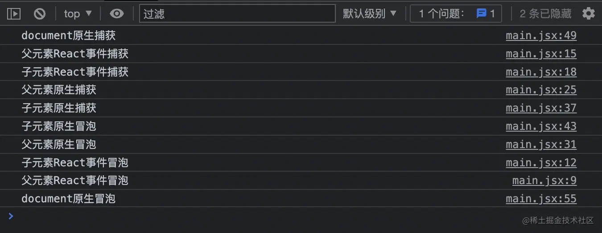

# react18事件系统

# 前置知识

事件流包含三个阶段, 按照以下顺序依次执行

```js
1. 事件捕获阶段
2. 处于目标阶段
3. 事件冒泡阶段
```

原生事件会产生一些跨平台的兼容问题

1. 阻止冒泡

- 在微软的模型中你必须设置事件的 `cancelBubble` 的属性为 true
- 在 W3C 模型中你必须调用事件的 `stopPropagation()` 方法

```js
js

 代码解读
复制代码function stopPropagation(event) {
  if (!event) {
    window.event.cancelBubble = true;
  }
  if (event.stopPropagation) {
    event.stopPropagation();
  }
}
```

1. 阻止默认事件

- 在微软的模型中你必须设置事件的 `returnValue` 的属性为 false
- 在 W3C 模型中你必须调用事件的 `preventDefault()` 方法

```js
js

 代码解读
复制代码function preventDefault(event) {
  if (!event) {
    window.event.returnValue = false
  }
  if (event.preventDefault) {
    event.preventDefault()
  }
}
```

基于以上等一些跨平台的浏览器兼容问题，React 内部实现了一套自己的合成事件。

# React 事件行为

```js
js

 代码解读
复制代码import { useRef, useEffect } from 'react'
import { createRoot } from 'react-dom/client'

function App() {
  const parentRef = useRef()
  const childRef = useRef()

  const parentBubble = () => {
    console.log('父元素React事件冒泡')
  }
  const childBubble = () => {
    console.log('子元素React事件冒泡')
  }
  const parentCapture = () => {
    console.log('父元素React事件捕获')
  }
  const childCapture = () => {
    console.log('子元素React事件捕获')
  }

  useEffect(() => {
    parentRef.current.addEventListener(
      'click',
      () => {
        console.log('父元素原生捕获')
      },
      true
    )

    parentRef.current.addEventListener('click', () => {
      console.log('父元素原生冒泡')
    })

    childRef.current.addEventListener(
      'click',
      () => {
        console.log('子元素原生捕获')
      },
      true
    )

    childRef.current.addEventListener('click', () => {
      console.log('子元素原生冒泡')
    })

    document.addEventListener(
      'click',
      () => {
        console.log('document原生捕获')
      },
      true
    )

    document.addEventListener('click', () => {
      console.log('document原生冒泡')
    })
  }, [])

  return (
    <div ref={parentRef} onClick={parentBubble} onClickCapture={parentCapture}>
      <p ref={childRef} onClick={childBubble} onClickCapture={childCapture}>
        事件执行顺序
      </p>
    </div>
  )
}

const root = createRoot(document.getElementById('root'))
root.render(<App />)
```

大家不看答案的情况下，如果可以说出以上代码打印的日志，那说明对 React 事件掌握的不错。

好，接下来揭晓一下答案



## 解析触发过程

上面代码层级如下 `document` -> `root` -> `div` -> `p`
 React17-18 中是采用了事件代理的形式，将事件挂载到了 #root 上，所以。

1. `document` 注册的事件最先触发。
2. `root` 注册的事件触发，React 根据当前点击的 `event.target` 收集对应 DOM 节点的 `fiber` 节点中的 `pendingProps`，`pendingProps` 在这里简单理解就是 `jsx` 中 DOM 节点对应的 `props`，收集 `props` 中的 `onClickCapture`（因为触发的是点击事件，所以收集 `onClickCapture` 捕获函数），最终在队列中收集成 `[childCapture, parentCapture]`，然后倒序触发。
3. `div` 注册的捕获事件触发。
4. `p` 注册的捕获事件触发。
5. `p` 注册的冒泡事件触发。
6. `div` 注册的冒泡事件触发。
7. `root` 收集的队列里有两个冒泡事件， `[childBubble, parentBubble]`， 然后正序触发。
8. `document` 注册的冒泡事件触发。

# 源码部分

入口文件 [ReactDOMRoot](https://link.juejin.cn?target=https%3A%2F%2Fgithub1s.com%2Ffacebook%2Freact%2Fblob%2FHEAD%2Fpackages%2Freact-dom%2Fsrc%2Fclient%2FReactDOMRoot.js) 文件中的 `listenToAllSupportedEvents` 方法，在 root 根 fiber 创建完之后绑定事件

## 1. 绑定所有简单事件

```js
js

 代码解读
复制代码SimpleEventPlugin.registerEvents();

const listeningMarker =
  '_reactListening' +
  Math.random()
    .toString(36)
    .slice(2);
export function listenToAllSupportedEvents(rootContainerElement: EventTarget) {
  if (!(rootContainerElement: any)[listeningMarker]) {
    (rootContainerElement: any)[listeningMarker] = true;
    allNativeEvents.forEach(domEventName => {
      // We handle selectionchange separately because it
      // doesn't bubble and needs to be on the document.
      if (domEventName !== 'selectionchange') {
        if (!nonDelegatedEvents.has(domEventName)) {
          listenToNativeEvent(domEventName, false, rootContainerElement);
        }
        listenToNativeEvent(domEventName, true, rootContainerElement);
      }
    });
  }
}
```

1. `SimpleEventPlugin.registerEvents()` 方法会为我们的 `allNativeEvents` 注册事件，`allNativeEvents` 是一个 `Set` 集合。
2. 首先看 `#root` 节点上是否绑定过事件代理了，如果第一次绑定就 `rootContainerElement[listeningMarker] = true`，防止多次代理。
3. `allNativeEvents` 是所有的原生事件（内容比较多，可点击跳转源码搜索 [simpleEventPluginEvents](https://link.juejin.cn?target=https%3A%2F%2Fgithub1s.com%2Ffacebook%2Freact%2Fblob%2FHEAD%2Fpackages%2Freact-dom-bindings%2Fsrc%2Fevents%2FDOMEventProperties.js%23L36)），因为有一些事件是没有冒泡行为的，比如  `scroll`事件等 ，所以在这里根据 `nonDelegatedEvents` 区分一下是否需要绑定冒泡事件。
4. `listenToNativeEvent` 其实就是给我们的 `root` 事件通过 `addEventListener` 来绑定真正的事件，实现事件代理。

## 2. SimpleEventPlugin.registerEvents

说一下 `allNativeEvents` 赋值的过程

1. 调用SimpleEventPlugin插件的registerEvents方法注册事件

```js
js

 代码解读
复制代码SimpleEventPlugin.registerEvents();
```

1. registerSimpleEvents

```js
js

 代码解读
复制代码// registerEvents 就是 registerSimpleEvents，内部导出的时候重命名了
let topLevelEventsToReactNames = new Map()
function registerSimpleEvents() {
  for (let i = 0; i < simpleEventPluginEvents.length; i++) {
    const eventName = ((simpleEventPluginEvents[i]: any): string);
    const domEventName = ((eventName.toLowerCase(): any): DOMEventName);
    const capitalizedEvent = eventName[0].toUpperCase() + eventName.slice(1);
    registerSimpleEvent(domEventName, 'on' + capitalizedEvent);
  }
}

function registerSimpleEvent(domEventName: DOMEventName, reactName: string) {
  topLevelEventsToReactNames.set(domEventName, reactName);
  registerTwoPhaseEvent(reactName, [domEventName]);
}

export function registerTwoPhaseEvent(
  registrationName: string,
  dependencies: Array<DOMEventName>,
): void {
  registerDirectEvent(registrationName, dependencies);
  registerDirectEvent(registrationName + 'Capture', dependencies);
}

export function registerDirectEvent(registrationName, dependencies) {
  for (let i = 0; i < dependencies.length; i++) {
    allNativeEvents.add(dependencies[i])
  }
}
```

1. `eventName` 就是 `click`、`drag`、`close` 等这些简单事件。
2. `capitalizedEvent` 就是 `React` 里绑定的事件了，比如上述的 `click`、`drag`、`close` 会转成 `onClick`, `onDrag`, `onClose`。
3. `topLevelEventsToReactNames` 是个 `Map`，用来建立原生事件跟 `React` 事件的映射，到时候根据触发的事件来找到 React 里映射的事件，收集 `fiber` 上的 `props` 对应的事件。
4. `registerTwoPhaseEvent` 方法注册捕获 + 冒泡阶段的事件。
5. `registerDirectEvent` 是真正的给 `allNativeEvents`这个 `Set` 赋值。

OK，到这里我们 `root` 节点就已经通过事件管理绑定了所有的简单事件。
 接下来就是事件触发的过程

## 3. 事件触发的函数

1. dispatchDiscreteEvent

```js
js

 代码解读
复制代码/**
 * @param {*} domEventName click 等事件名
 * @param {*} eventSystemFlags 0 冒泡  4 捕获
 * @param {*} container #root 根节点
 * @param {*} nativeEvent 原生事件 event
 */
function dispatchDiscreteEvent(
  domEventName: DOMEventName,
  eventSystemFlags: EventSystemFlags,
  container: EventTarget,
  nativeEvent: AnyNativeEvent,
) {
  try {
    dispatchEvent(domEventName, eventSystemFlags, container, nativeEvent);
  }
}
```

1. dispatchEvent

```js
js

 代码解读
复制代码export function dispatchEvent(
  domEventName: DOMEventName,
  eventSystemFlags: EventSystemFlags,
  targetContainer: EventTarget,
  nativeEvent: AnyNativeEvent,
): void {
  dispatchEventOriginal(
      domEventName,
      eventSystemFlags,
      targetContainer,
      nativeEvent,
  );
}
```

1. dispatchEventOriginal

```js
js

 代码解读
复制代码function dispatchEventOriginal(
  domEventName: DOMEventName,
  eventSystemFlags: EventSystemFlags,
  targetContainer: EventTarget,
  nativeEvent: AnyNativeEvent,
) {
  dispatchEventForPluginEventSystem(
    domEventName,
    eventSystemFlags,
    nativeEvent,
    null,
    targetContainer,
  );
}
```

1. dispatchEventForPluginEventSystem

```js
js

 代码解读
复制代码export function dispatchEventForPluginEventSystem(
  domEventName,
  eventSystemFlags,
  nativeEvent,
  targetInst,
  targetContainer
) {
  dispatchEventsForPlugins(
    domEventName,
    eventSystemFlags,
    nativeEvent,
    targetInst,
    targetContainer
  )
}
```

1. dispatchEventsForPlugins

```js
js

 代码解读
复制代码/**
 * 
 * @param {*} domEventName click  等原生事件
 * @param {*} eventSystemFlags 0是冒泡，4 是捕获
 * @param {*} nativeEvent 原生事件 event
 * @param {*} targetInst 当前点击 DOM 节点对应的 fiber 节点
 * @param {*} targetContainer #root
 */
function dispatchEventsForPlugins(
  domEventName: DOMEventName,
  eventSystemFlags: EventSystemFlags,
  nativeEvent: AnyNativeEvent,
  targetInst: null | Fiber,
  targetContainer: EventTarget,
): void {
  const nativeEventTarget = getEventTarget(nativeEvent);
  const dispatchQueue: DispatchQueue = [];
  extractEvents(
    dispatchQueue,
    domEventName,
    targetInst,
    nativeEvent,
    nativeEventTarget,
    eventSystemFlags,
    targetContainer,
  );
  processDispatchQueue(dispatchQueue, eventSystemFlags);
}


export function processDispatchQueue(dispatchQueue, eventSystemFlags) {
  const inCapturePhase = (eventSystemFlags & IS_CAPTURE_PHASE) !== 0 //true 就是捕获
  for (let i = 0; i < dispatchQueue.length; i++) {
    const { event, listeners } = dispatchQueue[i]
    processDispatchQueueItemsInOrder(event, listeners, inCapturePhase)
  }
}

function processDispatchQueueItemsInOrder(
  event: ReactSyntheticEvent,
  dispatchListeners: Array<DispatchListener>,
  inCapturePhase: boolean,
): void {
  let previousInstance;
  if (inCapturePhase) {
    for (let i = dispatchListeners.length - 1; i >= 0; i--) {
      const {instance, currentTarget, listener} = dispatchListeners[i];
      if (instance !== previousInstance && event.isPropagationStopped()) {
        return;
      }
      executeDispatch(event, listener, currentTarget);
      previousInstance = instance;
    }
  } else {
    for (let i = 0; i < dispatchListeners.length; i++) {
      const {instance, currentTarget, listener} = dispatchListeners[i];
      if (instance !== previousInstance && event.isPropagationStopped()) {
        return;
      }
      executeDispatch(event, listener, currentTarget);
      previousInstance = instance;
    }
  }
}

function executeDispatch(event, listener, currentTarget) {
  event.currentTarget = currentTarget
  listener(event)
  event.currentTarget = null
}
```

1. `getEventTarget` 就是获取 `event.target`，也就是我们在页面上点击的 DOM 节点。
2. `extractEvents` 方法会根据传过去的 `domEventName`（比如这个事件是 `click`），去`targetInst` 这个 fiber 节点上去收集 `props` 里的 `onClick` 事件，`fiber.return` 指的就是 `targetInst` 的父 `fiber`，比如当前点击的 `p` 标签，`targetInst`就是 `p` 标签的 fiber，`targetInst.return`指的就是 `div` 的 `fiber` 节点，然后一直递归收集到 `dispatchQueue` 队列里面，最终 `dispatchQueue` 队列的数据结构就是
    `[{event：合成事件源, listener:  [{instance: p 标签的 fiber，listener：对应 p 标签的 onClick 事件，currentTarget：p 标签 DOM 节点}, div 标签的 {instance, listener, currentTarget}]}]`。
3. `processDispatchQueue` 开始去执行我们收集的事件。
4. `processDispatchQueueItemsInOrder` 会判断如果当前是捕获阶段，那就倒序遍历执行我们的 `dispatchListeners`，如果是冒泡阶段，就正序遍历执行 `dispatchListeners`，遍历过程中还需要更改事件源上的 `currentTarget` 属性。
5. 整个事件阶段就完成了。

作者：lisen6
链接：https://juejin.cn/post/7191308289177550906
来源：稀土掘金
著作权归作者所有。商业转载请联系作者获得授权，非商业转载请注明出处。