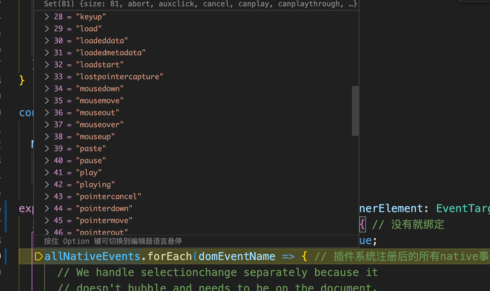
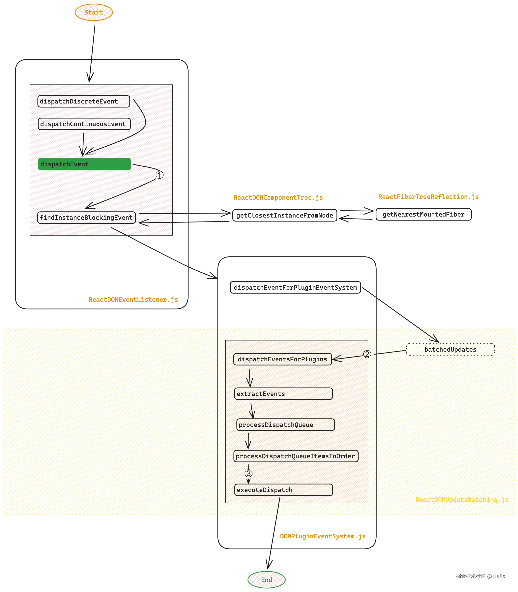

# react18事件系统

## 前置知识

事件流包含三个阶段，按照以下顺序依次执行

```js
1. 事件捕获阶段
2. 处于目标阶段
3. 事件冒泡阶段
```

原生事件会产生一些跨平台的兼容问题

#### 1. 阻止冒泡

- 在微软的模型中你必须设置事件的 `cancelBubble` 的属性为 true
- 在 W3C 模型中你必须调用事件的 `stopPropagation()` 方法

```js
function stopPropagation(event) {
  if (!event) {
    window.event.cancelBubble = true;
  }
  if (event.stopPropagation) {
    event.stopPropagation();
  }
}
```

#### 2. 阻止默认事件

- 在微软的模型中你必须设置事件的 `returnValue` 的属性为 false
- 在 W3C 模型中你必须调用事件的 `preventDefault()` 方法

```js
function preventDefault(event) {
  if (!event) {
    window.event.returnValue = false
  }
  if (event.preventDefault) {
    event.preventDefault()
  }
}
```

基于以上等一些跨平台的浏览器兼容问题，React 内部实现了一套自己的合成事件。


## 事件代理

事件代理又称之为事件委托， 事件代理是把原本需要绑定在`子元素`的事件委托给`父元素`，让父元素负责事件监听和处理。在`react18`中事件绑定在`root`节点上，也就是我们应用挂载的节点。

**事件代理主要有以下好处：**

1. 可以大量节省内存占用，减少事件注册事件。

2. 当新增子对象时无需再次对其绑定

**能够事件事件代理的前提：**

1. 事件冒泡到父元素，父元素可以订阅到冒泡事件。

2. 可以通过 `event.target` 得到目标节点。不然，父元素怎么针对不同的子节点，进行定制化事件代理。

`react`实现事件代理也是基于此。不过`react`的事件体系，不是全部都通过`事件委托`来实现的。有一些[特殊情况](https://github.com/facebook/react/blob/v17.0.2/packages/react-dom/src/client/ReactDOMComponent.js#L530-L616)，是直接绑定到对应 DOM 元素上的(如:`scroll`，`load`)，它们都通过[listenToNonDelegatedEvent](https://github.com/facebook/react/blob/v17.0.2/packages/react-dom/src/events/DOMPluginEventSystem.js#L295-L314)函数进行绑定.


## React16和React18的不同

`react16`中事件是统一绑定在`document`节点上，而18是绑定在挂载的根结点上。主要是以下考虑：

1. **更好的事件隔离**：将事件处理器绑定到 root 节点上，可以更好地隔离不同的 React 应用。如果页面上运行着多个 React 应用，这种方式可以防止一个应用的事件处理干扰到另一个应用。
2. **避免冒泡到 document**：在 React 16 及之前版本中，所有的事件处理器都绑定在 document 上，这意味着非react节点产生的事件都会冒泡到 document 层级。这种行为在某些情况下可能不是必需的，甚至可能引起性能问题。通过将事件处理器绑定到 root 节点，可以避免不必要的事件冒泡，从而提高性能。
3. **更好的兼容性和封装性**：将事件绑定在更接近组件的位置（即 root 节点），有助于保持组件的封装性，使得组件和应用更加独立。这也有助于在使用 Shadow DOM 等 Web 组件时，提供更好的兼容性。
4. **简化事件处理逻辑**：通过将事件处理逻辑保持在更局部的范围内（即 root 节点），React 可以更简单地管理事件，减少对全局事件监听的依赖，这在复杂应用中可以简化事件管理。

# React18 事件行为

```js
import { useRef，useEffect } from 'react';
import { createRoot } from 'react-dom/client';

function App() {
  const parentRef = useRef();
  const childRef = useRef();

  const parentBubble = () => {
    console.log('父元素React事件冒泡');
  };
  const childBubble = () => {
    console.log('子元素React事件冒泡');
  };
  const parentCapture = () => {
    console.log('父元素React事件捕获');
  };
  const childCapture = () => {
    console.log('子元素React事件捕获');
  };

  useEffect(() => {
    parentRef.current.addEventListener(
      'click',
      () => {
        console.log('父元素原生捕获');
      },
      true,
    );

    parentRef.current.addEventListener('click'，() => {
      console.log('父元素原生冒泡');
    });

    childRef.current.addEventListener(
      'click',
      () => {
        console.log('子元素原生捕获');
      },
      true,
    );

    childRef.current.addEventListener('click'，() => {
      console.log('子元素原生冒泡');
    });

    document.addEventListener(
      'click',
      () => {
        console.log('document原生捕获');
      },
      true,
    );

    document.addEventListener('click'，() => {
      console.log('document原生冒泡');
    });
  }，[]);

  return (
    <div ref={parentRef} onClick={parentBubble} onClickCapture={parentCapture}>
      <div ref={childRef} onClick={childBubble} onClickCapture={childCapture}>
        点击这里
      </div>
    </div>
  );
}

const root = createRoot(document.getElementById('root'));
root.render(<App />);
```

当我们点击之后，打印的结果如下图：

```js
/**
document原生捕获
父元素React事件捕获
子元素React事件捕获
父元素原生捕获
子元素原生捕获
子元素原生冒泡
父元素原生冒泡
子元素React事件冒泡
父元素React事件冒泡
document原生冒泡
 */
```

整个执行顺序如下图所示：


如果不理解没关系我们下面会结合源码详细讲解。

## 解析触发过程

上面代码层级如下 `document` -> `root` -> `div` -> `p`。根据事件触发原理，捕获阶段的事件会最先处理

1. 所以`document` 注册的捕获事件最先触发。
2. `root` 注册的捕获事件触发，React 根据当前点击的 `event.target` 上的`internalContainerInstanceKey`属性找到对应的`fiber`节点。然后从当前`fiber`节点网上收集`internalPropsKey`属性中含有当前捕获事件的函数放入数组中。收集完成之后对数组倒序触发，模拟捕获的行为。所以这时候`react`中绑定的捕获会先触发
3. `div` 注册的原生捕获事件触发。
4. `p` 注册的原生捕获事件触发。
5. `p` 注册的原生冒泡事件触发。
6. `div` 注册的原生冒泡事件触发。
7. `root` 注册的冒泡事件触发，同理会通过`fiber`节点向上收集。然后正序触发。
8. `document` 注册的冒泡事件触发。


## 源码解析

在`react18`中，事件系统被当作插件的形式被使用。所以和事件有关的文件基本都用`plugin`命名。事件系统的核心主要分为两部分

1. 事件绑定
2. 事件触发

## 事件绑定

当我们调用`ReactDOM.createRoot`之后，会进入到`/packages/react-dom/src/client/ReactDOMRoot.js`代码下的逻辑。`createRoot`中会调用`listenToAllSupportedEvents`函数，这个函数就是用来进行事件绑定的。

### listenToAllSupportedEvents

```js
SimpleEventPlugin.registerEvents(); // 用来注册事件。在/packages/react-dom/src/client/ReactDOMRoot.js文件中被引入的时候就会执行

const listeningMarker =
  '_reactListening' +
  Math.random()
    .toString(36)
    .slice(2);
export function listenToAllSupportedEvents(rootContainerElement: EventTarget) {
  if (!(rootContainerElement: any)[listeningMarker]) {
    (rootContainerElement: any)[listeningMarker] = true;
    allNativeEvents.forEach(domEventName => {
      if (domEventName !== 'selectionchange') {
        // 不支持冒泡的事件不用绑定
        if (!nonDelegatedEvents.has(domEventName)) {
          listenToNativeEvent(domEventName，false，rootContainerElement); // 绑定冒泡事件
        }
        listenToNativeEvent(domEventName，true，rootContainerElement); // 绑定捕获事件
      }
    });
  }
}
```

1. `SimpleEventPlugin.registerEvents()` 方法会为我们的 `allNativeEvents` 注册事件，`allNativeEvents` 是一个 `Set` 集合。包含所有需要进行事件代理的事件名称。同时会保存一个原生事件->`react`事件的映射。

   
2. 首先看 `#root` 节点上是否绑定过事件代理了，如果第一次绑定就 `rootContainerElement[listeningMarker] = true`，防止多次代理。
3. `allNativeEvents` 是所有的原生事件（内容比较多，可点击跳转源码搜索 [simpleEventPluginEvents](https://link.juejin.cn?target=https%3A%2F%2Fgithub1s.com%2Ffacebook%2Freact%2Fblob%2FHEAD%2Fpackages%2Freact-dom-bindings%2Fsrc%2Fevents%2FDOMEventProperties.js%23L36)），因为有一些事件是没有冒泡行为的，比如  `scroll`事件等 ，所以在这里根据 `nonDelegatedEvents` 区分一下是否需要绑定冒泡事件。
4. `listenToNativeEvent` 其实就是给我们的 `root` 事件通过 `addEventListener` 来绑定真正的事件，实现事件代理。

#### SimpleEventPlugin.registerEvents

这里简单说一下 `allNativeEvents` 赋值的过程

1. 调用SimpleEventPlugin插件的registerEvents方法注册事件

```js
SimpleEventPlugin.registerEvents();
```

1. registerSimpleEvents

```js
// registerEvents 就是 registerSimpleEvents，内部导出的时候重命名了
let topLevelEventsToReactNames = new Map() // 原生事件到react事件的map
export const registrationNameDependencies = {}; // react事件到原生事件的map
function registerSimpleEvents() {
  for (let i = 0; i < simpleEventPluginEvents.length; i++) {
    const eventName = ((simpleEventPluginEvents[i]: any): string); // `click`、`drag`、`close` 等这些简单事件。
    const domEventName = ((eventName.toLowerCase(): any): DOMEventName);
    const capitalizedEvent = eventName[0].toUpperCase() + eventName.slice(1); // 将click -> onClik
    registerSimpleEvent(domEventName，'on' + capitalizedEvent);
  }
  
  // Special cases where event names don't match.
  registerSimpleEvent(ANIMATION_END，'onAnimationEnd');
  registerSimpleEvent(ANIMATION_ITERATION，'onAnimationIteration');
  registerSimpleEvent(ANIMATION_START，'onAnimationStart');
  registerSimpleEvent('dblclick'，'onDoubleClick');
  registerSimpleEvent('focusin'，'onFocus');
  registerSimpleEvent('focusout'，'onBlur');
  registerSimpleEvent(TRANSITION_END，'onTransitionEnd');
}

// 注册单个事件
function registerSimpleEvent(domEventName: DOMEventName，reactName: string) {
  topLevelEventsToReactNames.set(domEventName，reactName); // 存放 click -> onClick映射
  registerTwoPhaseEvent(reactName，[domEventName]);
}

export function registerTwoPhaseEvent(
  registrationName: string,
  dependencies: Array<DOMEventName>,
): void {
  registerDirectEvent(registrationName，dependencies); // 冒泡事件
  registerDirectEvent(registrationName + 'Capture'，dependencies); // 捕获事件
}

export function registerDirectEvent(registrationName，dependencies) {
  registrationNameDependencies[registrationName] = dependencies;
  for (let i = 0; i < dependencies.length; i++) {
    allNativeEvents.add(dependencies[i]) // 添加到allNativeEvents中
  }
}
```

1. `simpleEventPluginEvents`就是我们在`react-18.2.0/packages/react-dom/src/events/DOMEventProperties.js`定义的所有事件名称的一个数组。
2. `eventName` 就是 `click`、`drag`、`close` 等这些简单事件。
3. `capitalizedEvent` 就是 `React` 里绑定的事件了，比如上述的 `click`、`drag`、`close` 会转成 `onClick`，`onDrag`，`onClose`。
4. `topLevelEventsToReactNames` 是个 `Map`，用来建立原生事件跟 `React` 事件的映射，到时候根据触发的事件来找到 React 里映射的事件，收集 `fiber` 上的 `props` 对应的事件。
5. `registerTwoPhaseEvent` 方法注册捕获 + 冒泡阶段的事件。
6. `registerDirectEvent` 是真正的给 `allNativeEvents`这个 `Set` 赋值。

### listenToNativeEvent

我们接着看`listenToAllSupportedEvents`中针对每个事件会调用`listenToNativeEvent`进行事件绑定

```js
export function listenToNativeEvent( // 可以进行事件委托的事件的绑定
  domEventName: DOMEventName,
  isCapturePhaseListener: boolean，// 是否是捕获阶段执行
  target: EventTarget,
): void {
  let eventSystemFlags = 0; // 事件系统标识，可以用来标记是不是捕获啥的。已经是不是需要继续向上冒泡之类的
  if (isCapturePhaseListener) {
    eventSystemFlags |= IS_CAPTURE_PHASE; // 是捕获阶段就加上对应的值，可以同时支持冒泡和捕获
  }
  addTrappedEventListener( // 绑定
    target,
    domEventName,
    eventSystemFlags,
    isCapturePhaseListener,
  );
}
```

`listenToNativeEvent`代码很简单，最后会调用`addTrappedEventListener`进行绑定。

### addTrappedEventListener

`addTrappedEventListener`简化后的代码如下：

```js
function addTrappedEventListener(
  targetContainer: EventTarget,
  domEventName: DOMEventName,
  eventSystemFlags: EventSystemFlags,
  isCapturePhaseListener: boolean,
  isDeferredListenerForLegacyFBSupport?: boolean
) {
  let listener = createEventListenerWrapperWithPriority(
    targetContainer,
    domEventName,
    eventSystemFlags
  );

  unsubscribeListener = addEventBubbleListener(
    targetContainer,
    domEventName,
    listener
  );
  unsubscribeListener = addEventCaptureListener(
    targetContainer,
    domEventName,
    listener
  );
}

```

首先通过 `createEventListenerWrapperWithPriority` 函数创建了一个带有优先级的` listenr` 监听函数，这个监听函数很重要，后面事件真正触发的时候调用的就是这个函数。

我们可以看到不同优先级会赋值为不同的listenerWrapper函数。这些函数里面只是做了优先级相关的处理。最后都会调用`dispatchEvent`。然后`listenr` 监听函数会通过 dispatchEvent 去 bind 绑定一些重要参数，返回的一个函数。这样每次事件触发都可以调用 dispatchEvent 并且携带一些固定的参数。

```js
export function createEventListenerWrapperWithPriority( // 通过不同的优先级处理函数来包裹我们的事件处理函数
  targetContainer: EventTarget,
  domEventName: DOMEventName,
  eventSystemFlags: EventSystemFlags,
): Function {
  const eventPriority = getEventPriority(domEventName); // 通过事件名获取事件的优先级
  let listenerWrapper;
  switch (eventPriority) { // 返回不同优先级的dispatch函数
    case DiscreteEventPriority: // 优先级最高
      listenerWrapper = dispatchDiscreteEvent;
      break;
    case ContinuousEventPriority:
      listenerWrapper = dispatchContinuousEvent;
      break;
    case DefaultEventPriority: // 优先级最低
    default:
      listenerWrapper = dispatchEvent;
      break;
  }
  return listenerWrapper.bind( // 提前绑定一些参数
    null,
    domEventName,
    eventSystemFlags,
    targetContainer,
  );
}

// 以clcik为例，getEventPriority(domEventName)会返回DiscreteEventPriority。所以listenerWrapper为dispatchDiscreteEvent
function dispatchDiscreteEvent(
  domEventName,
  eventSystemFlags,
  container,
  nativeEvent,
) {
  const previousPriority = getCurrentUpdatePriority(); // 获取当前状态
  const prevTransition = ReactCurrentBatchConfig.transition;
  ReactCurrentBatchConfig.transition = null;
  try {
    setCurrentUpdatePriority(DiscreteEventPriority); // 设置当前优先级
    dispatchEvent(domEventName，eventSystemFlags，container，nativeEvent); // 派发事件
  } finally {
    setCurrentUpdatePriority(previousPriority);
    ReactCurrentBatchConfig.transition = prevTransition;
  }
}
```

最后会调用然后调用 `addEventBubbleListener` `addEventCaptureListener` 函数。这个就是真正将事件绑定到`root`节点上的函数。

```js
export function addEventBubbleListener( // 冒泡
  target: EventTarget,
  eventType: string,
  listener: Function,
): Function {
  target.addEventListener(eventType，listener，false); // 绑定事件
  return listener;
}

export function addEventCaptureListener( // 捕获
  target: EventTarget,
  eventType: string,
  listener: Function,
): Function {
  target.addEventListener(eventType，listener，true); // 绑定事件
  return listener;
}
```

至此，我们的事件都已经绑定到`root`节点上了。当我们点击某个节点之后就会进行触发这些函数。下面我们详细讲解触发部门

## 事件触发

事件触发的流程可以总结为：提取所有事件监听的处理函数放到 `dispatchQueue` 当中。然后，模拟捕获阶段和冒泡阶段的执行流程，去执行所有的监听处理函数。

上文提到，所有事件的触发，都绑定到了 dispachtEvent 函数上（有一些优先级相关的前置处理），相当于：

```js
div.addEventListener("click"，dispatchEvent.bind(null，click，eventSystemFlags，div#root)，true) // 捕获

div.addEventListener("click"，dispatchEvent.bind(null，click，eventSystemFlags，div#root)，false) // 冒泡
```

所以当点击`react`中某个节点，在捕获阶段的时候会被我们的根结点捕获到并触发`dispatchEvent.bind(null，click，eventSystemFlags，div#root)`。同时会将`event`原始对象作为参数传入。

我们以点击为例来梳理下。整体流程图如下：



### dispatchDiscreteEvent

在`createEventListenerWrapperWithPriority`中，`listenerWrapper`会被赋值为`dispatchDiscreteEvent`。

```js
/**
 * @param {*} domEventName click 等事件名
 * @param {*} eventSystemFlags 0 冒泡  4 捕获
 * @param {*} container #root 根节点
 * @param {*} nativeEvent 原生事件 event
 */
function dispatchDiscreteEvent(
  domEventName,
  eventSystemFlags,
  container,
  nativeEvent,
) {
  // 之前的状态
  const previousPriority = getCurrentUpdatePriority();
  const prevTransition = ReactCurrentBatchConfig.transition;
  ReactCurrentBatchConfig.transition = null;
  try {
    setCurrentUpdatePriority(DiscreteEventPriority); // 更改当前优先级为DiscreteEventPriority
    dispatchEvent(domEventName，eventSystemFlags，container，nativeEvent); // 派发事件
  } finally {
    setCurrentUpdatePriority(previousPriority);
    ReactCurrentBatchConfig.transition = prevTransition;
  }
}
```

`dispatchDiscreteEvent`会将当前触发的优先级设置为`DiscreteEventPriority`。后续的更新都会用这个优先级来设置。最后会调用`dispatchEvent`来触发事件。

### dispatchEvent

```js
export function dispatchEvent(
  domEventName: DOMEventName,
  eventSystemFlags: EventSystemFlags,
  targetContainer: EventTarget,
  nativeEvent: AnyNativeEvent，// 原生的事件对象
): void {
  // enableCapturePhaseSelectiveHydrationWithoutDiscreteEventReplay 是个为true的常量
  if (enableCapturePhaseSelectiveHydrationWithoutDiscreteEventReplay) {
    dispatchEventWithEnableCapturePhaseSelectiveHydrationWithoutDiscreteEventReplay(
      domEventName,
      eventSystemFlags,
      targetContainer,
      nativeEvent,
    );
  } else {
    dispatchEventOriginal(
      domEventName,
      eventSystemFlags,
      targetContainer,
      nativeEvent,
    );
  }
}
```

### dispatchEventWithEnableCapturePhaseSelectiveHydrationWithoutDiscreteEventReplay

```js
function dispatchEventWithEnableCapturePhaseSelectiveHydrationWithoutDiscreteEventReplay(
  domEventName: DOMEventName,
  eventSystemFlags: EventSystemFlags,
  targetContainer: EventTarget,
  nativeEvent: AnyNativeEvent,
) {
  let blockedOn = findInstanceBlockingEvent( // 找到 event.target 所对应的 Fiber
    domEventName,
    eventSystemFlags,
    targetContainer,
    nativeEvent,
  );
  if (blockedOn === null) {
    dispatchEventForPluginEventSystem( // // 执行依赖收集函数
      domEventName,
      eventSystemFlags,
      nativeEvent,
      return_targetInst,
      targetContainer,
    );
    clearIfContinuousEvent(domEventName，nativeEvent);
    return;
  }

  // 省略阻塞的逻辑
}
```

这个函数主要做了两件事情：

1. 调用`findInstanceBlockingEvent`从`nativeEvent`原生事件中提取触发事件的`Fiber`节点，当 寻找到触发事件的`Fiber`后通过`ReactDOMEventListener.js`文件中的`return_targetInst`变量缓存目标`Fiber`节点实例

1. 调用`dispatchEventForPluginEventSystem`执行事件触发

### dispatchEventForPluginEventSystem

```js
export function dispatchEventForPluginEventSystem(
  domEventName,
  eventSystemFlags,
  nativeEvent,
  targetInst,
  targetContainer
) {
  // 省略其他逻辑
  batchedUpdates(() =>
    dispatchEventsForPlugins(
      domEventName,
      eventSystemFlags,
      nativeEvent,
      ancestorInst,
      targetContainer,
    ),
  );
}
```

### dispatchEventsForPlugins

```js
/**
 * 
 * @param {*} domEventName click  等原生事件
 * @param {*} eventSystemFlags 0是冒泡，4 是捕获
 * @param {*} nativeEvent 原生事件 event
 * @param {*} targetInst 当前点击 DOM 节点对应的 fiber 节点
 * @param {*} targetContainer #root
 */
function dispatchEventsForPlugins(
  domEventName: DOMEventName,
  eventSystemFlags: EventSystemFlags,
  nativeEvent: AnyNativeEvent,
  targetInst: null | Fiber,
  targetContainer: EventTarget,
): void {
  const nativeEventTarget = getEventTarget(nativeEvent); // 获取当前node
  const dispatchQueue: DispatchQueue = []; // 所有的监听函数
  extractEvents( // 收集监听函数
    dispatchQueue,
    domEventName,
    targetInst,
    nativeEvent,
    nativeEventTarget,
    eventSystemFlags,
    targetContainer,
  );
  processDispatchQueue(dispatchQueue，eventSystemFlags); // 处理监听函数
}
```

`dispatchEventsForPlugins`主要做两件事情：

1. 从当前`fiber`向上收集所有的监听函数
2. 执行所有的监听函数

### extractEvents

```js
function extractEvents( // 根据当前fiber调用插件系统去收集所有的事件处理函数
  dispatchQueue: DispatchQueue,
  domEventName: DOMEventName,
  targetInst: null | Fiber,
  nativeEvent: AnyNativeEvent,
  nativeEventTarget: null | EventTarget,
  eventSystemFlags: EventSystemFlags,
  targetContainer: EventTarget,
) {
  SimpleEventPlugin.extractEvents(
    dispatchQueue,
    domEventName,
    targetInst,
    nativeEvent,
    nativeEventTarget,
    eventSystemFlags,
    targetContainer,
  );
}


function extractEvents(
  dispatchQueue: DispatchQueue,
  domEventName: DOMEventName,
  targetInst: null | Fiber,
  nativeEvent: AnyNativeEvent,
  nativeEventTarget: null | EventTarget,
  eventSystemFlags: EventSystemFlags,
  targetContainer: EventTarget,
): void {
  const reactName = topLevelEventsToReactNames.get(domEventName);
  if (reactName === undefined) {
    return;
  }
  // 收集事件，并对事件进行封装，以及其他兼容性的处理，这个也就是后续我们在 JSX 回调函数中可以获取到的事件
  let SyntheticEventCtor = SyntheticEvent;
  let reactEventType: string = domEventName;
  switch (domEventName) {
    case 'click':
      SyntheticEventCtor = SyntheticMouseEvent; // 合成事件，不同的事件对应不同的合成事件
      break;
  }

	const inCapturePhase = (eventSystemFlags & IS_CAPTURE_PHASE) !== 0;
  const accumulateTargetOnly =
    !inCapturePhase &&
    domEventName === 'scroll';

  const listeners = accumulateSinglePhaseListeners( // 收集事件处理函数
    targetInst,
    reactName,
    nativeEvent.type,
    inCapturePhase,
    accumulateTargetOnly,
    nativeEvent,
  );
  if (listeners.length > 0) {
    // Intentionally create event lazily.
    const event = new SyntheticEventCtor(
      reactName,
      reactEventType,
      null,
      nativeEvent,
      nativeEventTarget,
    );
    dispatchQueue.push({event, listeners});
	}
}
```

`extractEvents` 方法会根据传过去的 `domEventName`（比如这个事件是 `click`），去`targetInst` 这个 fiber 节点上去收集 `props` 里的 `onClick` 事件，`fiber.return` 指的就是 `targetInst` 的父 `fiber`，比如当前点击的 `div` 标签，`targetInst`就是 `div` 标签的 fiber，`targetInst.return`指的就是 `div#parent` 的 `fiber` 节点，然后一直递归收集到 `dispatchQueue` 队列里面，最终 `dispatchQueue` 队列的数据结构就是
`[{event：合成事件源，listener:  [{instance: div#child 标签的 fiber，listener：对应 div#child 标签的 onClick 事件，currentTarget：div#child 标签 DOM 节点}，div#parent 标签的 {instance，listener，currentTarget}]}]`。

### processDispatchQueue

```js
export function processDispatchQueue(
  dispatchQueue: DispatchQueue,
  eventSystemFlags: EventSystemFlags,
): void {
  const inCapturePhase = (eventSystemFlags & IS_CAPTURE_PHASE) !== 0;
  for (let i = 0; i < dispatchQueue.length; i++) { // 可能有多个事件
    const {event, listeners} = dispatchQueue[i];
    processDispatchQueueItemsInOrder(event, listeners, inCapturePhase);
    //  event system doesn't use pooling.
  }
  // This would be a good time to rethrow if any of the event handlers threw.
  rethrowCaughtError();
}

// 最终的处理函数
function processDispatchQueueItemsInOrder( // 事件处理函数
  event: ReactSyntheticEvent,
  dispatchListeners: Array<DispatchListener>,
  inCapturePhase: boolean,
): void {
  let previousInstance;
  if (inCapturePhase) { // b捕获阶段从后往前，因为我们是从当前节点往上层捕获的，所有反过来遍历就好了
    for (let i = dispatchListeners.length - 1; i >= 0; i--) {
      const {instance, currentTarget, listener} = dispatchListeners[i];
      if (instance !== previousInstance && event.isPropagationStopped()) {
        return;
      }
      executeDispatch(event, listener, currentTarget); // 传入我们的合成事件event并执行
      previousInstance = instance;
    }
  } else { // 冒泡阶段从前往后
    for (let i = 0; i < dispatchListeners.length; i++) {
      const {instance, currentTarget, listener} = dispatchListeners[i];
      if (instance !== previousInstance && event.isPropagationStopped()) { // 判断是不是停止了冒泡
        return;
      }
      executeDispatch(event, listener, currentTarget);
      previousInstance = instance;
    }
  }
}
```

这样我们就完成我们的事件触发。

### 合成事件

由于我们的事件都是合成事件(`react-18.2.0/packages/react-dom/src/events/SyntheticEvent.js`)。每一次调用的时候都会产生一个合成事件实例。这个实例从触发的节点向上传递都是同一个。所以我们可以在这些事件里面做一些处理。例如调用`stopPropagation`后会将实例的`isPropagationStopped`设置为返回`true`。这样在`processDispatchQueueItemsInOrder`中就会停止执行

```js
stopPropagation: function() {
  const event = this.nativeEvent;
  if (!event) {
    return;
  }

  // 兼容不同浏览器
  if (event.stopPropagation) {
    event.stopPropagation(); // 调用原生的
  } else if (typeof event.cancelBubble !== 'unknown') {
    event.cancelBubble = true;
  }

  this.isPropagationStopped = functionThatReturnsTrue;
},
preventDefault: function() {
  this.defaultPrevented = true;
  const event = this.nativeEvent;
  if (!event) {
    return;
  }

   // 兼容不同浏览器
  if (event.preventDefault) {
    event.preventDefault(); // 调用原生的
  } else if (typeof event.returnValue !== 'unknown') {
    event.returnValue = false;
  }
  this.isDefaultPrevented = functionThatReturnsTrue;
},
```

## 事件委托的坑点
`react`的事件都是基于事件冒泡的，所以一旦有原生节点绑定原生事件后阻止了事件冒泡，那么我们的所有`react`绑定的冒泡事件都不会触发（捕获事件可以正常触发）。例如上面的代码中我们增加一个阻止冒泡：
```js{2}
divRef.current.addEventListener("click", (e) => {
  e.stopPropagation();
  console.log("父元素原生冒泡");
});
```
最后代码点击之后运行的结果为：

```js
/**
document原生捕获
父元素React事件捕获
子元素React事件捕获
父元素原生捕获
子元素原生捕获
子元素原生冒泡
父元素原生冒泡
 */
```
可以看到和冒泡相关的事件都没触发，包括子元素的都没有触发。
