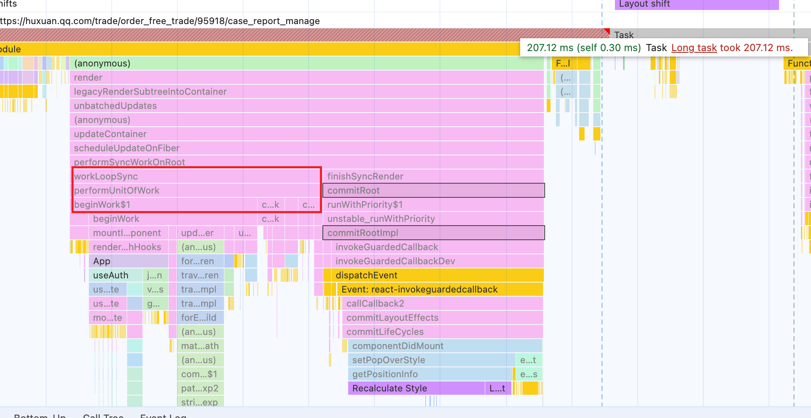
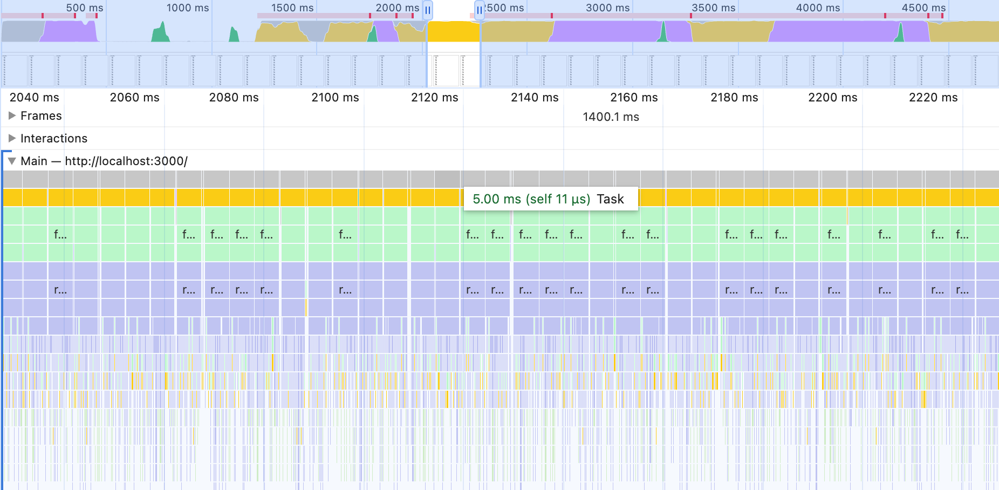
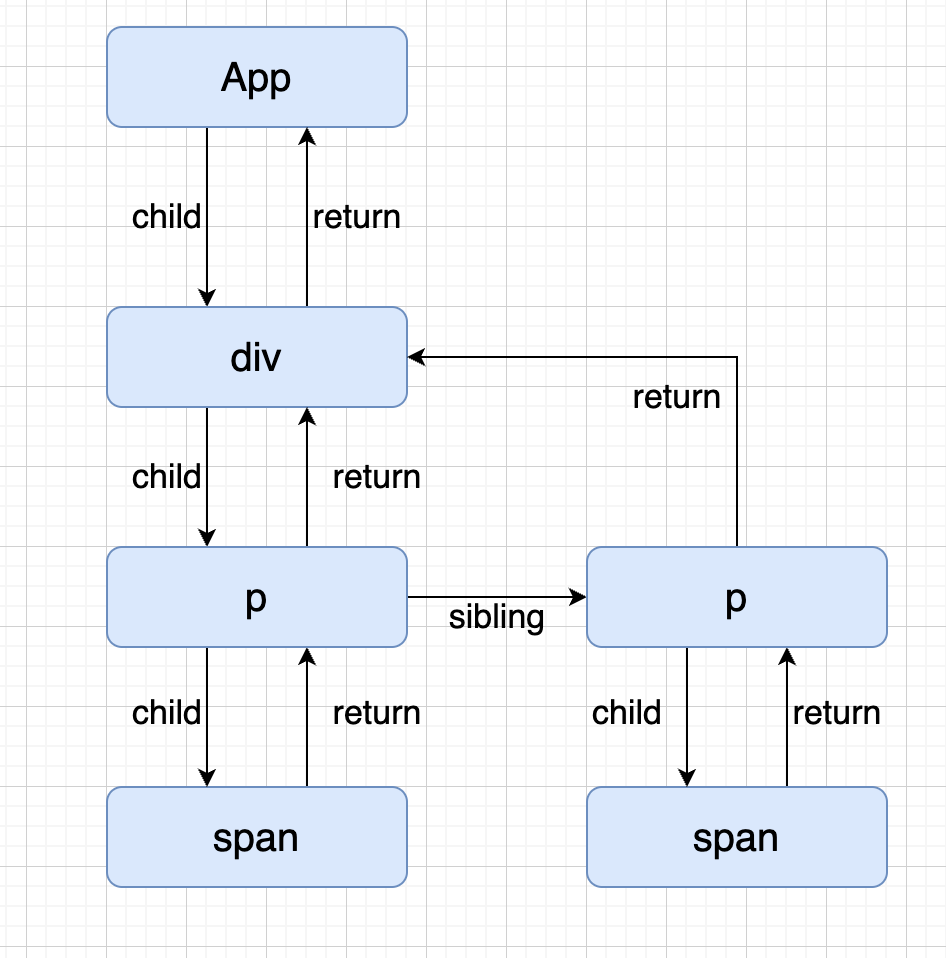
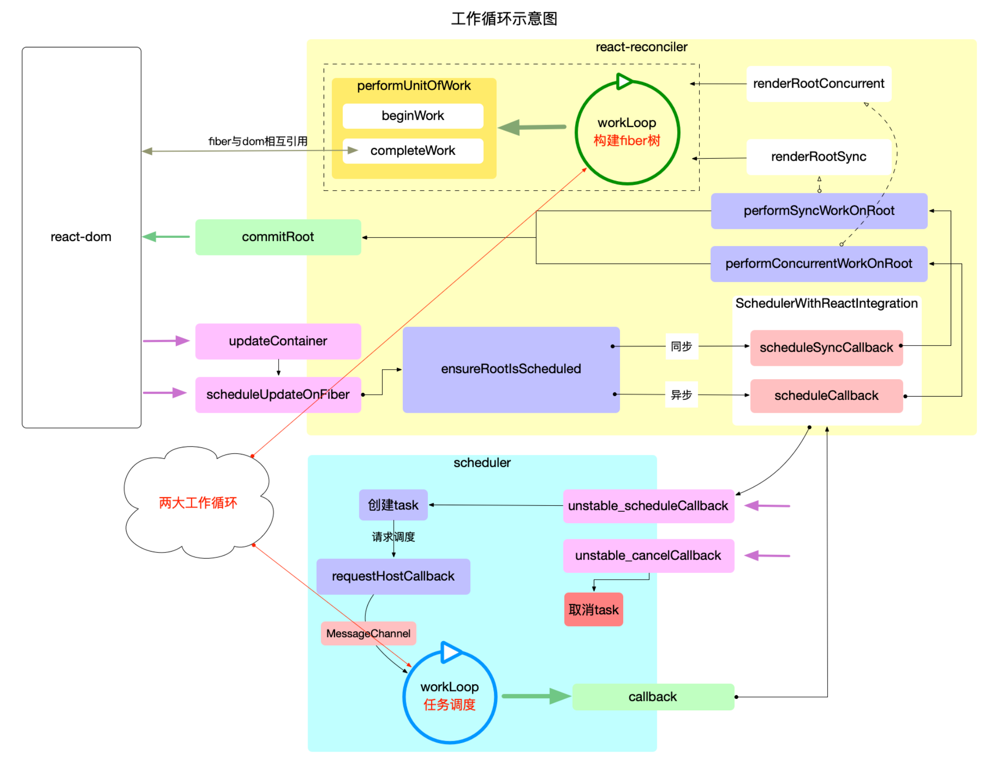
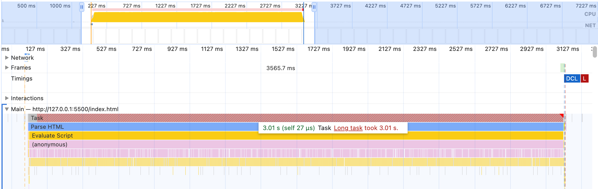
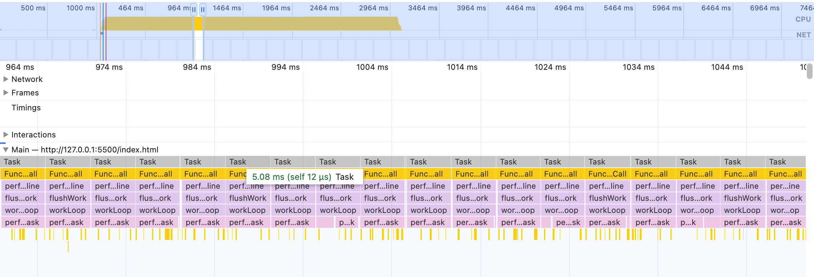
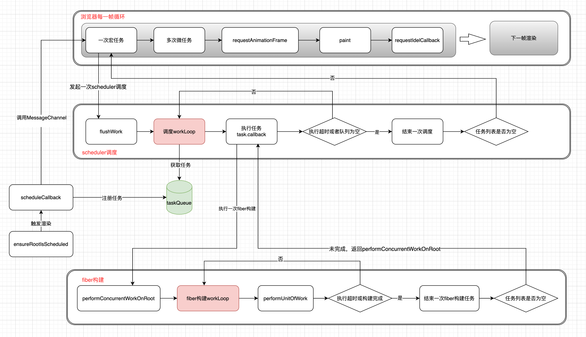

# 彻底理解react中任务调度和时间分片

> `react` 是前端开发每天都在使用的前端框架，为了更好的驾驭它，自然要深入了解它的原理。我用 React 也挺久了，也阅读过部分源码，借着这个周末，系统的整理下`react`中比较核心的部分。本篇文章主要来聊聊`react`中的时间分片和任务调度，以及它们在整个`react`渲染过程中是如何紧密结合的。本文所有关于源码都是基于` react v18.2` 版本。

## 前置知识

在讲述硬核内容之前，我们先来点简单的复习。

#### vdom

我们知道`react`和`vue`都是基于`vdom`实现的。可能大家都想过为什么要基于 `vdom` 呢？直接操作真实` dom `不行么？

确实是可以的。但是在复杂的页面，如果涉及到的`dom`操作非常多，势必会引起大量的浏览器重排和重绘。同时，每一次的`dom`操作也会带来一定的性能消耗，这显然不是我们所期望的结果。这时候聪明的开发者就想到了能不能通过对象来表示一个`dom`节点呢，所有的`dom`操作都在内存中进行，只在最后真正渲染的时候才一次性提交到真实的`dom`中去。

因此`vdom`应运而生，`vdom`其实就是在`dom`之上的一个中间层，将真实的`dom`操作转到了`vdom`上。不同框架的`vdom`表示形式不同，但大体结构如下所示：

```js
{
    type: 'div', // 节点类型
    props: { // 节点属性
        id: 'xxx',
        className: ['xxx'],
        onClick: function() {}
    },
    children: [] // 孩子节点
}
```

但是要让开发去写这样的` vdom `么？那肯定不行，这样太麻烦了，大家熟悉的是 html 那种方式，所以我们要引入编译的手段。

### JSX

直接写` vdom `太麻烦了，所以各种前端框架都会设计一套自己的`DSL`，然后编译产生 vdom。在`react`中，这个`DSL`也就是大家熟悉的`JSX`，编译函数也就是大家熟知的`createElement`（17后已废弃改用`jsx.runtimer`）

所以这里我们也顺势弄清楚了`JSX`和`vdom`的关系。`JSX`会通过编译函数生成`vdom`，最后被提交到页面上。

### 浏览器渲染

在浏览器的每一帧渲染过程中（按 60fps来计算，大概有16.6ms），要执行包括 “执行 JS -> requestAnimationFrame -> paint -> requestIdelCallback”。在执行 JS 的过程中，浏览器会执行一次事件循环 eventloop 。每一次事件循环会执行一次宏任务和多次微任务。

所以如果我们的`js`执行时间过长，超过了每一帧的时间（16.6ms），就会阻碍渲染引起卡顿。这也是为什么我们需要关注项目中长任务的原因。

### react15的性能瓶颈

要了解为什么` React `要引入时间分片和任务调度技术。我们就需要知道之前的`react`版本所存在的问题。

在大型应用程序中，组件树通常会变得非常庞大，导致更新操作变得非常耗时。在这种情况下，如果没有合适的优化措施，放任`js`一直占用主线程，就会导致用户界面出现卡顿，影响用户体验。例如我们用过没有开启同步模式的`react`，我们会发现在更新的过程中`js`会一直占用主线程，当组件多，计算量大的时候界面的卡顿会变得非常严重。



上图可以看到当`react`进行渲染的时候，整个阶段都是不可中断，一直执行的，整整占用了主线程207ms，也就是说这207ms我们操作界面将不会有任何反应。如果电脑性能再差点，页面组件再复杂点，这个占用的时间只会更多。

`react15 `架构通常可以分为两层：

- `Reconciler`（协调器）—— 负责找出变化的组件
- `Renderer`（渲染器）—— 负责将变化的组件渲染到页面上

在`react`15中，`Reconciler`会从根节点开始递归的更新所有子节点。由于递归执行，所以更新一旦开始，中途就无法中断。这样就会带来两个非常大的问题：

- 如果递归更新一直占用主线程，当超过了16ms的时候用户的交互就会变得非常卡顿
- 如果所有的更新都按照顺序依次更新，会导致像用户输入这种对系统反馈时效性高的更新滞后，从而造成不好的用户体验

所以为了优化这些问题，`react16`之后对整个架构进行了升级，大体可以分为三层：

- Scheduler（调度器）—— 调度任务的优先级，高优任务优先进入**Reconciler**
- Reconciler（协调器）—— 负责找出变化的组件
- Renderer（渲染器）—— 负责将变化的组件渲染到页面上

可以看到整个架构最大的变化就是引入了调度器，可以实现对不同优先级的任务进行调度。这样就保证了对时效性高的任务可以快速响应。另外，在渲染阶段`react`还引入了时间分片的概念(`react`定义的时间为5ms)，把一个大的任务拆解成一个个小的任务，这样就可以保证每一帧都留出时间供浏览器渲染，降低卡顿。这两个概念也是我们本篇文章重点。如下图，单个任务占用主线程的时间基本在5ms左右，不会长时间占用主线程了。



## react-sheduler

上面提到，`react16`之后的版本引入了调度器`sheduler`，接下来我们就从它入手揭开`react`的神秘面纱。

### react-sheduler介绍

**Scheduler设计之初的定位就是一个独立的包，不仅仅在React中可以使用。**从名字可以看出，Scheduler 的主要功能就是进行任务的调度。

- `Scheduler`可以实现对不同优先级的任务进行调度，优先执行高优先级的任务。
- `Scheduler`利用时间分片可以实现任务的中断和恢复，如果一个任务执行时间过长，超过了我们Scheduler设置的执行时间，就会中断当前任务，将线程让出进行渲染，避免造成卡顿。中断的任务会在下一次恢复执行。

### Scheduler中核心的概念

### Scheduler中的任务是什么

```js
var newTask = {
    id: taskIdCounter++,            // 任务id，在 react 中是一个全局变量，每次新增 task 会自增+1
    callback: callback,             // 在调度事调用的回掉函数，由开发者传进来
    priorityLevel: priorityLevel,   // 任务优先级
    startTime: startTime,           // 任务开始时间
    expirationTime: expirationTime, // 任务过期时间
    sortIndex: -1                   // 排序索引, 全等于过期时间/开始时间. 保证过期时间越小/startTime, 越紧急的任务排在最前面
  };
```

可以看到一个任务其实就是一个对象，我们主要关注`sortIndex`和`callback`这两个属性。`sortIndex`决定我们的任务在小顶堆中的位置，它由`startTime / expirationTime`赋值而来，`sortIndex`越小表示我们任务越早被执行。`callback`决定我们最终任务执行的时候执行哪个函数

### Scheduler如何实现任务的管理

`Scheduler`使用小顶堆实现了两个队列(`packages/scheduler/src/SchedulerMinHeap.js`)，底层都是按照任务的`sortIndex`来排序，只是在不同的队列中会被赋值为不同的变量。

- timerQueue：存放未到开始时间的任务。`sortIndex`会被赋值任务的开始时间（`startTime`），开始时间越早，说明会越早开始，开始时间小的排在前面。任务进来的时候，开始时间默认是当前时间，如果进入调度的时候传了延迟时间，开始时间则是当前时间与延迟时间的和
- taskQueue：存放已经到开始时间的任务。`sortIndex`会被赋值为任务的过期时间（`expirationTime`）排序，过期时间越早，说明越紧急，过期时间小的排在前面。过期时间根据任务优先级计算得出，优先级越高，过期时间越小。

`Scheduler`在执行的时候都是去`taskQueue`中读取优先级最高的任务进行执行，在每一次调度和特定的时候都会通过`advanceTimers`函数判断`timerQueue`中是否有过期的任务，如有则将其从`timerQueue`中移到`taskQueue`中，如果没有则不处理。

```js
// 从timer中将快要过期的任务取出来放到taskQueue中去
function advanceTimers(currentTime) {
  let timer = peek(timerQueue);
  while (timer !== null) { // 循环遍历timerQueue
    if (timer.callback === null) { // 没有回调函数说明任务被取消
      pop(timerQueue);
    } else if (timer.startTime <= currentTime) { // 任务已经到了开始时间
      pop(timerQueue);
      timer.sortIndex = timer.expirationTime; // 任务开始了就将expirationTime赋值给sortIndex用于taskQueue排序
      push(taskQueue, timer);
    } else {
      return; // 如果最早开始时间的任务没有过期，后面的肯定都不会过期，直接返回
    }
    timer = peek(timerQueue); // 检查下一个
  }
}
```

### Scheduler中的优先级

我们知道了`Scheduler`可以实现优先级调度，为了实现这个目标，`Scheduler`实现了一套优先级机制，并且会根据这些优先级设置超时时间，最后作为任务的过期时间，过期时间越早说明任务优先级越高，在排序中就会越靠前，运行时就会优先执行。

> 注意：这里说的优先级是Scheduler优先级，在渲染流程中还有另外一套优先级机制`Lane`，这里后续在讲解是如何关联的。

```js
export const NoPriority = 0; // 没有优先级 
export const ImmediatePriority = 1; // 立即执行的优先级，级别最高 
export const UserBlockingPriority = 2; // 用户阻塞级别的优先级 
export const NormalPriority = 3; // 正常优先级 
export const LowPriority = 4; // 较低优先级 
export const IdlePriority = 5; // 优先级最低，表示任务闲置
```

Scheduler中主要有以上几种优先级，这些优先级有对应的超时时间，也就是用户最长能忍受系统多长时间没有给出反馈，根据研究得来。

```js
var maxSigned31BitInt = 1073741823; 
var IMMEDIATE_PRIORITY_TIMEOUT = -1; // ImmediatePriority 
var USER_BLOCKING_PRIORITY_TIMEOUT = 250; // UserBlockingPriority 
var NORMAL_PRIORITY_TIMEOUT = 5000; // NormalPriority
var LOW_PRIORITY_TIMEOUT = 10000; // LowPriority
var IDLE_PRIORITY_TIMEOUT = maxSigned31BitInt; // IdlePriority
```

## 如何实现任务调度

有了上面的基础认识，我们接下来看看Scheduler是如何进行任务管理的。主要分为三个部分：创建任务，调度任务，执行任务。

### 创建任务

`Scheduler`模块暴露出`unstable_scheduleCallback`供外部调用者进行任务的创建并且会发起一次任务调度。

```js
function unstable_scheduleCallback(priorityLevel, callback, options) {
  var currentTime = getCurrentTime(); // 获取当前时间
  var startTime; // 获取开始时间
  if (typeof options === 'object' && options !== null) { // 做延时用的，我们可以自定义延迟时间
    var delay = options.delay;
    if (typeof delay === 'number' && delay > 0) {
      startTime = currentTime + delay;
    } else {
      startTime = currentTime;
    }
  } else {
    startTime = currentTime;
  }

  var timeout; // 获取超时时间
  switch (priorityLevel) { // 不同的schduler优先级对应不同的超时时间
    case ImmediatePriority:
      timeout = IMMEDIATE_PRIORITY_TIMEOUT;
      break;
    case UserBlockingPriority:
      timeout = USER_BLOCKING_PRIORITY_TIMEOUT;
      break;
    case IdlePriority:
      timeout = IDLE_PRIORITY_TIMEOUT;
      break;
    case LowPriority:
      timeout = LOW_PRIORITY_TIMEOUT;
      break;
    case NormalPriority:
    default:
      timeout = NORMAL_PRIORITY_TIMEOUT;
      break;
  }

  // 过期时间 = 开始时间 + 延迟时间
  var expirationTime = startTime + timeout;

  var newTask = { // 创建任务
    id: taskIdCounter++,
    callback,
    priorityLevel,
    startTime,
    expirationTime,
    sortIndex: -1, // timerQueue和taskQueue会分别被赋值为startTime和expirationTime
  };
  if (enableProfiling) {
    newTask.isQueued = false;
  }

  // 当前任务没有到开始时间，放入timerQueue
  if (startTime > currentTime) {
    newTask.sortIndex = startTime;
    push(timerQueue, newTask); // 放到timerQueue队列中
    if (peek(taskQueue) === null && newTask === peek(timerQueue)) {
      if (isHostTimeoutScheduled) {
        cancelHostTimeout();
      } else {
        isHostTimeoutScheduled = true;
      }
      // 发起一次延时调度
      requestHostTimeout(handleTimeout, startTime - currentTime);
    }
  } else {
    // 当前任务已经到了开始时间，放入taskQueue中
    newTask.sortIndex = expirationTime;
    push(taskQueue, newTask);
    if (enableProfiling) {
      markTaskStart(newTask, currentTime);
      newTask.isQueued = true;
    }
    // Schedule a host callback, if needed. If we're already performing work,
    // wait until the next time we yield.
    if (!isHostCallbackScheduled && !isPerformingWork) {
      isHostCallbackScheduled = true;
      // 发起一次即使调度
      requestHostCallback(flushWork);
    }
  }

  return newTask;
}
```

从源码中可以看出任务的创建流程还是比较简单的，整个过程分为三个步骤

1. 计算任务的开始时间`startTime`
2. 计算任务的超时时间`timeout`，超时时间也就是我们在`Scheduler`优先级中提到的，根据不同的优先级获取不同的超时时间。
3. 创建任务，任务的过期时间`expirationTime`为开始时间`startTime`+ 超时时间`timeout`
4. 通过任务开始时间`startTime`和当前时间`currentTime`判断当前任务是否需要立马开始调度，并会发起不同的调度函数。主要区别是一个是同步立即调用一个是异步调用。
   - 任务没到开始时间会调用`requestHostTimeout`
   - 任务到了开始时间会调用`requestHostCallback`

### 调度任务

我们知道创建任务之后会发起一次调度，对应的函数

- `requestHostCallback`：即时调度，现在的任务已经到开始时间了，我们需要立马发起调度。

- `requestHostTimeout(handleTimeout, startTime - currentTime)`：延时调度，我们当前的任务还没到开始时间，我们不需要立马开始调度，可以等到了开始时间(`startTime - currentTime`)再调度。`requestHostTimeout`主要是用`setTimeout`包裹了一层，最终还是会调用到`requestHostCallback`。

  > ```js
  > function requestHostTimeout(callback, ms) {
  >   taskTimeoutID = localSetTimeout(() => {
  >     callback(getCurrentTime());
  >   }, ms); // 这里的ms就是startTime - currentTime
  > }
  > ```

这两个创建任务的函数还分别对应了两个取消函数

```js
export let cancelHostCallback; // 取消及时回调: scheduledHostCallback = null
export let cancelHostTimeout; // 取消延时回调: cancelTimeout
```

接下来我们重点看下`requestHostCallback`函数即可。

```js
function requestHostCallback(callback) {
  scheduledHostCallback = callback; // 注意这个scheduledHostCallback，他是我们后面调度时会执行的函数，也就是flushWork，
  if (!isMessageLoopRunning) { // 现在是不是正在调度
    isMessageLoopRunning = true;
    schedulePerformWorkUntilDeadline();
  }
}
```

可以看到`requestHostCallback`函数主要是保存当前的回调函数给`scheduledHostCallback`，并且调用`schedulePerformWorkUntilDeadline`进行发起一次任务调度。

```js
let schedulePerformWorkUntilDeadline;
if (typeof localSetImmediate === 'function') {
  // Node.js and 旧版本IE.
  schedulePerformWorkUntilDeadline = () => {
    localSetImmediate(performWorkUntilDeadline);
  };
} else if (typeof MessageChannel !== 'undefined') {
  // 浏览器环境
  const channel = new MessageChannel();
  const port = channel.port2;
  // 监听消息
  channel.port1.onmessage = performWorkUntilDeadline;
  schedulePerformWorkUntilDeadline = () => {
    // 发送消息
    port.postMessage(null);
  };
} else {
  // 低版本浏览器环境
  schedulePerformWorkUntilDeadline = () => {
    localSetTimeout(performWorkUntilDeadline, 0);
  };
}
```

这里就是`Scheduler`如何配合浏览器的事件循环发起调度的精髓所在。我们知道浏览器每一帧会执行一次宏任务和多次微任务，那么我们就很当然的想到是不是每次都发起一次宏任务，这样可以保证每一帧都能进行一次任务调度。`Scheduler`也是这么做的，只不过为了兼容不同的环境使用了不同的浏览器`api`进行兼容。最后的目的都是为了在浏览器的每一次事件循环都能发起一次`Scheduler`调度。

#### 为什么选宏任务不选微任务

宏任务执行时间可控，一次事件循环宏任务只会执行一次，而微任务会执行多次导致，导致线程被一直占用。

#### 为什么不用setTimeout和setInterval

`setTimeout`也是宏任务，不过由于4ms延迟的限制，导致我们`setTimeout(fn,0) `所创建的宏任务，会有至少 4ms 的执行时差，`setTimeout`也是如此。不过对于不支持`MessageChannel`的浏览器会降级使用`setTimeout`。

#### 为什么不用requestIdelCallback

requestIdelCallback 方法也被 React 尝试过，只是后来因为兼容性、不同机器及浏览器执行效率的问题又被 requestAnimationFrame + setTimeout 的 polyfill 方法替代了。不过很多培训机构写的`mini react`都是使用`requestIdelCallback`来实现的哈哈。

#### 为什么不用requestAnimationFrame

在16.10之前的版本，react还是使用的`requestAnimationFrame` + `setTimeout`的方式来处理任务，不过因为效果不理想被放弃。个人觉得主要是因为在浏览器没激活或者其他为了节省性能的地方`requestAnimationFrame`会停止执行，体验不是很好。

还有其他的一些方案都被`react`放弃，所以我们主要看`MessageChannel`这种方式就行了，具体使用方式可查看[MDN](https://developer.mozilla.org/zh-CN/docs/Web/API/MessageChannel)。

> 此处需要注意: `MessageChannel`在浏览器事件循环中属于`宏任务`, 所以这里的调度永远是`异步执行`的

当我们调用`schedulePerformWorkUntilDeadline`也就是调用`MessageChannel`发送消息。然后我们监听到消息就会执行`performWorkUntilDeadline`函数。

```js
// 接收 MessageChannel 消息的处理函数
const performWorkUntilDeadline = () => {
  if (scheduledHostCallback !== null) { // scheduledHostCallback是我们在requestHostCallback中赋值的flushWork
    const currentTime = getCurrentTime();
    startTime = currentTime;
    const hasTimeRemaining = true;
    let hasMoreWork = true;
    try {
      // hasMoreWork的返回值就是workLoop的返回值,如果为true就说明任务没执行完还要发起下一次调度
      hasMoreWork = scheduledHostCallback(hasTimeRemaining, currentTime);
    } finally {
      if (hasMoreWork) {
        // 如果因为超时造成的中断，那么这里会重新请求调度
        schedulePerformWorkUntilDeadline();
      } else {
        isMessageLoopRunning = false;
        scheduledHostCallback = null;
      }
    }
  } else {
    isMessageLoopRunning = false;
  }
  needsPaint = false;
};
```

`performWorkUntilDeadline`最终会执行`scheduledHostCallback`，也就是我们`requestHostCallback(flushWork);`传进去的`flushWork`，整个任务处理的核心都在`flushWork`这个函数里。任务处理完成后会根据`flushWork`的返回值`hasMoreWork`来判断是不是要发起下一次调度。

#### 执行任务

当我们发起调度之后最终会执行`flushWork`函数。

```js
function flushWork(hasTimeRemaining, initialTime) {
  // 1. 做好全局标记, 表示现在已经进入调度阶段
  isHostCallbackScheduled = false;
  isPerformingWork = true;
  const previousPriorityLevel = currentPriorityLevel;
  try {
    // 2. 循环消费队列
    return workLoop(hasTimeRemaining, initialTime);
  } finally {
    // 3. 还原全局标记
    currentTask = null;
    currentPriorityLevel = previousPriorityLevel;
    isPerformingWork = false;
  }
}
```

`flushWork`中调用了`workLoop`。`workLoop`函数主要是循环执行我们`taskQueue`中的任务，它是`react`中非常重要的一个循环 --  `任务调度循环`。后面我们讲渲染的时候会讲到另一个循环`fiber构建循环`。这两个循环紧密配合组成了`react`现有的架构。

```js
function workLoop(hasTimeRemaining, initialTime) {
  let currentTime = initialTime;
  advanceTimers(currentTime); // 从timerQueue中提取过期任务到taskQueue中
  // 通过小顶堆获取第一个最高优的任务，但是要注意我们并没有从taskQueue中删除
  currentTask = peek(taskQueue);
  while (
    currentTask !== null &&
    !(enableSchedulerDebugging && isSchedulerPaused)
  ) {
    if (
      currentTask.expirationTime > currentTime &&
      (!hasTimeRemaining || shouldYieldToHost()) // 判断是不是过期
    ) {
      // 任务没有超时并且我们已经的时间分片时间已经到了
      break;
    }
    const callback = currentTask.callback; // 获取任务的回调函数
    if (typeof callback === 'function') { // 当前任务被取消了
      currentTask.callback = null; // 标记当前任务已经执行完
      currentPriorityLevel = currentTask.priorityLevel; // 当前任务的优先级
      const didUserCallbackTimeout = currentTask.expirationTime <= currentTime; // 回调是不是已经过期
      if (enableProfiling) {
        markTaskRun(currentTask, currentTime);
      }
      // 执行任务，并返回任务是否中断还是已执行完成
      const continuationCallback = callback(didUserCallbackTimeout);
      currentTime = getCurrentTime();
      // 如果callback执行之后的返回类型是function类型就把又赋值给currentTask.callback，说明没执行完。没有执行完就不会执行pop逻辑，下一次返回的还是当前任务
      if (typeof continuationCallback === 'function') {
        currentTask.callback = continuationCallback;
      } else {
      // 不是函数说明当前任务执行完，弹出来就行
        if (currentTask === peek(taskQueue)) {
          pop(taskQueue);
        }
      }
      advanceTimers(currentTime);
    } else {
      // 执行的方法不存在就应该删除
      pop(taskQueue);
    }
    currentTask = peek(taskQueue); // 执行完继续执行下一个任务
  }
  // 如果task队列没有清空, 返回true. 等待调度中心下一次回调
  if (currentTask !== null) {
    return true;
  } else {
  // task队列已经清空, 返回false.
    const firstTimer = peek(timerQueue);
    if (firstTimer !== null) {
      requestHostTimeout(handleTimeout, firstTimer.startTime - currentTime);
    }
    return false;
  }
}

```

`workLoop`就是一个大循环, 虽然代码也不多, 但是非常精髓, 在此处实现了`时间切片`和`fiber树的可中断渲染`。这 2 大特性的实现, 都集中于这个`while`循环。

从代码中可以看到，任务调度循环这个循环的粒度是针对单个任务来实现的。在每一次循环之前我们都会通过`shouldYieldToHost`来判断这一帧是否还有空闲时间给`Scheduler`使用（代码中写死了这个时间为5ms）。如果超时了会立马中断当前这一次调度。然后我们会判断当前的任务队列是否被清空，如果没有清空就会返回`true`，在`performWorkUntilDeadline`中`hasMoreWork`这个变量就会被赋值为`true`，因此会在下一次事件循环重新发起一次新的调度。

至此，我们对`Scheduler`的任务调度和时间切片有了初步的认识，下面我们来做一个总结：

- 任务调度：实际上是在浏览器的每一帧的事件循环中执行一次宏任务，从`taskQueue`中获取优先级最高的任务进行处理。
- 时间分片：在任务调度的过程中，每执行完一个任务，我们都会判断当前帧是不是有剩余时间。如果没有了就需要立即终止循环，并判断是否有任务没执行完，来判断是不是要发起一次新的任务调度。

可以看出来，时间分片其实并不是我们将一个个任务分成固定的大小然后去执行，而是在执行的过程中到达了一定的时间之后再去分片。就好比切黄瓜，不是把先标记好每一段再切割，而是在切的时候到了一定长度就切。所以你可能会想要是单个任务执行时间超过了5ms，也就是我们的`callback`一直在执行，没有给循环判断是否超时的机会，这样是不是也会一直占用主线程？你的想法是正确的，如果我们的调度的任务耗时很长，远远的超过了5ms，其实也是会引起掉帧的情况。

那么我们思考能不能让调度的任务(`task.callback`)自己也能够检测是否超时呢。为了实现这一目标，`react`就引入了`fiber`架构。后面我们会知道，我们在`Scheduler`中注册的任务其实就是一个构建`fiber`树的任务。那么在`fiber`树的构建过程中，每构建一个`fiber`单元，都会检测当前任务是否超时，如果超时就退出`fiber`树的构造，并返回一个函数表示当前任务未完成。在`workLoop`源码中`const continuationCallback = callback(didUserCallbackTimeout);`这段代码在执行回调函数之后会返回当前任务是否执行完成。

至此有了可中断的`fiber`架构之后，我们就可以保证每次调度的任务基本都能在5ms左右的时间完成，大大降低了浏览器卡顿的问题。

> 要注意，有了可中断的`fiber`架构之后，`Scheduler`中的一个任务是有可能被调用很多次的，因为上一次没执行完后面会接着执行。

## fiber

通过上面的分析我们得知，在`React15`及以前，`Reconciler`采用递归的方式创建虚拟DOM，递归过程是不能中断的。如果组件树的层级很深，递归会占用线程很多时间，造成卡顿。为了解决这个问题，`React16`将**递归的无法中断的更新**重构为**异步的可中断更新**，由于曾经用于递归的**虚拟DOM**数据结构已经无法满足需要。于是，`fiber`架构应运而生，配合`Scheduler`的任务调度，使得`react`性能大大提升。下面我们就来看看`fiber`到底是个什么东西。

```js
function FiberNode(
  tag: WorkTag,
  pendingProps: mixed,
  key: null | string,
  mode: TypeOfMode,
) {
  // Instance
  this.tag = tag;
  this.key = key;
  this.elementType = null;
  this.type = null;
  this.stateNode = null;

  // Fiber树相关
  this.return = null;
  this.child = null;
  this.sibling = null;
  this.index = 0;

  this.ref = null;

  this.pendingProps = pendingProps;
  this.memoizedProps = null;
  this.updateQueue = null;
  this.memoizedState = null;
  this.dependencies = null;

  this.mode = mode;

  // 副作用相关
  this.flags = NoFlags;
  this.subtreeFlags = NoFlags;
  this.deletions = null;

  this.lanes = NoLanes;
  this.childLanes = NoLanes;

  this.alternate = null;
}
```

省略掉一些不重要的属性，`fiber`的主要结构如上。一个`fiber`节点其实就是一个对象。我们实例化一个`FiberNode`就是创建了一个`fiber`节点。

```js
const createFiber = function(
  tag: WorkTag,
  pendingProps: mixed,
  key: null | string,
  mode: TypeOfMode,
): Fiber {
  return new FiberNode(tag, pendingProps, key, mode);
};
```

为了实现**异步的可中断更新**，传统的树型结构是没有办法满足的，因为我们没有办法获取中断那一刻的状态。所以`fiber`中引入了`return child sibling`三个属性，分别表示当前节点的父节点，孩子节点和兄弟节点。通过这三个属性，我们可以从树中的任意一个节点遍历到整棵树。这样就实现了记录中断那一刻的状态。

例如对于下面的组件结构

```jsx
function App() {
  return (
    <div>
      <p>
        <span>fiber1</span>
      </p>
      <p>
        <span>fiber2</span>
      </p>
    </div>
  )
}
```

构建成`fiber`树后将会是下面这样子。



至于为什么`fiber1`和`fiber2`不会出现在`fiber`树中，是因为`react`为了优化，字符串会直接渲染不产生`fiber`节点。

## 单个任务如何实现可中断更新

### react渲染流程概览

在了解到如何实现可中断渲染之前，我们先大概的看下`react`的整个渲染流程。这里借用网上很流行的一张图(没有找到出处)，但是这张图对于整个`react`脉络总结的非常到位。



整个`react`的渲染大体可以分为两个阶段`render`阶段和`commit`阶段

- render阶段：生成`fiber`树，并生成副作用`effectList`。这个过程可以是异步可中断的，中断的粒度是单个`fiber`节点。
- commit阶段：将生成的`fiber`树提交到浏览器页面上。这个过程是同步的，一旦开始就不可中断，因为在浏览器上断断续续的展示`dom`节点显然是不可接受的。

在每一次`render`过程中（代码基本位于`/packages/react-reconciler/src/ReactFiberWorkLoop.old.js`下），我们都会依次调用`updateContainer -> scheduleUpdateOnFiber -> ensureRootIsScheduled`。在这个函数里面我们会判断当前更新是要同步更新还是要异步更新。

如果是异步逻辑，最后会调用到`ensureRootIsScheduled -> scheduleCallback -> performConcurrentWorkOnRoot -> renderRootConcurrent -> workLoopConcurrent`。

```js
function workLoopConcurrent() {
  // Perform work until Scheduler asks us to yield
  while (workInProgress !== null && !shouldYield()) {
    performUnitOfWork(workInProgress);
  }
}
```

如果是同步逻辑最后的调用链路`ensureRootIsScheduled -> scheduleSyncCallback -> performSyncWorkOnRoot -> renderRootSync -> workLoopSync`

```js
function workLoopSync() {
  // Already timed out, so perform work without checking if we need to yield.
  while (workInProgress !== null) {
    performUnitOfWork(workInProgress); // 参数为workInProgress
  }
}
```

从这里我们可以看出，`workLoopConcurrent`其实就比`workLoopSync`多了一个`shouldYield`判断。在源码中可以看到`shouldYield`正是`react-sheduler`包导出的`shouldYieldToHost`。这下我们就清楚`react`是怎么实现对单个任务也能实现超过5ms就中断了，核心就是`workLoopConcurrent`这个循环里面的`shouldYield`。每构建完一个`fiber`节点，我们都会判断当前构建是否超时，超时的话就会中断当前的构建。

### 构建fiber树循环

`workLoopConcurrent和workLoopSync`中的循环就是我们提到的另一个循环`fiber`构建循环，它会不断的将`vdom`构建成为`fiber`。这个循环的粒度是单个`fiber`节点。

```js
function performUnitOfWork(unitOfWork: Fiber): void {
  const current = unitOfWork.alternate;
  setCurrentDebugFiberInDEV(unitOfWork);
  let next;
	// beginWork
  next = beginWork(current, unitOfWork, subtreeRenderLanes);
  unitOfWork.memoizedProps = unitOfWork.pendingProps;
  if (next === null) {
    // completeWork
    completeUnitOfWork(unitOfWork);
  } else {
    workInProgress = next;
  }
  ReactCurrentOwner.current = null;
}
```

在构建`fiber`树的过程中我们会不断的调用`beginWork`和`completeUnitOfWork`，这也`render`阶段最重要的两部分。

- beginWork：传入当前`fiber`节点，根据`vdom`创建子`fiber`节点，并将子`fiber`节点赋值给`workInProgress`当作下一次循环参数。
- completeUnitOfWork：完成当前`fiber`节点，生成副作用`flags`、真实`dom`和`effectList`用于后续`commit`阶段渲染。

由于篇幅有限，这里不做赘述。我们仅需要知道`performUnitOfWork`每次执行都会将新生成的`fiber`节点赋值给一个全局变量`workInProgress`，并作为下一次循环时调用`performUnitOfWork`传进来的参数。

### 何时向Scheduler中注册调度任务

前面我们知道了当我们调用`setState、forceUpdate、render`这些会引起页面重新渲染的函数时，`react`会依次调用`updateContainer -> scheduleUpdateOnFiber -> ensureRootIsScheduled`。我们来看看`ensureRootIsScheduled`这个函数，他也是我们渲染流程中和`Scheduler`关联最多函数：

```js
function ensureRootIsScheduled(root: FiberRoot, currentTime: number) {
   // 省略其他代码....
  // 找到下一个需要更新的优先级
  const nextLanes = getNextLanes(
    root,
    root === workInProgressRoot ? workInProgressRootRenderLanes : NoLanes,
  );
  // 省略其他代码....
  // 开始一个新的回调
  let newCallbackNode;
  // 同步渲染的模式 执行的是 performSyncWorkOnRoot
  if (newCallbackPriority === SyncLane) {
    // 省略其他代码....
  } else {
    // 优先级转换  lane优先级 -> event优先级 -> schduler优先级 -> sortIndex
    let schedulerPriorityLevel; // schduler优先级
    switch (lanesToEventPriority(nextLanes)) { // 转化为event优先级
      case DiscreteEventPriority:
        schedulerPriorityLevel = ImmediateSchedulerPriority;
        break;
      case ContinuousEventPriority:
        schedulerPriorityLevel = UserBlockingSchedulerPriority;
        break;
      case DefaultEventPriority:
        schedulerPriorityLevel = NormalSchedulerPriority;
        break;
      case IdleEventPriority:
        schedulerPriorityLevel = IdleSchedulerPriority;
        break;
      default:
        schedulerPriorityLevel = NormalSchedulerPriority;
        break;
    }
    // 调用schduler进行调度，回调函数就是performConcurrentWorkOnRoot，返回一个新的调度任务
    newCallbackNode = scheduleCallback( // newCallbackNode其实就是schduler中的一个任务
      schedulerPriorityLevel,
      performConcurrentWorkOnRoot.bind(null, root),
    );
  }
   // 省略其他代码....
}
```

我们可以先不看`ensureRootIsScheduled`中的其它代码，仅需关注最后调用`scheduleCallback`这一段。这里就是`schduler`和渲染流程建立联系的地方。

我们在`ensureRootIsScheduled`中会调用`scheduleCallback`。这个函数也就是我们在`Scheduler`提到的`unstable_scheduleCallback`函数。`scheduleCallback`会在`taskQueue`中注册一个任务，这个任务的回调函数就是`performConcurrentWorkOnRoot.bind(null, root)`。然后`scheduleCallback`会发起一次调度，在下一次事件循环执行任务的时候就会执行`performConcurrentWorkOnRoot`，从而使两者紧密关联。

### 如何进行fiber构建的中断

我们知道`fiber`架构的核心就是为了实现在`Scheduler`调度的时候，单个任务内部也可以实现超时中止的判断。这里的核心实现就是我们`fiber`构建循环中的的`shouldYield`判断，每当我们构建了一个新`fiber`节点的时候，我们都会在循环的开始判断当前构建是否超时，如果超时的话就会中断`fiber`树的构建。这样就实现了单个任务内部也可以超时终止。

### 如何进行fiber构建的恢复

那么当我们终止了`fiber`树的构建之后，`react`怎么知道从什么地方开始继续构建呢？

关键点就在于我们前面提到的`workInProgress`变量，它保存的就是我们当前要构建的`fiber`节点。由于`workInProgress`是存储在内存中的，所以当我们任务被中断并重启的时候可以直接读取`workInProgress`变量，直接从上一次中断的`fiber`节点开始执行`fiber`树的构建。

另外当我们执行任务的回调函数`performConcurrentWorkOnRoot`时会判断当前任务和上一次任务是否相等，如果相等说明任务没有执行完（任务执行完会在`commitRootImpl`中将`root.callbackNode`设置为`null`），会重新返回函数本身。

```js
function performConcurrentWorkOnRoot(root, didTimeout) { 
  const originalCallbackNode = root.callbackNode; // 这个callback就是在ensureRootIsScheduled中赋值的,其实就是schduler中的一个task
  // 中断继续执行,不相等的情况，任务被取消或者任务已经完成
  if (root.callbackNode === originalCallbackNode) {
    return performConcurrentWorkOnRoot.bind(null, root);
  }
  return null;
}
```

任务中断的重启+`workInProgress`保存上一次中断的状态就可以实现我们`fiber`构建的重启了。

### fiber vdom jsx之间的关系

在搞清楚渲染流程之后，我们顺便总结下`fiber vdom jsx`这三个常见概念的关系。`jsx`通过`createElement/jsx.runtimer`编译成`vdom`，`vdom`在`render`过程中被构建为`fiber`树。最后在`commit`阶段将`fiber`树整个的渲染到浏览器的页面中

### 总结

现在我们已经知道了react是如何通过`fiber`架构来实现单个任务也能实现可中断更新的，

## 任务调度机制

前面我们已经知道了`react`调度和渲染的基本流程，我们也知道`sheduler`可以实现优先级调度，接下来就从整体来看看究竟是如何实现的。

### React中的各种优先级

在理解优先级调度之前，我们先了解下`react`中的所有优先级。

前面提到，除了`schduler`优先级，在`react`中还有另外两种优先级。优先级机制最终目的就是为了实现**高优先级任务优先执行，低优先级任务延后执行**。因此，要理解`react`整套调度流程就必须理解`react`的优先级机制。为了防止大家搞混，我们在这里对所有的优先级做一个整理。我们先大概看看从一次事件触发到`DOM`更新大概要经过哪些阶段以及会存在哪些优先级：

1. 用户和界面交互产生用户事件（例如点击）。在这个过程中会根据不同的事件类型执行不同的回调，而不同的回调有不同事件优先级**（源码位于`/packages/react-dom/src/events/ReactDOMEventListener.js中getEventPriority`函数）
2. 事件的回调函数中会调用 setState 改变状态，产生一个带有`Lane`优先级的 update（一般这个`update`的优先级由事件优先级转换而来），并从`updateContainer`开始发起一次渲染。
3. `react `创建渲染任务。并调用`scheduleCallback`向`schduler`注册一个调度任务。会实现`Lane优先级 -> 事件优先级 -> schduler优先级`的转换。
4. `schduler`调度器调度任务执行回调函数`performConcurrentWorkOnRoot`，`performConcurrentWorkOnRoot`中构建`fiber`树又会使用2中产生的`Lane`优先级

所以在`react`主要有三种优先级`event`优先级、`Lane`优先级和`Scheduler`优先级。这三种优先级相互转换，贯穿`react`的整个运行流程。

1. `event`优先级：

```js
export const ImmediatePriority: ReactPriorityLevel = 99;
export const UserBlockingPriority: ReactPriorityLevel = 98;
export const NormalPriority: ReactPriorityLevel = 97;
export const LowPriority: ReactPriorityLevel = 96;
export const IdlePriority: ReactPriorityLevel = 95;
// NoPriority is the absence of priority. Also React-only.
export const NoPriority: ReactPriorityLevel = 90;
```

`react`中的事件都是包装过的合成事件，每种事件都会带有不同的优先级。我们通过点击或者其它事件出发绑定的监听事件的时候就会带上对应的优先级，对应的源码在(packages/react-dom/src/events/ReactDOMEventListener.js)中可以看到：

```js
export function createEventListenerWrapperWithPriority( // 通过不同的优先级处理函数来包裹我们的事件处理函数
  targetContainer: EventTarget,
  domEventName: DOMEventName,
  eventSystemFlags: EventSystemFlags,
): Function {
  const eventPriority = getEventPriority(domEventName); // 通过事件名获取事件的优先级
  let listenerWrapper;
  switch (eventPriority) {
    case DiscreteEventPriority:
      listenerWrapper = dispatchDiscreteEvent;
      break;
    case ContinuousEventPriority:
      listenerWrapper = dispatchContinuousEvent;
      break;
    case DefaultEventPriority:
    default:
      listenerWrapper = dispatchEvent;
      break;
  }
  return listenerWrapper.bind(
    null,
    domEventName,
    eventSystemFlags,
    targetContainer,
  );
}
```

2. `Lane`优先级

在整个渲染过程中与`fiber`构造过程相关的优先级(如`fiber.updateQueue`,`fiber.lanes`)，都是使用的我们熟知的`lanes`模型。`Lanes`是一个 32 位的二进制变量，每一位代表不同优先级的任务。设计成二进制的原因也是因为二进制计算性能高，同时通过`& ^ ｜`等操作也非常方便我们对优先级做处理。

```js
export const NoLanes: Lanes = /*                        */ 0b0000000000000000000000000000000;
export const NoLane: Lane = /*                          */ 0b0000000000000000000000000000000;

export const SyncLane: Lane = /*                        */ 0b0000000000000000000000000000001;

export const InputContinuousHydrationLane: Lane = /*    */ 0b0000000000000000000000000000010;
export const InputContinuousLane: Lane = /*             */ 0b0000000000000000000000000000100;

export const DefaultHydrationLane: Lane = /*            */ 0b0000000000000000000000000001000;
export const DefaultLane: Lane = /*                     */ 0b0000000000000000000000000010000;
// 还有很多，优先级枚举位于packages/react-reconciler/src/ReactFiberLane.old.js
```

一种优先级只有一位会是1，其它位都是0，1越靠右(数字越小)，优先级越高，例如`SyncLane`代表同步优先级，它的优先级是最高的。

`Lane`优先级是在`updateContainer`的`requestUpdateLane`函数中获取，在`requestUpdateLane`就有通过触发的事件类型获取当前`lane`优先级的代码（`requestUpdateLane`还有很多获取优先级的逻辑，我们本篇文章只关注从事件上获取优先级）。

```js
export function requestUpdateLane(fiber: Fiber): Lane { // 获取更新优先级 同步 -> transition -> 当前更新 -> 事件优先级
  // 省略获取其他类型优先级的代码
  const eventLane: Lane = (getCurrentEventPriority(): any);
  return eventLane;
}
```

3. `Scheduler`优先级

Scheduler优先级就是我们上面提到的调度过程中的优先级。在`ensureRootIsScheduled`中发起调度的时候，我们会通过`lanesToEventPriority`将`Lanes`优先级转换为事件优先级，由于事件优先级的个数和`schduler`个数一致，所以刚好可以将事件优先级转换成调度优先级。

#### 优先级之间的相互转换

- `lane `优先级转` event `优先级

  传入`Lane`优先级，判断`Lane`优先级所在的区间(`isHigherEventPriority`)，从而返回不同的`event`优先级。比如传入的优先级不大于 Discrete 优先级，就返回 Discrete 优先级，以此类推。具体实现在`lanesToEventPriority`函数中

- `event` 优先级转` scheduler `优先级

  在`ensureRootIsScheduled`中通过`switch...case`进行映射

- `event` 优先级转` lane `优先级

  根据不同的`event`类型，返回不同的`lane`优先级。具体位于`getEventPriority`函数中

在`react`的每个阶段都会使用不同的优先级。 正是通过对优先级的灵活运用, `React`实现了`可中断渲染`,`时间切片(time slicing)`,`异步渲染(suspense)`等特性。所以在学习`react`源码的时候理解优先级机制是非常重要的。

### 要考虑的问题

要实现优先级调度，我们需要考虑如下几个问题。

1. 如何确定不同场景下触发更新的优先级。
2. 如何实现高优先级任务打断低优先级任务。也就是如果有更高优先级的任务进来，我们如何取消正在执行的任务，转而执行这个更高优先级的任务
3. 如何确保低优先级任务不会一直被跳过从而处于饥饿状态。可以让低优先级任务在达到一定的时间后可以升级为高优先级任务。

如果弄清楚了这些问题，我们对整个优先级机制就有了更全面的认知

### 如何确定不同场景下触发更新的优先级

由于用户触发的各种事件上都会预先被设置带有不同的优先级，所以在更新的时候自然可以确认不同更新场景的优先级

### 如何实现高优先级任务打断低优先级任务

```js
function ensureRootIsScheduled(root: FiberRoot, currentTime: number) {
  // 上一次调度的任务
  const existingCallbackNode = root.callbackNode;
  
  markStarvedLanesAsExpired(root, currentTime);

  // 找到下一个需要更新的优先级
  const nextLanes = getNextLanes(
    root,
    root === workInProgressRoot ? workInProgressRootRenderLanes : NoLanes,
  );
  
  // 如果 nextLanes 为 NoLanes，就证明所有任务都执行完毕了
  if (nextLanes === NoLanes) {
      ...
      root.callbackNode = null;
      root.callbackPriority = NoLane;
      // 只要 nextLanes 为 NoLanes，就可以结束调度了
      return;
  }
  
  // 省略其他代码...
  
  // 从nextLanes获取最高优先级，也就是本次渲染的优先级
  const newCallbackPriority = getHighestPriorityLane(nextLanes); 
 	// 上一次遍历时的优先级
  const existingCallbackPriority = root.callbackPriority;
  
   // 相同优先级就停止调度了，不处理，可以在同一批次进行调度
  if (
    existingCallbackPriority === newCallbackPriority
  ) {
    return;
  }
  
  // 前面不相等并且存在已有的任务，说明这次的任务肯定比以前的任务优先级高，取消之前的任务
  if (existingCallbackNode != null) {
    cancelCallback(existingCallbackNode);
  }

  // 开始一个新的回调
  let newCallbackNode;
  // 同步渲染的模式 执行的是 performSyncWorkOnRoot
  if (newCallbackPriority === SyncLane) {
    // 省略其他代码
  } else {
    let schedulerPriorityLevel;
    // 省略优先级转换代码
    // 调用schduler进行调度，回调函数就是performConcurrentWorkOnRoot，返回一个新的调度任务newCallbackNode
    newCallbackNode = scheduleCallback(
      schedulerPriorityLevel,
      performConcurrentWorkOnRoot.bind(null, root),
    );
  }

  root.callbackPriority = newCallbackPriority; // 挂载上现在的回调函数和优先级
  root.callbackNode = newCallbackNode;
}
```

实现高优先级任务打断低优先级任务的代码都位于`ensureRootIsScheduled`函数中，我们对代码进行了精简，省略了不需要关注的逻辑。首先我们需要理解以下几个重要的变量

- `root.callbackNode`：存储上一次调度调度的任务
- `root.callbackPriority`：存储上一次调度任务的优先级
- `newCallbackPriority`：本次调度任务的优先级。这里我们需要理解一个点，由于我们调度的优先级的转换规则为`lane优先级 -> event优先级 -> schduler优先级 -> sortIndex`。所以我们每次调度的肯定是`lane`中最高优先级的赛道。
- `newCallbackNode`：本次调度产生新的任务。

在每一次调度开始，我们都会比较`root.callbackPriority`和`newCallbackPriority`。如果两次优先级相当，说明不需要执行高优先级任务打断低优先级任务的逻辑，并且为了优化性能，这两次更新可以进行合并，所以`ensureRootIsScheduled`会直接`return`不进行任何处理。

但是一旦`root.callbackPriority`和`newCallbackPriority`不相等，就说明当前的任务优先级更高

>这个也很好理解，因为每一次调度我们都是选取的最高优先级的任务，如果当前任务的优先级比上一次优先级还低的话就于我们的调度逻辑相悖了。

所以如果不相等，这里我们就要执行高优先级任务打断低优先级任务的逻辑了。主要有以下几个步骤：

1. 取消上一次调度的任务
2. 调度这一次的更高优先级任务
3. 重启低优先级任务

#### 取消上一次调度的任务

```js
if (existingCallbackNode != null) { // 前面不相等并且存在已有的任务，说明这次的任务肯定比以前的任务优先级高，取消之前的任务
  cancelCallback(existingCallbackNode);
}
```

调用`sheduler`包中的`cancelCallback`函数，这个函数很简单，就是将`sheduler`任务的回调函数置为`null`

```js
function unstable_cancelCallback(task) {
  task.callback = null;
}
```

如果一个任务回调函数被设置为`null`，在`sheduler`循环中会被跳过，并且从`taskQueue`中去除。从下面的代码中可以看到` currentTask.callback`不是函数就不会执行这个任务。

```js
function workLoop(hasTimeRemaining, initialTime) {
  let currentTime = initialTime;
  advanceTimers(currentTime); // 从timerQueue中提取过期任务到taskQueue中
  // 通过小顶堆获取第一个最高优的任务 *** 但是并没有弹出来噢
  currentTask = peek(taskQueue);
  while (
    currentTask !== null &&
    !(enableSchedulerDebugging && isSchedulerPaused)
  ) {
    // 省略其他代码....
    const callback = currentTask.callback;
    if (typeof callback === 'function') {
      // 省略其他代码....
    } else {
      // 执行的方法不存在就应该删除
      pop(taskQueue);
    }
    // 省略其他代码....
  }
  // 省略其他代码....
}
```

思考下，为什么我们需要取消掉这个任务，而不是直接执行高优先级任务就行了呢？

> 由于我们`sheduler`任务绑定的回调函数为`performConcurrentWorkOnRoot.bind(null, root)`。这个函数是绑定了`fiber`树`root`的。如果先执行高优先级的任务，那么`fiber`树的状态肯定会发生变化，这时候再用老的`fiber`树肯定不合适了，所以要舍弃这个任务，后面再开启一个新的任务。

#### 调度这一次的更高优先级任务

调度高优先级任务就比较简单了，我们只需要再调用一次`scheduleCallback`就可以了。下一个事件循环的时候`sheduler`就会优先调用我们这个高优先级任务。

#### 重启低优先级任务

前面提到我们会取消这个低优先级的任务，所以在完成高优先级的任务之后我们需要发起一次新的调度来重新创建这个低优先级的任务。这个逻辑在`commit`阶段中。

```js
function commitRootImpl(
  root: FiberRoot,
  recoverableErrors: null | Array<CapturedValue<mixed>>,
  transitions: Array<Transition> | null,
  renderPriorityLevel: EventPriority,
) {
  	// 省略其他代码....
    root.callbackNode = null;
  	root.callbackPriority = NoLane; // 清空回调函数
    var remainingLanes = mergeLanes(finishedWork.lanes, finishedWork.childLanes);
		markRootFinished(root, remainingLanes);
    // 省略其他代码....
		ensureRootIsScheduled(root, now());
  	// 省略其他代码....
}
```

`commitRootImpl`中会清空`root`上保存的当前任务和优先级。`remainingLanes`也就是我们还没有处理完的优先级，这里面就包含了我们被取消的低优先级任务，然后我们会发起一次新的`ensureRootIsScheduled`。

```js
function ensureRootIsScheduled(root: FiberRoot, currentTime: number) {
  var nextLanes = getNextLanes(
    root, root === workInProgressRoot ? workInProgressRootRenderLanes : NoLanes
  );
  // 如果 nextLanes 为 NoLanes，就证明所有任务都执行完毕了
  if (nextLanes === NoLanes) {
      ...
      root.callbackNode = null;
      root.callbackPriority = NoLane;
      // 只要 nextLanes 为 NoLanes，就可以结束调度了
      return;
  }
  // 如果 nextLanes 不为 NoLanes，就代表还有任务未执行完，也就是那些被打断的低优先级任务
}
```

这时候`nextLanes`肯定不为`NoLanes`。所以我们会重新发起一次`scheduleCallback`（不管这一次调度是不是被取消的那一次的优先级，只要`nextLanes`不为空，最后肯定会调用到我们被取消的那一次优先级）

> 举个例子：初始状态A为 0b00100，来了一个高优先任务B变成了0b00110，之后又来了一个更高优先级C变成了0b00111。最后任务的的调度流程为C -> B -> A

### 如何确保低优先级任务不会一直被跳过从而处于饥饿状态

按照高优先级打断低优先级的规则，如果一直有高优先级任务过来，那我们的低优先级任务岂不是没有重启之日？所以 react 为了解决低优先级任务的饥饿问题，在 `ensureRootIsScheduled` 函数开始的时候调用`markStarvedLanesAsExpired`来处理饥饿问题。

```js
export function markStarvedLanesAsExpired(
  root: FiberRoot,
  currentTime: number,
): void {
  const pendingLanes = root.pendingLanes;
  const suspendedLanes = root.suspendedLanes;
  const pingedLanes = root.pingedLanes;
  const expirationTimes = root.expirationTimes;
  var lanes = pendingLanes;
  let lanes = pendingLanes;
  while (lanes > 0) {
    const index = pickArbitraryLaneIndex(lanes);
    const lane = 1 << index;
    const expirationTime = expirationTimes[index];
    if (expirationTime === NoTimestamp) {
      if (
        (lane & suspendedLanes) === NoLanes ||
        (lane & pingedLanes) !== NoLanes
      ) {
        expirationTimes[index] = computeExpirationTime(lane, currentTime);
      }
    } else if (expirationTime <= currentTime) {
      root.expiredLanes |= lane;
    }
    lanes &= ~lane;
  }
}
```

`markStarvedLanesAsExpired`会遍历判断`Lane`的每一位，看下对应的优先级的任务是否过期，如果过期的话就添加到`root.expiredLanes`上面去。后续在`performConcurrentWorkOnRoot`中会通过`includesExpiredLane(root, lanes) `来判断当前任务是否过期，如果过期了的话就会使用同步的方式去调度。

```js
const shouldTimeSlice = // 是否启用时间分片
    !includesBlockingLane(root, lanes) &&
    !includesExpiredLane(root, lanes) &&
    (disableSchedulerTimeoutInWorkLoop || !didTimeout);
let exitStatus = shouldTimeSlice
    ? renderRootConcurrent(root, lanes)
    : renderRootSync(root, lanes);
```

> 不过这里有一个疑问，就算在`performConcurrentWorkOnRoot`中使用同步的方式去调用，如果一直有高优先级任务进来的话，低优先级任务还是不能得到及时执行。在`react17`中，`ensureRootIsScheduled`中获取优先级的函数`getNextLanes`会优先读取过期的优先级，但是`react18`中去掉了这个代码。这里原因还在调查中，有知道的大佬还请多多指教。

## 实战

`react-sheduler`会被导出成单独的`npm`包，所以在业务中如果遇到耗时高的任务，我们可以利用`sheduler`的任务调度和时间分片来提高我们系统的性能。例如长列表计算，复杂表单计算等等。

```html
<!DOCTYPE html>
<html lang="en">
<head>
  <meta charset="UTF-8">
  <meta name="viewport" content="width=device-width, initial-scale=1.0">
  <title>Scheduler</title>
</head>
<body>
  <script src="https://unpkg.com/scheduler@0.23.2/umd/scheduler.production.min.js"></script>
  <script src="https://unpkg.com/react@18.3.1/umd/react.development.js"></script>
</body>
</html>
<script>
  const { unstable_scheduleCallback: scheduleCallback, unstable_shouldYield: shouldYield, unstable_NormalPriority: normalPriority } = Scheduler;
  const list = Array.from({ length: 3000 }, (_, i) => i);
  const doTask = (list) => {
    let index = 0;
    const result = [];
    while(index < list.length) {
      const now = performance.now();
      while(performance.now() - now < 1) { // 模拟耗时操作
      }
      result.push(list[index++]);
    }
    console.log(result);
  }

  
  const result = []; // 此处要定义为全局变量
  let index = 0;
  const doTaskWithScheduler = (list) => {
    const performTask = () => {
      while(index < list.length && !shouldYield()) {
        const now = performance.now();
        while(performance.now() - now < 1) { // 模拟耗时操作
        }
        result.push(list[index]);
        index += 1;
      }
      if (index < list.length) {
        return performTask; // 没执行完继续返回执行
      }
      console.log(result);
    }

    const task = scheduleCallback(normalPriority, performTask)

    return () => {
      task.cancel()
    }
  }

  // doTask(list); // 未启用Scheduler
  const task = doTaskWithScheduler(list) // 启用Scheduler
</script>
```

例如我们实现了一个简易的长列表计算逻辑，`doTask`和`doTaskWithScheduler`分别是没开启/开启了`Scheduler`的情况。最终的火焰图如下。

### 未启用`Scheduler`



### 启用`Scheduler`



可以看到启用`Scheduler`之后，浏览器每一帧基本`js`线程都只会占用5ms，不会影响浏览器的渲染。但是未启用的情况下足足阻塞了浏览器主线程3s，这三秒期间浏览器不会有任何响应。

## 总结



到此我们的文章就已接近尾声，其实整个`react`运行的过程就是三个循环相互配合的过程。三个循环分别位于浏览器，`Scheduler`和`Reconciler`。然后我们再整体串一下整个流程：

1. 用户触发`setState、forceUpdate、render`这些会引起页面重新渲染的函数时，`react`会依次调用`updateContainer -> scheduleUpdateOnFiber -> ensureRootIsScheduled`。`ensureRootIsScheduled`会在`taskQueue`中注册一个任务，同时会调用`MessageChannel`表示需要发起调度。
2. 在浏览器事件循环中监听到`MessageChannel`触发`Scheduler`调度，从而开启我们的`Scheduler workloop`循环。同时`Scheduler workloop`的每一次循环中都会判断当前帧是否还有空闲时间，如果没有会立刻中断循环。然后判断是否还有任务需要调度来决定是不是要发起一次新的调度。
3. 在`Scheduler workloop`中会从`taskQueue`中不断的获取任务并执行，任务的回调函数也就是我们的`performConcurrentWorkOnRoot`。在`performConcurrentWorkOnRoot`中会开启`fiber`构建循环`workLoopConcurrent`。循环的通过`vdom`去构建`fiber`树。每一次循环也都会判断当前帧是否还有空闲时间，如果没有会立刻中断。同时记录当前构建的状态，并返回`performConcurrentWorkOnRoot`函数本身，表示当前任务未执行完，在下次调度的时候从上一次记录的状态开始构建。

`react`源码中还有非常多值得学习和探讨的地方，本篇文章也只是站在一个比较宏观的角度将`react`中比较重要的几个部分进行串联，相信看完之后大家对`react`也有了整体的认识，再去看源码的话也不至于一头雾水。
