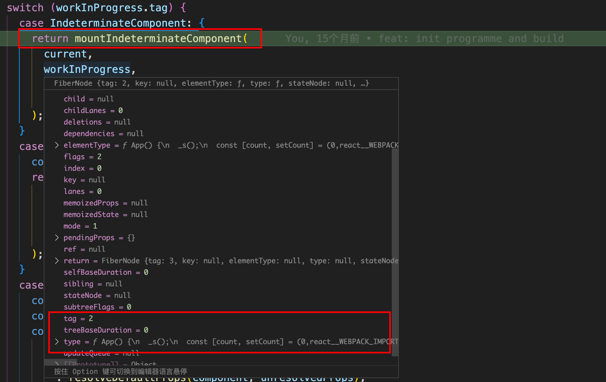

# 函数组件的加载

前面我们已经大概了解了`react`的一个整体渲染流程，在每次加载和更新的时候都会通过`performConcurrentWorkOnRoot`里的`workLoop`不断的进行`beginWork`和`completeWork`。接下来我们主要了解下函数组件的挂载和更新流程。

## 加载阶段

首先准备一个函数组件案例：
```js
function App () {
  const [count, setCount] = useState(0);

  useEffect(() => {
    console.log(count, 'useEffect');
  }, [count]);

  useLayoutEffect(() => {
    console.log(count, 'useLayoutEffect');
  }, [count]);

  const click = () => {
    setCount(count + 1);
    setCount(count + 1);
  }
  return <div onClick={() => click()}>{ count }</div> // { count }在babel编译的时候会被当成children。获取对应的值就行了 
}
```

我们就直接从`beginWork`开始。直接跳转到函数组件对应的`Fiber`节点加载。执行该`Fiber`节点的`beginWork`工作，根据`tag`类型，进入`IndeterminateComponent`待定组件的逻辑处理【`case IndeterminateComponent`】：

```js
case IndeterminateComponent: {
    return mountIndeterminateComponent(
      current,
      workInProgress,
      workInProgress.type, // 这个type存储的就是我们函数组件的函数
      renderLanes,
    );
  }
```

> 每个函数组件的首次加载都是走的`IndeterminateComponent`分支逻辑，这是因为在创建函数组件`Fiber`的时候，react没有更新它的`tag`值，所以它的首次`beginWork`工作就会进入`IndeterminateComponent`分支，在`mountIndeterminateComponent`方法中才会更新它的`tag`，使函数组件的`Fiber`在更新阶段执行`beginWork`时，能够进入正确的`FunctionComponent`分支。
>



### mountIndeterminateComponent

查看`mountIndeterminateComponent`方法：

```js
// packages\react-reconciler\src\ReactFiberBeginWork.new.js
function mountIndeterminateComponent(
  _current,
  workInProgress,
  Component,
  renderLanes,
) {
  // 取出函数组件的props
  const props = workInProgress.pendingProps;

  // 存储FirstChild内容
  let value; 
  let hasId;
      
  // 调用函数组件
  value = renderWithHooks(
    null,
    workInProgress,
    Component,
    props,
    context,
    renderLanes,
  );

  // 针对类组件和函数组件进行不同的处理
  if (
    !disableModulePatternComponents &&
    typeof value === 'object' &&
    value !== null &&
    typeof value.render === 'function' &&
    value.$$typeof === undefined
  ) {
	// 类组件的处理逻辑 【只是类组件现在已经不走这里了】

  } else {

    // 函数组件处理
    // 更新tag为函数组件类型的值，下个逻辑就可以直接进入函数组件的处理【节点更新的时候】
    workInProgress.tag = FunctionComponent;

    // 创建子节点
    reconcileChildren(null, workInProgress, value, renderLanes);
      
    return workInProgress.child;
  }
}
```

1. 首先取出当前函数组件`FIber`节点上的最新的`props`，方便函数组件加载的使用：
2. 然后调用`renderWithHooks`方法执行函数组件并返回子节点。这也是`mountIndeterminateComponent`函数最主要的逻辑。
3. 更新函数组件`fibder tag`为正确的`tag`。因为类组件的实例上必须有`render`方法，所以没有的就是函数组件了
4. 调用`reconcileChildren`根据我们调用`renderWithHooks`返回的内容生成子节点进行下一次协调。

其实函数组件的加载非常简单，`renderWithHooks`方法就是函数组件的主要加载逻辑。
这个方法会执行我们定义的函数组件，返回值就是函数中`return`的内容，也就是`jsx`内容【处理过后的`react-element`元素对象】。例如我们上面的函数组件通过`babel`编译后会长下面这样。

```js
import { jsx as _jsx } from "react/jsx-runtime";
function App() {
  const [count, setCount] = useState(0);
  useEffect(() => {
    console.log(count, 'useEffect');
  }, [count]);
  useLayoutEffect(() => {
    console.log(count, 'useLayoutEffect');
  }, [count]);
  const click = () => {
    setCount(count + 1);
    setCount(count + 1);
  };
  return /*#__PURE__*/_jsx("div", { // 通过jsx包裹起来生成react-element
    onClick: () => click(),
    children: count
  });
```

所以下面我们重点看下`renderWithHooks`函数
### renderWithHooks


```js
// packages\react-reconciler\src\ReactFiberHooks.new.js
export function renderWithHooks<Props, SecondArg>(
  current: Fiber | null,
  workInProgress: Fiber,
  Component: (p: Props, arg: SecondArg) => any,
  props: Props,
  secondArg: SecondArg,
  nextRenderLanes: Lanes,
): any {
  renderLanes = nextRenderLanes;
  // 设置为当前渲染中的Fiber，后续hooks的操作会频繁用到这个属性
  currentlyRenderingFiber = workInProgress;

  // 重置函数组件节点的数据。这一点非常重要，每次函数组件执行前都会重置
  workInProgress.memoizedState = null;
  workInProgress.updateQueue = null;
  workInProgress.lanes = NoLanes;

  // 设置首次加载的dispatcher【重点】,也就是我们后续需要使用的hooks
  ReactCurrentDispatcher.current =current === null || current.memoizedState === null
        ? HooksDispatcherOnMount
        : HooksDispatcherOnUpdate;

  // Component为workInProgress.type 如果是函数组件：就是自身函数
  // 调用这个函数，即调用组件，循环生成Element对象，
  // 将return返回的Jsx内容转换为reactElement对象，最后返回这个对象
  let children = Component(props, secondArg);
  // 重置一些信息
  renderLanes = NoLanes;
  currentlyRenderingFiber = (null: any);

  currentHook = null;
  workInProgressHook = null;
  didScheduleRenderPhaseUpdate = false;

  // 返回函数组件的内容【reactElement对象】
  return children;
}
```

`renderWithHooks`的逻辑也很清楚，我们分下面几步来说

#### 1. 确定当前函数`fiber`并初始化相关变量

首先将当前函数组件节点`workInProgress`赋值给全局变量`currentlyRenderingFiber`。变量`currentlyRenderingFiber`会在后面的逻辑中被多次用到，这里要重点注意下，后面可以回想起来即可。

接着重置函数组件`Fiber`的两个属性：

```js
workInProgress.memoizedState = null;
workInProgress.updateQueue = null;
```

然后设置`ReactCurrentDispatcher`的`current`属性值：

**注意：**`memoizedState`，`ReactCurrentDispatcher`，`updateQueue`属性是函数组件的重点内容，这几个属性与`hooks`紧密相连，后面也会多次用到。需要注意。

#### 2. 调用函数组件获取子节点

```js
let children = Component(props, secondArg);
```

这个`Component`在`mountIndeterminateComponent`传进来的`workInProgress.type`。其实就是调用我们定义的函数，也就是说函数组件的加载其实就是**执行一次我们定义的函数**：

所以函数组件的加载核心就是执行一次函数的内容，理解起来也很简单。最后触发`return`关键字，这里的`jsx`内容会在react内部通过`jsxRuntime.jsx`方法进行处理，生成`react-element`对象，最后返回值就是创建的`react`元素对象。

同时我们`hooks`也是在函数组件执行的时候进行的。这里我们后面会单独来讲`hooks`。

```js
value = renderWithHooks()
```

这里的`value`就是创建的`react`元素对象。

#### 3. 确定组件真实的tag

然后通过一个`if`语句来区分类组件和函数组件的逻辑：

```js
if (...) {
	// 类组件的处理
} else {
	// 函数组件的处理
    
    // 更新tag为函数组件类型的值，下个逻辑就可以直接进入函数组件的处理【节点更新的时候】
    workInProgress.tag = FunctionComponent;

    // 处理函数组件FirstChild内容【当前为App组件】
    reconcileChildren(null, workInProgress, value, renderLanes);
      
    return workInProgress.child;
}
```

这里区分类组件与函数组件，主要是通过`render`函数：

```js
typeof value.render === 'function'
```

因为类组件必须存在`render`函数，所以它创建的组件实例`instance`会存在`render`方法，而函数组件则不存在。

> 只是类组件的加载已经不走这里的逻辑了，具体可以查看后续累组件的加载。

函数组件初始化执行完成后，就会更新函数组件`Fiber`节点的`tag`值为正确的类型`FunctionComponent`【后续逻辑函数组件节点便可以进入`Function`分支了】。

#### 4. 调用`reconcileChildren`创建子`Fiber`节点

然后根据新建的`value`【`react`元素对象】创建子`Fiber`节点，最后返回子节点，函数组件的加载过程就基本完成了。

### completeWork

```js
function completeWork(
  current: Fiber | null,
  workInProgress: Fiber,
  renderLanes: Lanes,
): Fiber | null { //  完成任务
  const newProps = workInProgress.pendingProps;
  popTreeContext(workInProgress);
  switch (workInProgress.tag) {
    case IndeterminateComponent:
    case LazyComponent:
    case SimpleMemoComponent:
    case FunctionComponent: // 函数组件
    case ForwardRef:
    case Fragment:
    case Mode:
    case Profiler:
    case ContextConsumer:
    case MemoComponent:
      bubbleProperties(workInProgress); // 冒泡lanes和flags
      return null;
  }
}
```

函数组件的`completeWork`十分简单，就是调用`bubbleProperties`就是将孩子的`lanes`更新到`childLanes`上，方便里面找到更新的节点。

### 总结

所以可以看到函数组件的加载流程还是比较清晰的，只不过我们省略了里面`hooks`加载的重要部分。

## 更新阶段

在初始化的时候我们的函数组件`fiber tag`已经被更新为正确的值了，所以`update` 的时候会走到函数组件更新的流程：

```js
case FunctionComponent: {
  // 函数组件内容
  const Component = workInProgress.type;
  const unresolvedProps = workInProgress.pendingProps;
  const resolvedProps =
    workInProgress.elementType === Component
      ? unresolvedProps
      : resolveDefaultProps(Component, unresolvedProps);
  // 调用updateFunctionComponent更新
  return updateFunctionComponent(
    current,
    workInProgress,
    Component,
    resolvedProps,
    renderLanes,
  );
}
```

### updateFunctionComponent

```js
function updateFunctionComponent(
  current,
  workInProgress,
  Component,
  nextProps: any,
  renderLanes,
) {

  let context;
  if (!disableLegacyContext) {
    const unmaskedContext = getUnmaskedContext(workInProgress, Component, true);
    context = getMaskedContext(workInProgress, unmaskedContext);
  }

  let nextChildren;
  let hasId;
  prepareToReadContext(workInProgress, renderLanes);
  if (enableSchedulingProfiler) {
    markComponentRenderStarted(workInProgress);
  }
 
  nextChildren = renderWithHooks(
    current,
    workInProgress,
    Component,
    nextProps,
    context,
    renderLanes,
  );
  hasId = checkDidRenderIdHook();


  if (current !== null && !didReceiveUpdate) { // 如果可以优化就可以复用之前的fiber，不用走到reconcileChildren
    bailoutHooks(current, workInProgress, renderLanes);
    return bailoutOnAlreadyFinishedWork(current, workInProgress, renderLanes);
  }


  // React DevTools reads this flag.
  workInProgress.flags |= PerformedWork;
  // 获取子节点fiber
  reconcileChildren(current, workInProgress, nextChildren, renderLanes);
  return workInProgress.child;
}
```

可以看到函数组件的更新和`mountIndeterminateComponent`其实差不多。唯一不同的是返回孩子节点这部分会有个`didReceiveUpdate`的判断，这是`react`的一个优化手段，如果没有属性发生变化，我们是可以复用之前的`fiber`节点的。所以会直接返回`bailoutOnAlreadyFinishedWork`。如果不满足的话就会调用`reconcileChildren`生成新的`fiber`节点。
