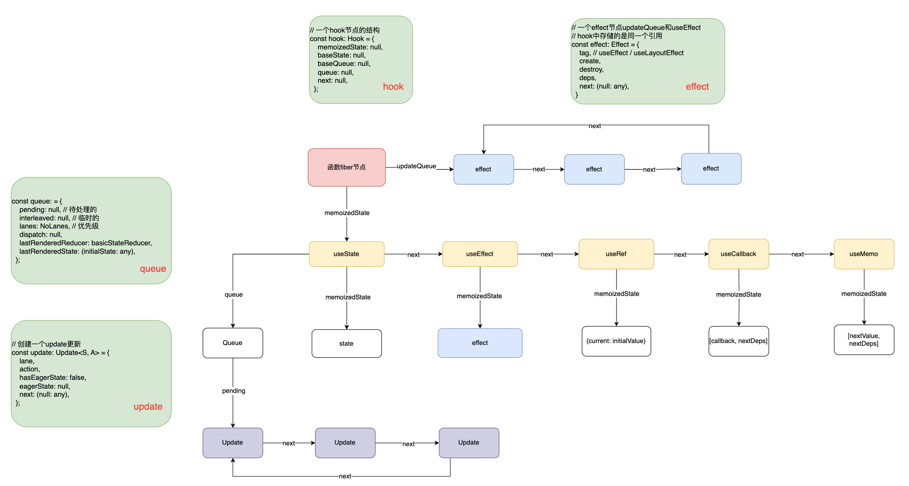

# 概览

```js
// packages\react-reconciler\src\ReactFiberHooks.new.js
export function renderWithHooks<Props, SecondArg>(
  current: Fiber | null,
  workInProgress: Fiber,
  Component: (p: Props, arg: SecondArg) => any,
  props: Props,
  secondArg: SecondArg,
  nextRenderLanes: Lanes,
): any {
  renderLanes = nextRenderLanes;
  // 设置为当前渲染中的Fiber，后续hooks的操作会频繁用到这个属性
  currentlyRenderingFiber = workInProgress;

  // 重置函数组件节点的数据。这一点非常重要，每次函数组件执行前都会重置
  workInProgress.memoizedState = null;
  workInProgress.updateQueue = null;
  workInProgress.lanes = NoLanes;

  // 设置首次加载的dispatcher【重点】,也就是我们后续需要使用的hooks
  ReactCurrentDispatcher.current =current === null || current.memoizedState === null
        ? HooksDispatcherOnMount
        : HooksDispatcherOnUpdate;

  // Component为workInProgress.type 如果是函数组件：就是自身函数
  // 调用这个函数，即调用组件，循环生成Element对象，
  // 将return返回的Jsx内容转换为reactElement对象，最后返回这个对象
  let children = Component(props, secondArg);
  
  // 重置一些信息
  renderLanes = NoLanes;
  currentlyRenderingFiber = (null: any);
  currentHook = null;
  workInProgressHook = null;
  didScheduleRenderPhaseUpdate = false;

  // 返回函数组件的内容【reactElement对象】
  return children;
}
```

我们还是从`renderWithHook`函数开始，这个函数中有几个变量我们需要重点关注。

1. `currentlyRenderingFiber`：表示当前正在渲染的`fiber`节点
2. ` workInProgress.memoizedState`：存储当前`fiber`节点的`hooks`链表
3. `ReactCurrentDispatcher`：存储当前调用的`hook`最终实现，初始化和更新阶段调用不同的`hook`实现

## ReactCurrentDispatcher

在函数调用`renderWithHook`的时候，我们会给这个变量赋值，这个变量上在不同的情况下保存这不同的`hooks`函数。

```js
  // 设置首次加载的dispatcher【重点】,也就是我们后续需要使用的hooks
  ReactCurrentDispatcher.current =current === null || current.memoizedState === null
        ? HooksDispatcherOnMount
        : HooksDispatcherOnUpdate;
```

设置`ReactCurrentDispatcher`的`current`属性值。针对是不是首次加载使用不同的`hooks`执行函数。

`ReactCurrentDispatcher`对象是一个全局变量，它是在react源码中的`react`包定义的：

```js
// packages\react\src\ReactCurrentDispatcher.js

const ReactCurrentDispatcher = {
  current: null,
};
export default ReactCurrentDispatcher;
```

然后将它包装在一个新的对象中：

```js
// packages\react\src\ReactSharedInternals.js

const ReactSharedInternals = {
  ReactCurrentDispatcher,
  ReactCurrentBatchConfig,
  ReactCurrentOwner,
};
export default ReactSharedInternals;
```

最后会在`react`包的入口文件中暴露给外部其他资源包使用：

```js
// packages\react\src\React.js
export {
  ...
  ReactSharedInternals as __SECRET_INTERNALS_DO_NOT_USE_OR_YOU_WILL_BE_FIRED,
}
```

而`shared`包【通用工具包】会引入这个对象，然后暴露给全局。前面讲`react`的包组成的时候也讲过了，`share`包就主要是提供共享模块的。

```js
// packages\shared\ReactSharedInternals.js

import * as React from 'react';

const ReactSharedInternals = React.__SECRET_INTERNALS_DO_NOT_USE_OR_YOU_WILL_BE_FIRED;
export default ReactSharedInternals;
```

其他资源包就可以通过`shared`工具包来拿到这个对象，所以我们在函数组件加载时才能使用这个对象：

```js
// packages\react-reconciler\src\ReactFiberHooks.new.js

import ReactSharedInternals from 'shared/ReactSharedInternals';
// 拿到ReactCurrentDispatcher对象
const {ReactCurrentDispatcher, ReactCurrentBatchConfig} = ReactSharedInternals;
```

知道了`ReactCurrentDispatcher`对象的由来，我们才能更好地理解它的作用，因为函数组件的每个`hook`实际就是在调用这个对象中的**同名方法**，比如`useState`：

```js
// packages\react\src\ReactHooks.js

export function useState(initialState){
  const dispatcher = resolveDispatcher();
  return dispatcher.useState(initialState);
}
```

查看`resolveDispatcher`方法：

```js
function resolveDispatcher() {
  const dispatcher = ReactCurrentDispatcher.current;
  // 返回获取到的dispatcher
  return dispatcher;
}
```

`useState`里面的`dispatcher`就是上面的`ReactCurrentDispatcher.current`对象。

```js
dispatcher.useState(initialState); 
// 等同于
ReactCurrentDispatcher.current.useState(initialState)
```

其他的`hook`也是一样的原理，所以理解`ReactCurrentDispatcher`对象才能知道`hooks`的本质。

## 函数fiber+hook组织形式



通过这张图片可以很好的展示出`fiber`节点和`hook`是如何组织起来的。函数的`fiber`节点有两个重要属性：

- `updateQueue`：存储的是`effect`副作用，在最后`commit`阶段会调用。`useEffect / useLayoutEffect`此类`hooks`会添加
- `memoizedState`：存储的是当前函数`fiber`节点的`hooks`链表。
