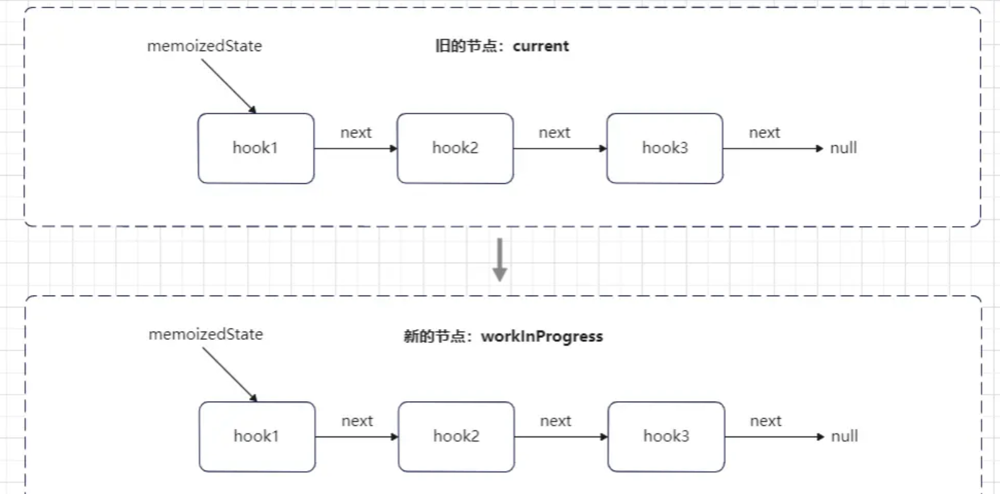
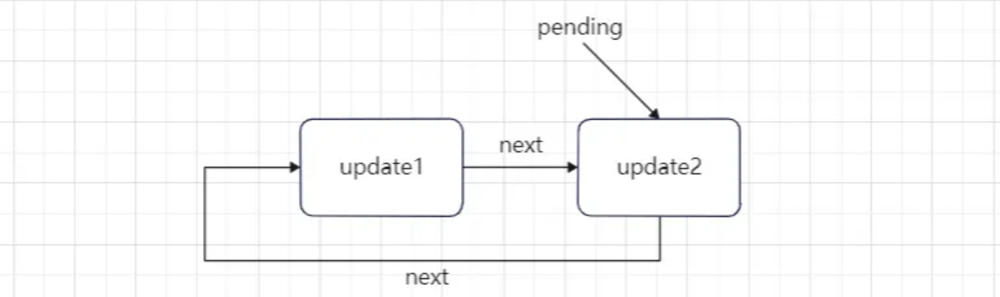
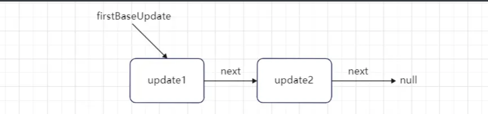

# useState

## mount阶段

首先查看`useState`的初始化：

```js
export function useState(initialState){
  const dispatcher = resolveDispatcher();
  return dispatcher.useState(initialState);
  // 等同于
  return ReactCurrentDispatcher.current.useState(initialState)
}
```

所以我们得先查看当前的`ReactCurrentDispatcher`对象。在第一次加载的时候显然为`HooksDispatcherOnMount`。

```ini
  // 设置首次加载的dispatcher【重点】,也就是我们后续需要使用的hooks
ReactCurrentDispatcher.current =current === null || current.memoizedState === null
      ? HooksDispatcherOnMount
      : HooksDispatcherOnUpdate;
```

继续查看`HooksDispatcherOnMount`对象：

```js
// packages\react-reconciler\src\ReactFiberHooks.new.js

const HooksDispatcherOnMount: Dispatcher = {
  readContext,

  useCallback: mountCallback,
  useContext: readContext,
  useEffect: mountEffect,
  useImperativeHandle: mountImperativeHandle,
  useLayoutEffect: mountLayoutEffect,
  useInsertionEffect: mountInsertionEffect,
  useMemo: mountMemo,
  useReducer: mountReducer,
  useRef: mountRef,
  useState: mountState, // 加载state
  useDebugValue: mountDebugValue,
  useDeferredValue: mountDeferredValue,
  useTransition: mountTransition,
  useMutableSource: mountMutableSource,
  useSyncExternalStore: mountSyncExternalStore,
  useId: mountId,

  unstable_isNewReconciler: enableNewReconciler,
};
```

可以发现，所有`hooks`在加载时都是在调用`HooksDispatcherOnMount`对象的同名方法。这里我们只关注`useState: mountState`

### mountState

查看`mountState`方法：

```js
// packages\react-reconciler\src\ReactFiberHooks.old.js

function mountState(initialState) {
  // 生成当前hook节点，并形成链表
  const hook = mountWorkInProgressHook();
  if (typeof initialState === 'function') {
    initialState = initialState();
  }
  hook.memoizedState = hook.baseState = initialState; // 赋值
  const queue = {
    pending: null, // 等待处理的update链表
    lanes: NoLanes,
    dispatch: null, // dispatchSetState方法
    lastRenderedReducer: basicStateReducer, // 一个函数，通过action和lastRenderedState计算最新的state
    lastRenderedState: initialState, // 上一次的state
  };
  hook.queue = queue; // 等同于fiber的 updateQueue
  const dispatch = queue.dispatch = dispatchSetState.bind(null, currentlyRenderingFiber, queue) // 绑定currentlyRenderingFiber
  # 返回值
  return [hook.memoizedState, dispatch];
}
```

首先调用`mountWorkInProgressHook`方法，创建了一个`hook`对象。

##### mountWorkInProgressHook

继续查看`mountWorkInProgressHook`方法：

```js
function mountWorkInProgressHook(): Hook {
  // hook对象
  const hook: Hook = {
    memoizedState: null,
    baseState: null,
    baseQueue: null,
    queue: null,
    next: null, // 形成链表
  };

  if (workInProgressHook === null) {
    // 第一个hook。currentlyRenderingFiber被复制为当前渲染的fiber
    currentlyRenderingFiber.memoizedState = workInProgressHook = hook;
  } else {
    // 后面的hook对象添加到第一个hook的next属性上，形成一个单向链表
    workInProgressHook = workInProgressHook.next = hook;
  }
  return workInProgressHook;
}
```

首先创建一个`hook`对象，`workInProgressHook`默认为`null`，它代表当前正在处理中的`hook`对象。

当前`useState`为函数组件中的第一个调用的`hook`，所以这时`workInProgressHook`肯定为`null`：

将新建`hook`对象赋值给`workInProgressHook`，表示为正在处理中的`hook`对象。

同时也将第一个`hook`对象赋值给当前函数组件`Fiber`节点的`memoizedState`属性。

此时函数组件`Fiber`节点的`memoizedState`属性指向为：


最后返回新建的`hook`对象。

继续回到`mountState`方法中：

```js
... 
const hook = mountWorkInProgressHook();
if (typeof initialState === 'function') {
  initialState = initialState();
}
hook.memoizedState = hook.baseState = initialState;
...
```

在`hook`新建完成之后，判断传入的参数`initialState`是否为函数，如果为函数则调用此函数，将结果赋值为新的`initialState`。

然后设置`hook`对象的`memoizedState`和`baseState`属性为初始的数据`initialState`。

接着看`mountState`方法剩下的内容：

```js
function mountState(initialState) {
  /** 省略其他代码 */
  
  const queue = {
    pending: null,
    lanes: NoLanes,
    dispatch: null, // dispatchSetState方法
    lastRenderedReducer: basicStateReducer, // 一个函数，通过action和lastRenderedState计算最新的state
    lastRenderedState: (initialState: any), // 上一次的state
  };
  hook.queue = queue; // 设置队列
  const dispatch = queue.dispatch = dispatchSetState.bind(null, currentlyRenderingFiber, queue)
  return [hook.memoizedState, dispatch];
}
```

创建一个`queue`对象，这里要注意以下属性：

- `lastRenderedReducer`：它是一个函数，作用是根据`action`和`lastRenderedState`计算最新的`state`。

```js
function basicStateReducer(state, action) {
  // action就是setCount传入的参数，如果为一个函数，则将state传入进行计算，返回新的state
  // 如果不是函数，则action就是最新的state
  return typeof action === 'function' ? action(state) : action;
}
```

- `lastRenderedState`：代表上一次渲染的`state`。
- `pending`：后续`dispatch`产生的更新放在`pending`上。

然后更新`hook`对象的`queue`属性，同时设置`queue`对象的`dispatch`属性为一个修改函数`dispatchSetState`，

最后返回一个数组，这就是`useState hook`的返回值：一个初始`state`和一个修改函数。

```js
const [count, setCount] = useState(1)
```

到此，函数组件的`useState `初始化完成。

## update阶段

当我们在函数组件中调用`dispatch`出发更新的时候，实际上调用的是`dispatchSetState`。例如下面的代码

```js
const [state, setState] = useState(1);
setState(2);
// 等价于
dispatchSetState(currentlyRenderingFiber, queue, 2);
```

所以我们先从`dispatchSetState`函数出发：

```js
// packages\react-reconciler\src\ReactFiberHooks.new.js
function dispatchSetState<S, A>(
  fiber: Fiber,
  queue: UpdateQueue<S, A>,
  action: A, // state 1
) {
    
  // 请求更新优先级
  const lane = requestUpdateLane(fiber);
  // 创建update更新对象
  const update: Update<S, A> = {
    lane,
    action, // state 1
    hasEagerState: false,
    eagerState: null,
    next: (null: any),
  };

  if (isRenderPhaseUpdate(fiber)) {
    enqueueRenderPhaseUpdate(queue, update);
  } else {
    // 调度之前的一个优化策略校验: eagerState
    // 快速计算出本次最新的state，与原来的进行对比，如果没有发生变化，则跳过后续的更新逻辑
    const alternate = fiber.alternate;
    if (fiber.lanes === NoLanes && (alternate === null || alternate.lanes === NoLanes)) {
      const lastRenderedReducer = queue.lastRenderedReducer;
      if (lastRenderedReducer !== null) {
        let prevDispatcher;
        try {
          const currentState: S = (queue.lastRenderedState: any);
          const eagerState = lastRenderedReducer(currentState, action);
          update.hasEagerState = true;
          update.eagerState = eagerState;
          if (is(eagerState, currentState)) {
            enqueueConcurrentHookUpdateAndEagerlyBailout(fiber, queue, update);
            return;
          }
        } catch (error) {
          // Suppress the error. It will throw again in the render phase.
        } finally {
          // nothing
        }
      }
    }
	
    // 将更新对象入队
    const root = enqueueConcurrentHookUpdate(fiber, queue, update, lane);
    if (root !== null) {
      const eventTime = requestEventTime();
      // 开启一个新的调度更新任务
      scheduleUpdateOnFiber(root, fiber, lane, eventTime);
      entangleTransitionUpdate(root, queue, lane);
    }
  }
}
```

`dispatchSetState`方法的整个结构和类组件的更新方法`enqueueSetState`基本相同，还有react应用的初始加载`updateContainer`，其实一个react应用的更新场景就只有这三种，而它们的更新逻辑就是以下几个步骤：

- 获取更新优先级`lane`。
- 创建`update`更新对象 。
- 将`update`更新对象添加到目标`Fiber`对象的更新队列中。
- 开启一个新的调度更新任务。

所以搞清楚了这个逻辑对于理解`react`的更新有很大的帮助。

它们的区别主要在于函数组件这里在调度之前有一个`eagerState`优化策略校验：

```js
// 当前的state，即旧的state
const currentState: S = (queue.lastRenderedState: any);
// 快速计算最新的state
const eagerState = lastRenderedReducer(currentState, action);
update.hasEagerState = true;
update.eagerState = eagerState;
// 比较新旧state
if (is(eagerState, currentState)) {
  enqueueConcurrentHookUpdateAndEagerlyBailout(fiber, queue, update);
  return;
}
```

这个优化策略的作用是：调用 `queue.lastRenderedReducer`方法，通过原来的`state`和当前传入的`action`参数，快速的计算出本次最新的`state`【即`eagerState`】，通过比较新旧`state`来判断数据是否变化，如果没有变化则可以跳过后续的更新逻辑，即不会开启新的调度更新任务。当前我们的`state`是有变化的，所以不满足优化策略，将继续向下执行更新。

> `eagerState`优化策略针对的是单次触发状态修改的校验，`updateReducer`中最后的`Bailout`策略针对的是一个状态，经过`updateQueue`链表循环计算出最新的结果后，再次的校验状态是否发生变化，如果没有发生变化则进入`Bailout`策略。一个状态在一个事件回调被多次修改，就会将所有创建的`update`对象添加到此`hook`对象的`updateQueue`链表中。

其次是函数组件和类组件的`update`更新对象结构不同【其中类组件和应用更新共用同一个`update`对象结构】。

接下来我们首先看函数组件中`update`对象的定义：

```js
const update = {
  lane,
  action, // state数据 1， 也可以是一个函数
  hasEagerState: false,
  eagerState: null, // 急切的state 根据action计算
  next: null, // 指向下一个update对象
};

// 类组件和应用更新
const update = {
    eventTime, // 事件
    lane,
    tag: UpdateState, // 触发方式， setState / forceUpdate
    payload: null, // 更新内容
    callback: null, // 毁掉函数

    next: null,
  };
```

这里的`action`属性存储的就是`setCount`的传入参数，也就是新的`state`数据（在我们的例子中是2）

然后调用`enqueueConcurrentHookUpdate`方法，将`update`对象添加到队列。并放置在`queue`属性的`interleaved`属性上

下面查看`enqueueConcurrentHookUpdate`方法：

```js
export function enqueueConcurrentHookUpdate<S, A>(
  fiber: Fiber,
  queue: HookQueue<S, A>,
  update: HookUpdate<S, A>,
  lane: Lane,
) {
  const interleaved = queue.interleaved;
  if (interleaved === null) {
    update.next = update;
    pushConcurrentUpdateQueue(queue);
  } else {
    update.next = interleaved.next;
    interleaved.next = update;
  }
  queue.interleaved = update;
}
```

首先取出`queue`的`interleaved`属性，如果`interleaved`为`null`，表示为当前的`update1`为第一个入队的更新对象，将此`update1`的`next`属性指向自身，形成一个单向环状链表。

然后调用了一个`pushConcurrentUpdateQueue`方法，这个方法的作用是将`queue`备份到一个并发队列`concurrentQueues`之中，方便在之后将`queue.interleaved`的内容转移到`queue.pending`之上。

> `interleaved`只是一个临时存储`update`链表的属性，最终会在更新之前转移到`pending`属性之上用于计算。最后设置`queue.interleaved`为当前的`update`对象。

回到`dispatchSetState`方法中，这个方法最后会调用`scheduleUpdateOnFiber`函数进入更新的调度程序。然后又会通过`beginWork`到函数组件的更新部分。

```js
function updateFunctionComponent(
  current,
  workInProgress,
  Component,
  nextProps: any,
  renderLanes,
) {
...
  nextChildren = renderWithHooks(
    current,
    workInProgress,
    Component,
    nextProps,
    context,
    renderLanes,
  );
...
}
```

```js
// packages\react-reconciler\src\ReactFiberHooks.new.js
export function renderWithHooks<Props, SecondArg>(
  current: Fiber | null,
  workInProgress: Fiber,
  Component: (p: Props, arg: SecondArg) => any,
  props: Props,
  secondArg: SecondArg,
  nextRenderLanes: Lanes,
): any {
  renderLanes = nextRenderLanes;
  // 设置为当前渲染中的Fiber，后续hooks的操作会频繁用到这个属性
  currentlyRenderingFiber = workInProgress;

  // 重置函数组件节点的数据。这一点非常重要，每次函数组件执行前都会重置
  workInProgress.memoizedState = null;
  workInProgress.updateQueue = null;
  workInProgress.lanes = NoLanes;

  // 设置首次加载的dispatcher【重点】,也就是我们后续需要使用的hooks
  ReactCurrentDispatcher.current =current === null || current.memoizedState === null
        ? HooksDispatcherOnMount
        : HooksDispatcherOnUpdate;

  // Component为workInProgress.type 如果是函数组件：就是自身函数
  // 调用这个函数，即调用组件，循环生成Element对象，
  // 将return返回的Jsx内容转换为reactElement对象，最后返回这个对象
  let children = Component(props, secondArg);
  // 重置一些信息
  renderLanes = NoLanes;
  currentlyRenderingFiber = (null: any);

  currentHook = null;
  workInProgressHook = null;
  didScheduleRenderPhaseUpdate = false;

  // 返回函数组件的内容【reactElement对象】
  return children;
}
```

最后还是会走到`renderWithHooks`的逻辑中，只不过这一次` ReactCurrentDispatcher.current`会被赋值为`HooksDispatcherOnUpdate`。然后调用`Component`开始进行函数组件的执行。从而又会走到`useState`的逻辑。

```js
const HooksDispatcherOnUpdate: Dispatcher = {
  readContext,

  useCallback: updateCallback,
  useContext: readContext,
  useEffect: updateEffect,
  useImperativeHandle: updateImperativeHandle,
  useInsertionEffect: updateInsertionEffect,
  useLayoutEffect: updateLayoutEffect,
  useMemo: updateMemo,
  useReducer: updateReducer,
  useRef: updateRef,
  useState: updateState,
  useDebugValue: updateDebugValue,
  useDeferredValue: updateDeferredValue,
  useTransition: updateTransition,
  useMutableSource: updateMutableSource,
  useSyncExternalStore: updateSyncExternalStore,
  useId: updateId,

  unstable_isNewReconciler: enableNewReconciler,
};
```

```js
export function useState<S>(
  initialState: (() => S) | S,
): [S, Dispatch<BasicStateAction<S>>] {
  const dispatcher = resolveDispatcher();
  return dispatcher.useState(initialState); // 等价于调用updateState
}
```

最后会调用到`HooksDispatcherOnUpdate`上的`useState`，也就是`updateState`。

```js
function updateState<S>(
  initialState: (() => S) | S,
): [S, Dispatch<BasicStateAction<S>>] {
  return updateReducer(basicStateReducer, (initialState: any));
}
```

继续查看`updateReducer`方法：

```js
function updateReducer(reducer, initialArg, init?){
  // 更新hook工作
  const hook = updateWorkInProgressHook();
 
  ... // 省略代码

}
```

这里我们先省略`updateReducer`方法的其他代码，只看它的第一行代码逻辑。

调用了一个`updateWorkInProgressHook`方法，返回了一个`hook`对象。

##### updateWorkInProgressHook

查看`updateWorkInProgressHook`方法：

```js
function updateWorkInProgressHook(): Hook {

  // 即将处理的hook
  let nextCurrentHook: null | Hook;
  // 第一此进入更新时，currentHook为null
  if (currentHook === null) {
    // 取出当前正在更新的函数组件Fiber的旧节点
    const current = currentlyRenderingFiber.alternate;
    // 更新阶段，current都是存在的
    if (current !== null) {
      // 将旧节点的memoizedState 设置为下一个处理的Hook
      // 将组件加载时，初始化的hook链表取出，memoizedState指向的是hook1
      nextCurrentHook = current.memoizedState;
    } else {
      nextCurrentHook = null;
    }
  } else {
    // 从第二个hook更新开始，会走这里
    nextCurrentHook = currentHook.next;
  }

  // 设置下一个工作中的Hook为null
  let nextWorkInProgressHook: null | Hook;
  // 组件的第一个Hook更新时，workInProgressHook为null
  if (workInProgressHook === null) {
    // 将当前函数组件Fiber节点的memoizedState 设置为下一个处理的hook【默认是null】
    nextWorkInProgressHook = currentlyRenderingFiber.memoizedState;
  } else {
    // 如果不是第一个Hook，则取next指向的下一个
    nextWorkInProgressHook = workInProgressHook.next;
  }

  // 下一个不为null， 说明当前hook不是最后一个更新的hook，只有最后一个hook更新时，nextWorkInProgressHook才为null
  if (nextWorkInProgressHook !== null) {
    // There's already a work-in-progress. Reuse it.
    workInProgressHook = nextWorkInProgressHook;
    nextWorkInProgressHook = workInProgressHook.next;

    currentHook = nextCurrentHook;
  } else {
    // Clone from the current hook.

    if (nextCurrentHook === null) {
      throw new Error('Rendered more hooks than during the previous render.');
    }

    // 更新currentHook 为第一个hook
    currentHook = nextCurrentHook;

    // 创建一个新的Hook对象，复用原来的内容
    const newHook: Hook = {
      memoizedState: currentHook.memoizedState,

      baseState: currentHook.baseState,
      baseQueue: currentHook.baseQueue,
      queue: currentHook.queue,

      next: null, // 但是清空了next指向
    };

    // 第一个hook更新时，workInProgressHook为null，会进入这里
    if (workInProgressHook === null) {
      // This is the first hook in the list.
      // 更新当前函数的组件的memoizedState为第一个hook对象，同时设置为当前正在工作中的hook
      currentlyRenderingFiber.memoizedState = workInProgressHook = newHook;
    } else {
      // Append to the end of the list.
      // 非第一个Hook,直接添加到上一个hook对象的next属性中
      workInProgressHook = workInProgressHook.next = newHook;
    }
  }
  // 返回当前正在工作中的hook
  return workInProgressHook;
}
```

就像函数组件的`hook`在加载时都会调用一个`mountWorkInProgressHook`方法，生成一个`hook`链表。

而函数组件的`hook`在更新时也会调用一个`updateWorkInProgressHook`方法，生成对应的`hook`链表。

所以`updateWorkInProgressHook`方法的作用是：确定当前函数`Fiber`节点的`memoizedState`属性内容，也就是生成它的`hook`链表。它的做法就是从`current`节点上取出函数组件加载时生成的`hook`链表，按顺序取出原来的hook对象，根据原来的对象信息创建生成新的`newHook`对象，最后按顺序一个一个添加到新的`Fiber`节点的`memoizedState`属性上。



下面我们开始看它的具体执行过程：

函数组件第一个`hook`的更新，所以`currentHook`为`null`，从当前函数组件`Fiber`的`alternate`属性取出旧的节点`current`，因为函数组件在加载时，生成`hook`链表存储在`current.memoizedState`属性上，所以这里需要用到`current`节点。

然后判断`current`是否为`null`，在每个函数组件的更新阶段，它的`current`节点必然是存在的，所以这里直接取出`current.memoizedState`的内容：即函数组件加载时的第一个`hook`对象，也就是上图对应的`hook1`，这里将`hook1`赋值给`nextCurrentHook`。

然后判断`workInProgressHook`是否为`null`，同理当前为第一个`hook`的更新，所以`workInProgressHook`为`null`:

```js
if (workInProgressHook === null) {
    // 将当前函数组件Fiber节点的memoizedState 设置为下一个处理的hook【默认是null】
    nextWorkInProgressHook = currentlyRenderingFiber.memoizedState;
  } else {
    // 如果不是第一个Hook，则取next指向的下一个
    nextWorkInProgressHook = workInProgressHook.next;
  }
```

这时将当前函数组件`Fiber`节点的`memoizedState`属性赋值给`nextWorkInProgressHook`，很明显当前节点的`memoizedState`属性为`null`，因为函数组件在每次进入`renderWithHooks`方法时，都重置了它的`memoizedState`属性。

```js
export function renderWithHooks() {
  ...
  workInProgress.memoizedState = null;
  workInProgress.updateQueue = null;
}
```

所以此时`nextWorkInProgressHook`为`null`：

下面判断`nextWorkInProgressHook`的值是否为`null`，来进行不同的处理，当前它的值为`null`，进入`else`分支处理：

```js
function updateWorkInProgressHook(): Hook {
  ...
  if (nextWorkInProgressHook !== null) {
	...
  } else {
    if (nextCurrentHook === null) {
      throw new Error('Rendered more hooks than during the previous render.');
    }
    // 更新currentHook 为第一个hook
    currentHook = nextCurrentHook;
    // 创建一个新的Hook对象，复用原来的内容
    const newHook: Hook = {
      memoizedState: currentHook.memoizedState,
      baseState: currentHook.baseState,
      baseQueue: currentHook.baseQueue,
      queue: currentHook.queue,

      next: null, // 但是清空了next指向
    };
    // 第一个hook更新时，workInProgressHook为null，会进入这里
    if (workInProgressHook === null) {
      // 更新当前函数的组件的memoizedState为第一个hook对象，同时设置为当前正在工作中的hook
      currentlyRenderingFiber.memoizedState = workInProgressHook = newHook;
    } else {
      // 非第一个Hook,直接添加到上一个hook对象的next属性中
      workInProgressHook = workInProgressHook.next = newHook;
    }
  }
  // 返回当前正在工作中的hook
  return workInProgressHook;
}
```

直接更新`currentHook`为第一个`Hook`对象，然后新建一个`hook`对象，将`currentHook`的所有内容复制到新的hook对象上，但是清空了`next`指向。

**注意：**这里是一个重点，如果没有清空`next`属性，那更新当前函数组件`Fiber`节点的`memoizedState`属性，直接拿到第一个hook对象，就可以拿到整个`hook`链表，然后后续的`hook`更新就不需要再调用`updateWorkInProgressHook`方法了。但是函数组件为啥不能如此处理呢？因为react不能保证开发者是一定按照规范来使用的`hook`，如果开发者将`hook`置于条件语句中，在更新阶段出现了原来`hook`链表中不存在的`hook`对象，则在渲染时就会发生异常，所以react在函数组件更新时需要主动中断`hook`对象的`next`属性指向，按原来的链表顺序重新一个一个添加，如果出现了不匹配的`hook`对象，就会主动抛出异常，提示用户：

```js
if (nextCurrentHook === null) {
   // 当前渲染时，比原来出现了更多的hook
   throw new Error('Rendered more hooks than during the previous render.');
}
```

最后将第一个`newHook`对象赋值给当前函数组件`Fiber`节点的`memoizedState`属性，后续其他的`newHook`对象则添加到上一个hook的`next`属性之上，形成一个新的`Hook`链表，这就是`updateWorkInProgressHook`方法的作用。

#### 计算state

下面我们再回到`updateReducer`方法中：

```js
function updateReducer<S, I, A>(
  reducer: (S, A) => S,
  initialArg: I,
  init?: I => S,
): [S, Dispatch<A>] {
  // 返回新的hook对象
  const hook = updateWorkInProgressHook();
  const queue = hook.queue;

  if (queue === null) {
    throw new Error(
      'Should have a queue. This is likely a bug in React. Please file an issue.',
    );
  }

  queue.lastRenderedReducer = reducer; // 还是basicStateReducer，无变化
  const current = currentHook; // 旧的hook对象，加载时useState创建的hook对象
  // The last rebase update that is NOT part of the base state.
  let baseQueue = current.baseQueue;

  // The last pending update that hasn't been processed yet.
  // 等待处理的更新链表：默认指向的是最后一个update对象
  const pendingQueue = queue.pending;
  if (pendingQueue !== null) {
    // pendingQueue不为null，代表有需要处理的更新对象，然后需要将它们添加到baseQueue
    if (baseQueue !== null) {
      // Merge the pending queue and the base queue.
      const baseFirst = baseQueue.next;
      const pendingFirst = pendingQueue.next;
      baseQueue.next = pendingFirst;
      pendingQueue.next = baseFirst;
    }
    current.baseQueue = baseQueue = pendingQueue;
    queue.pending = null;
  }

  if (baseQueue !== null) {
    // 我们有一个队列要处理
    const first = baseQueue.next;
    let newState = current.baseState;

    let newBaseState = null;
    let newBaseQueueFirst = null;
    let newBaseQueueLast = null;
    let update = first;
     
    # 循环处理update更新对象
    do {
      // An extra OffscreenLane bit is added to updates that were made to
      // a hidden tree, so that we can distinguish them from updates that were
      // already there when the tree was hidden.
      const updateLane = removeLanes(update.lane, OffscreenLane);
      const isHiddenUpdate = updateLane !== update.lane;

      // Check if this update was made while the tree was hidden. If so, then
      // it's not a "base" update and we should disregard the extra base lanes
      // that were added to renderLanes when we entered the Offscreen tree.
      const shouldSkipUpdate = isHiddenUpdate
        ? !isSubsetOfLanes(getWorkInProgressRootRenderLanes(), updateLane)
        : !isSubsetOfLanes(renderLanes, updateLane);

      if (shouldSkipUpdate) {
        // Priority is insufficient. Skip this update. If this is the first
        // skipped update, the previous update/state is the new base
        // update/state.
        const clone: Update<S, A> = {
          lane: updateLane,
          action: update.action,
          hasEagerState: update.hasEagerState,
          eagerState: update.eagerState,
          next: (null: any),
        };
        if (newBaseQueueLast === null) {
          newBaseQueueFirst = newBaseQueueLast = clone;
          newBaseState = newState;
        } else {
          newBaseQueueLast = newBaseQueueLast.next = clone;
        }
        // Update the remaining priority in the queue.
        // TODO: Don't need to accumulate this. Instead, we can remove
        // renderLanes from the original lanes.
        currentlyRenderingFiber.lanes = mergeLanes(
          currentlyRenderingFiber.lanes,
          updateLane,
        );
        markSkippedUpdateLanes(updateLane);
      } else {
        // This update does have sufficient priority.

        if (newBaseQueueLast !== null) {
          const clone: Update<S, A> = {
            // This update is going to be committed so we never want uncommit
            // it. Using NoLane works because 0 is a subset of all bitmasks, so
            // this will never be skipped by the check above.
            lane: NoLane,
            action: update.action,
            hasEagerState: update.hasEagerState,
            eagerState: update.eagerState,
            next: (null: any),
          };
          newBaseQueueLast = newBaseQueueLast.next = clone;

        // Process this update.
        if (update.hasEagerState) {
          // If this update is a state update (not a reducer) and was processed eagerly,
          // we can use the eagerly computed state
          newState = ((update.eagerState: any): S);
        } else {
          const action = update.action;
          newState = reducer(newState, action);
        }
      }
      update = update.next;
    } while (update !== null && update !== first);

        
    if (newBaseQueueLast === null) {
      newBaseState = newState;
    } else {
      newBaseQueueLast.next = (newBaseQueueFirst: any);
    }

	# 【重点】如果对某一个状态多次修改的最终结果是无变化，则会设置全局变量ReceivedUpdate为false，方便后续进入Bailout策略
    if (!is(newState, hook.memoizedState)) {
      markWorkInProgressReceivedUpdate();
    }

    hook.memoizedState = newState;
    hook.baseState = newBaseState;
    hook.baseQueue = newBaseQueueLast;

    queue.lastRenderedState = newState;
  }

  const dispatch: Dispatch<A> = (queue.dispatch: any);
  return [hook.memoizedState, dispatch];
}
```

在`updateWorkInProgressHook`方法调用完成之后，返回值就是`useState`对应的`hook`对象：

取出`hook`对象的`queue`队列，如果`queue`为`null`，则会抛出错误：

```js
if (queue === null) {
  throw new Error(
    'Should have a queue. This is likely a bug in React. Please file an issue.',
  );
}
```

后面的逻辑看似比较多，但其实比较简单，而且和`this.setState`计算`state`的逻辑基本一致。

**它的核心逻辑：**按顺序正向循环`update`更新队列，定义一个变量`newState`来存储最新的`state`，然后根据原来`state`和`update`对象里面的信息计算最新的数据更新变量`newState`，每循环一次就会从`update`对象的`next`属性取出下一个参与计算的`update`，直接到所有的`update`处理完成。

当前`pendingQueue`结构【单向环状链表】：



在类组件中，会根据`pendingQueue`的内容重构生成一个新的单向链表，不再是环状，有明确的结束。



和类组件不同的是，函数组件这里并没有额外处理`pendingQueue`，而是直接复制给`baseQueue`，从`baseQueue.next`取出第一个`update`对象【即`first`】开始计算`state`。

所以函数组件这里的`do while`循环多了一个结束的判断条件，就是不能等于`first`，不然就会陷入无限循环：

```sql
do {
 ...
} while (update !== null && update !== first)
```

然后就是函数组件计算`state`的逻辑：

```js
// do while循环中，计算state的核心逻辑
if (update.hasEagerState) {
  newState = ((update.eagerState: any): S);
} else {
  const action = update.action;
  newState = reducer(newState, action);
}
```

- 如果`eagerState`存在，则直接使用`eagerState`的值为新的`state`。
- 如果不存在，则调用`reducer`【`basicStateReducer`】，根据最新的`newState`和当前`update`对象的`action`重新计算`state`。

循环结束，在更新`state`之前，还有一个校验需要注意：

```js
// 【重点】如果对某一个状态多次修改的最终结果是无变化，则会设置全局变量ReceivedUpdate为false，方便后续进入Bailout策略
if (!is(newState, hook.memoizedState)) {
  markWorkInProgressReceivedUpdate();
}
```

在针对一个状态的批量处理之后，有一个状态变化的校验，针对的是函数组件内部的`Bailout`策略。

即如果对某一个状态多次修改的最终结果是无变化，则会设置全局变量`ReceivedUpdate`为`false`，表示改组件没有更新的内容，这样就可以在`renderWithHooks`方法执行完成后，进入`Bailout`策略。

然后更新`hook`对象的`memoizedState`属性为最新的`newState`：

```js
// 存储最新的state
hook.memoizedState = newState;
```

到此，`useState hook`的更新程序执行完成，最后返回结果：

```js
// 记忆state
return [hook.memoizedState, dispatch];
```

同时这里我们也可以明白：函数组件`useState hook`能够缓存变量结果的原因，因为它的`state`存储在`hook`对象的属性之中，并且这个属性可以在函数组件重新渲染过程中得到更新。
