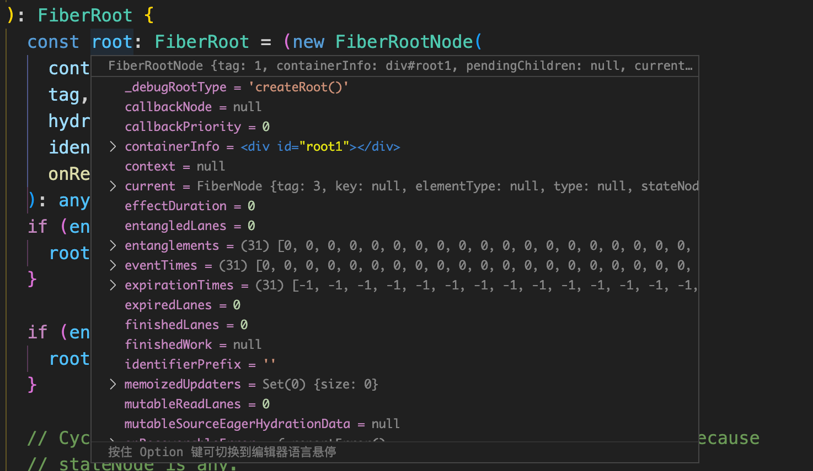
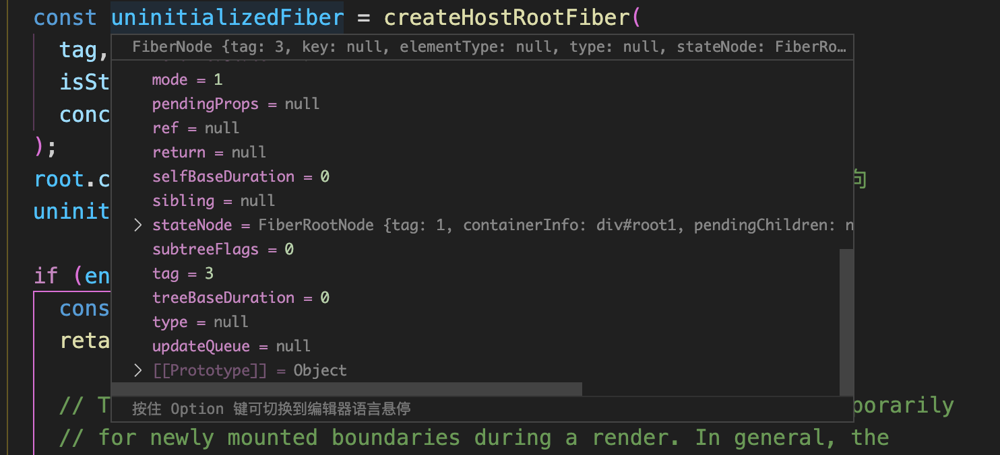
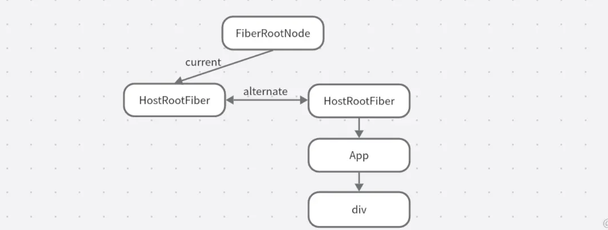
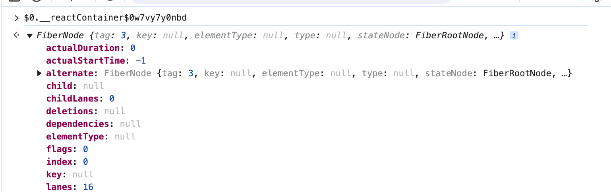
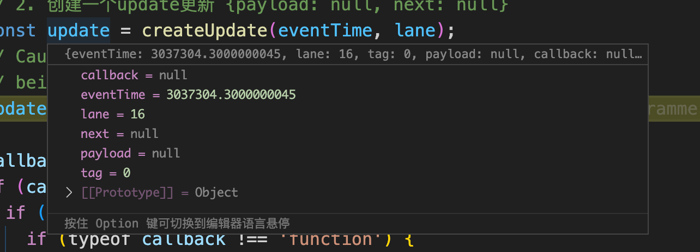
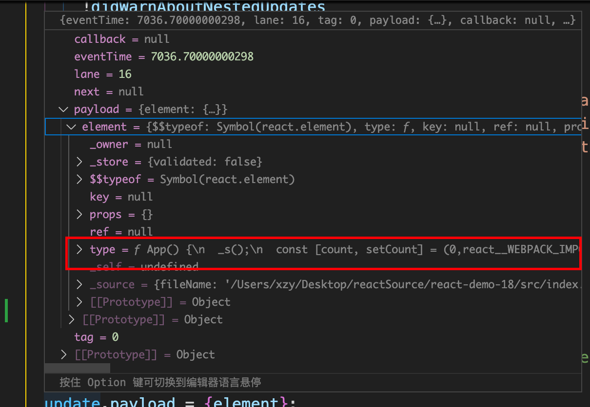

# 首次渲染

## 应用入口

根据`React18`版本，每一个`React`应用的入口都是从`react-dom`这个源码包中引入一个`ReactDOM`对象，然后调用`createRoot`方法进行一系列的初始化准备，这个方法会返回一个`root`对象【`ReactDOMRoot`构造函数的实例】，最后调用`root.render()`方法开始一个`React`应用的加载渲染。

```js
import React from 'react';
import ReactDOM from 'react-dom/client';

const root = ReactDOM.createRoot(document.getElementById('root'));
root.render(<App />);
```

所以接下来我们就从`createRoot`入手大概了解下`react`首次渲染的基本流程

### createRoot

```js
// packages\react-dom\src\client\ReactDOM.js
function createRoot(
  container: Element | Document | DocumentFragment,
  options?: CreateRootOptions,
): RootType {
      
  return createRootImpl(container, options);
}
```

`createRoot`主要就是调用`createRootImpl`。这里`createRootImpl`方法为`ReactDOMRoot.js`文件中的`createRoot`方法。

```js
// packages\react-dom\src\client\ReactDOMRoot.js

export function createRoot(
  container: Element | Document | DocumentFragment, // container: 默认是#root dom元素
  options?: CreateRootOptions,
): RootType {

  // 校验container是否为合法的dom元素
  if (!isValidContainer(container)) {
    throw new Error('createRoot(...): Target container is not a DOM element.');
  }

  // 开发环境校验警告
  warnIfReactDOMContainerInDEV(container);

  // 默认严格模式为false
  let isStrictMode = false;
  let concurrentUpdatesByDefaultOverride = false;
  let identifierPrefix = '';
  let onRecoverableError = defaultOnRecoverableError;
  let transitionCallbacks = null;
  ...

  // 创建root应用根节点对象,为FiberRootNode类型: 
  // 注：ConcurrentRoot为1，代表了v18版本的并发渲染模式
  const root = createContainer(
    container,
    ConcurrentRoot, // 1 默认开启并发模式
    null,
    isStrictMode,
    concurrentUpdatesByDefaultOverride,
    identifierPrefix,
    onRecoverableError,
    transitionCallbacks,
  );

  // 给#root DOM元素设置一个内部属性，存储root.current 即HostFiber对象
  markContainerAsRoot(root.current, container);

  const rootContainerElement: Document | Element | DocumentFragment =
    container.nodeType === COMMENT_NODE
      ? (container.parentNode: any)
      : container;

  // 监听[#root dom元素]的所有事件
  listenToAllSupportedEvents(rootContainerElement);

  # 创建ReactDOMRoot实例对象并返回 将root应用根节点对象 存储为ReactDOM的内部对象
  return new ReactDOMRoot(root);
}
```

`createRoot`方法首先对传入的`container`【`#root`】容器元素进行合法校验：

- 校验失败，抛出异常，停止应用加载。
- 校验成功，继续向下执行应用加载。

然后初始化了一些默认的状态，这个有一个变量需要注意：

```js
let isStrictMode = false;
```

`react18`默认没有开启严格模式，需要自己使用`<StrictMode>` 组件包裹`App`根组件，才能开启整个应用的严格模式。

```js
<StrictMode>
  <App />
</StrictMode>
```

但是React18会默认开启**并发渲染模式**：

```js
// 历史遗留模式，针对16，17版本
LegacyRoot = 0;
// 并发模式【react18默认开启】
ConcurrentRoot = 1;
```

`createRoot`方法中主要有三个重点逻辑处理：

- 调用`createContainer`方法，创建`root`应用根节点对象。
- 在`#root`应用容器元素上监听所有事件，这是`React`事件系统的关键。
- 创建一个`ReactDOMRoot`实例对象并返回，这就是`createRoot`方法最后返回的`root`对象。

下面我们开始逐个解析每个逻辑过程。

#### createContainer

首先进入`createContainer`源码：

```js
// packages\react-reconciler\src\ReactFiberReconciler.new.js

export function createContainer(
  containerInfo: Container,
  tag: RootTag,
  hydrationCallbacks: null | SuspenseHydrationCallbacks,
  isStrictMode: boolean,
  concurrentUpdatesByDefaultOverride: null | boolean,
  identifierPrefix: string,
  onRecoverableError: (error: mixed) => void,
  transitionCallbacks: null | TransitionTracingCallbacks,
): OpaqueRoot {
  // 所有带有hydrate的都代表ssr，默认为false，我们后续都会忽视这一段逻辑
  const hydrate = false;
  const initialChildren = null;
  // 只调用了一个方法
  return createFiberRoot(
    containerInfo,
    tag,
    hydrate,
    initialChildren,
    hydrationCallbacks,
    isStrictMode,
    concurrentUpdatesByDefaultOverride,
    identifierPrefix,
    onRecoverableError,
    transitionCallbacks,
  );
}
```

继续查看`createFiberRoot`源码：

```js
// packages\react-reconciler\src\ReactFiberRoot.new.js

// 创建root应用根节点对象
export function createFiberRoot(
  containerInfo: any,
  tag: RootTag,
  hydrate: boolean,
  ...
): FiberRoot {

  // 创建root应用根节点对象 【FiberRootNode】
  const root: FiberRoot = new FiberRootNode(
    containerInfo,
    tag, // 1
    hydrate,
    identifierPrefix,
    onRecoverableError,
  );

  // 创建一个FiberNode对象【HostRootFiber】，它是Fiber树的根节点，非常重要
  const uninitializedFiber = createHostRootFiber(
    tag,
    isStrictMode,
    concurrentUpdatesByDefaultOverride,
  );
    
  // 【关联起来，以便在后续的渲染过程中能够正确地处理该组件树的更新和重新渲染。】
  // 将root应用根节点对象的current属性 指向了当前Current Fiber Tree组件树的根节点【HostRootFiber】
  root.current = uninitializedFiber;
  // 然后将HostFiber.stateNode属性值：设置为root应用根节点对象
  uninitializedFiber.stateNode = root;

  if (enableCache) {
    const initialCache = createCache();
    retainCache(initialCache);

    root.pooledCache = initialCache;
    retainCache(initialCache);
    const initialState: RootState = {
      element: initialChildren,
      isDehydrated: hydrate,
      cache: initialCache,
      transitions: null,
      pendingSuspenseBoundaries: null,
    };
    uninitializedFiber.memoizedState = initialState;
  } else {
    const initialState: RootState = {
      element: initialChildren,
      isDehydrated: hydrate,
      cache: (null: any), // not enabled yet
      transitions: null,
      pendingSuspenseBoundaries: null,
    };
    // 初始化数据。memoizedState存储的是组件上的一些数据，后续hooks也会用到这个属性
    uninitializedFiber.memoizedState = initialState;
  }

  // 初始化HostRootFiber根节点对象的updateQueue属性。所有产生的更新都会在fiber的update上
  initializeUpdateQueue(uninitializedFiber);

  # 返回root应用根节点对象【容器】
  return root;
}
```

`createFiberRoot`方法一进来就创建了一个`root`实例对象，它的类型为`FiberRootNode`。

它是根据`#root`容器元素创建的对象，可以称为**应用根节点**。我们一些更新的全局数据都挂载在这个对象上。

```js
const root = new FiberRootNode()
```

我们要理解这个对象的内容，就要查看`FiberRootNode`构造函数：

```js
function FiberRootNode(
  containerInfo,
  tag,
  hydrate,
  identifierPrefix,
  onRecoverableError,
) {

  this.tag = tag; // 应用模式：1 表示并发渲染模式
  this.containerInfo = containerInfo; // 存储#root dom对象
  this.pendingChildren = null;
  
  this.current = null; # 这个属性指向Current Fiber Tree的根节点 也就是HostFiberRoot
  this.pingCache = null;
  this.finishedWork = null; // 存储创建完成的FiberTree
  this.timeoutHandle = noTimeout;
  this.context = null;
  this.pendingContext = null;
  this.callbackNode = null; // 回调节点，存储当前任务task
  this.callbackPriority = NoLane; // 回调任务优先级
  this.eventTimes = createLaneMap(NoLanes); // 标识哪个优先级在渲染
  this.expirationTimes = createLaneMap(NoTimestamp); // 事件饥饿相关

  this.pendingLanes = NoLanes; // 要渲染的优先级。默认 0
  this.suspendedLanes = NoLanes;
  this.pingedLanes = NoLanes;
  this.expiredLanes = NoLanes; // 过期的优先级
  this.mutableReadLanes = NoLanes;
  this.finishedLanes = NoLanes;

  this.entangledLanes = NoLanes;
  this.entanglements = createLaneMap(NoLanes);
  ...
}
```

下图示例：为`debug`调试中创建的`FiberRootNode`实例对象：



`FiberRootNode`中的实例属性很多，我们只需要先了解几个常用的。

下面我们继续回到`createFiberRoot`方法，然后又创建了一个`Fiber`对象：

```js
// hostFiber
const uninitializedFiber = createHostRootFiber()

// packages\react-reconciler\src\ReactFiber.new.js

export function createHostRootFiber(
  tag: RootTag, // 1
  isStrictMode: boolean,
  concurrentUpdatesByDefaultOverride: null | boolean,
): Fiber {
  let mode;
  ... 省略

  // 创建Fiber对象 tag为3即代表HostRoot节点 
  return createFiber(HostRoot, null, null, mode);
}
```

查看`createFiber`方法，这个内部直接调用`FiberNode`构造函数，创建了一个`Fiber`对象：

```js
const createFiber = function(
  tag: WorkTag,
  pendingProps: mixed,
  key: null | string,
  mode: TypeOfMode,
): Fiber {

  // 创建FiberNode实例对象
  return new FiberNode(tag, pendingProps, key, mode);
};
```

##### FiberNode

继续查看`FiberNode`构造函数：

```js
function FiberNode(
  tag: WorkTag,
  pendingProps: mixed,
  key: null | string,
  mode: TypeOfMode,
) {
  // Instance

  this.tag = tag; // 节点类型，非常重要，不同的值代表不同的节点对象
  this.key = key; // 节点key
  
  this.elementType = null; // 大部分情况同type，存储组件对象Element
  this.type = null; # 组件原始定义
  // 存储FiberNode对象对应的dom元素【hostCompoent】，
  // 函数组件此属性无值，
  // 类组件此属性存储的是组件实例instance
  this.stateNode = null; 

  # FiberNode节点之间的链接
  this.return = null; // 指向父级节点对象FiberNode
  this.child = null; // 指向第一个子节点FiberNode
  this.sibling = null; // 指向下一个兄弟节点FiberNode
  this.index = 0;

  this.ref = null; // ref引用
  
  # hooks相关
  this.pendingProps = pendingProps; // 新的，等待处理的props
  this.memoizedProps = null; // 旧的，上一次存储的props
  this.updateQueue = null; // 存储update更新对象链表
  this.memoizedState = null; // 类组件：旧的，上一次存储的state; 函数组件：存储hook链表
  this.dependencies = null;

  this.mode = mode; // 存储的是当前应用渲染模式：默认是concurrent mode

  // 各种effect副作用相关的执行标记
  this.flags = NoFlags;
  this.subtreeFlags = NoFlags; // 子树节点的副作用标记，默认无副作用
  this.deletions = null; // 删除标记

  // 优先级调度，默认为0
  this.lanes = NoLanes; // 节点自身的更新Lanes
  this.childLanes = NoLanes; // 子树节点的更新lanes

  # 这个属性指向另外一个缓冲区对应的FiberNode
  // current.alternate === workInProgress
  // workInProgress.alternate === current
  this.alternate = null;
  ...
  
}
```

可以看到`FiberNode`同样定义了很多的实例属性，讲到这里必须要对`FiberNode`进行一些说明：

`Fiber`是`VDOM`是在React源码中的实现，`FiberNode`即虚拟dom，在Vue源码中定义为`VNode`。

在React源码中有两种`Fiber`节点定义：`FiberRootNode`和`FiberNode`，但实际上我们说的`Fiber`节点是指的普通的`FiberNode`，我们从上面两个构造函数的定义可以发现，它们的实例属性完全不同，因为它们本来就是不一样的作用。

- `FiberRootNode`：是针对React应用挂载的容器元素【`#root`】创建的一个对象，它是应用根节点。它的作用是负责应用加载相关的内容【应用级】，比如应用加载模式`mode`，存储本次应用更新的回调任务以及优先级，存储创建完成的`FiberTree`等。
- `FiberNode`：这才是针对普通DOM元素或者组件创建的`Fiber`对象，是虚拟DOM的真实体现，它的属性存储了元素的或者组件的类型，对应的DOM信息，以及数据`State`和组件更新的相关信息，所以`FiberNode`才是`Fiber`架构的核心。

回到`createContainer`方法内：

```js
const uninitializedFiber = createHostRootFiber()
```

这里要注意创建的对象为`HostFiber`，虽然它也是普通的`FiberNode`类型，但是它的`tag`属性为`3`，代表着它是**虚拟DOM树的根节点**。我们后续的更新会从这个节点开始一步步往下遍历。

```js
export const HostRoot = 3;
```



然后将`FiberRootNode`与`HostRootFiber`进行关联，方便在后续使用中可以互相访问：

```js
root.current = uninitializedFiber;
uninitializedFiber.stateNode = root;
```

以一张图表示它们的关系：



`FiberRootNode`是React应用的根节点【容器】，`HostRootFiber`是虚拟DOM树的根节点【`FiberTree`】。

通过属性关联之后，它们就可以在需要的时候互相访问。例如更新的时候可以通过`FiberRootNode.current`找到我们的`fiber`根结点。

回到`createContainer`方法内：

```js
function createContainer() {

  ...省略其他代码
    
  // 初始化HostFiber节点的updateQueue属性
  initializeUpdateQueue(uninitializedFiber);

  // 返回root应用根节点对象
  return root;
}
```

再返回`root`对象之前，还需要对`HostRootFiber`进行处理：

```js
// 初始化一个Fiber对象的updateQueue属性
export function initializeUpdateQueue<State>(fiber: Fiber): void {
  // 创建一个更新队列对象
  const queue: UpdateQueue<State> = {
    baseState: fiber.memoizedState, // 初始state数据
    firstBaseUpdate: null, 
    lastBaseUpdate: null,
    shared: {
      pending: null,
      lanes: NoLanes,
    },
    effects: null,
  };

  // 设置更新队列对象
  fiber.updateQueue = queue;
}
```

初始化`HostFiber`节点的`updateQueue`属性，为一个更新队列对象。里面会存储我们的更新链表。后续会详细讲解这个属性。

**总结`createContainer`方法：**

- 创建`FiberRootNode`应用根节点对象。
- 创建`HostFiber`虚拟DOM树根节点对象。
- 关联两个对象，可以互相访问。
- 初始化`HostFiber`的`memoizedState`属性
- 初始化`HostFiber`的`updateQueue`属性。
- 返回`FiberRootNode`节点。

#### markContainerAsRoot

```js
export function markContainerAsRoot(hostRoot: Fiber, node: Container): void {
  node[internalContainerInstanceKey] = hostRoot;
}
```

这里提一下这个函数，他保存的我们根`dom`节点和`HostFiber`的一个引用，我们可以通过根结点的`internalContainerInstanceKey`找到`HostFiber`。这对我们项目开发调试中可以随时查看`fiber`结构。我们常用的引用有下面这些

```js
const internalInstanceKey = '__reactFiber$' + randomKey; // dom获取fiber
const internalPropsKey = '__reactProps$' + randomKey; // dom获取props
const internalContainerInstanceKey = '__reactContainer$' + randomKey; // dom获取HostFiber
const internalEventHandlersKey = '__reactEvents$' + randomKey; // 获取evnets
const internalEventHandlerListenersKey = '__reactListeners$' + randomKey;
const internalEventHandlesSetKey = '__reactHandles$' + randomKey;
```

例如下面我们就可以访问当前的`fiber`了。




#### listenToAllSupportedEvents

回到`createRoot`方法，在创建`FiberRootNode`应用根节点对象后，然后给`#root`根元素绑定了**所有事件**，任何子孙元素触发的该类型事件都会委托给【**根元素的事件回调**】处理。

```js
listenToAllSupportedEvents(rootContainerElement);
```

这里涉及到了React的合成事件系统，它的实现非常复杂，后面会仔细讲解这部分的内容。我们可以大概看下这里面做的事情。

- 在`#root`根元素上绑定所有的事件回调，任何子孙元素触发的改类型事件都会通过冒泡委托给【根元素的事件回调】处理。
- 通过触发事件的`dom`节点的`internalInstanceKey`，找到对应的`FiberNode`节点。
- 收集从当前`FiberNode`节点到`HostFiber`之间的所有注册该事件的回调函数。
- 循环执行一次收集的所有回调函数。

回到`createRoot`方法最后，创建了一个`ReactDOMRoot`实例对象并返回。

```js
return new ReactDOMRoot(root);
```

查看`ReactDOMRoot`构造函数的定义：

```js
function ReactDOMRoot(internalRoot: FiberRoot) {
  // 存储应用根节点[FiberRootNode]
  this._internalRoot = internalRoot;
}

// 原型方法
ReactDOMRoot.prototype.render = function() {}
ReactDOMRoot.prototype.unmount = function() {}
```

`ReactDOMRoot`构造函数只定义了一个实例属性`_internalRoot`，它的作用是存储创建完成的应用根节点`FiberRootNode`对象。后面我们调用`render`的时候可以通过`this._internalRoot`拿到应用根结点

还在原型对象上定义了两个静态方法`render`和`unmount`。

```js
import React from 'react';
import ReactDOM from 'react-dom/client';

const root = ReactDOM.createRoot(document.getElementById('root'));
// 调用render方法，开始应用加载
root.render(<App />);
```

**最后对`createRoot`方法做一个总结：** 它的主要作用就是为react应用加载做准备工作，初始化了一些根对象和基础信息，最后返回了一个`ReactDOMRoot`对象，调用它的`render`方法开启`React`应用的加载流程。

### ReactDOMRoot.prototype.render

最后我们再来看一下这个`render`方法：

```js
ReactDOMRoot.prototype.render = function(children) {
  const root = this._internalRoot; // 拿到FiberRootNode
  if (root === null) {
    throw new Error('Cannot update an unmounted root.');
  }

  // 开始加载react应用 children为App根组件, root为应用根节点对象FiberRootNode
  /**
   * react组件都会被转换为react-element对象:
   * {
   *    $$typeof: Symbol(react.element),
   *    key: null,
   *    props: {},
   *    ref: null,
   *    type: fun App() {}
   * }
   * 
   */
  updateContainer(children, root, null, null);
}
```

#### updateContainer

继续查看`updateContainer`源码：

```js
// packages\react-reconciler\src\ReactFiberReconciler.new.js

// 加载应用：触发调度更新任务
export function updateContainer(
  element: ReactNodeList, // App根组件
  container: OpaqueRoot,
  parentComponent: ?React$Component<any, any>,
  callback: ?Function,
): Lane {

  // 取出current对象,为HostFiber 【它是当前Fiber树的根节点】
  const current = container.current;
  // 获取当前的程序执行时间【默认是performenct.now返回的微秒时间】
  const eventTime = requestEventTime();
    
  # 获取更新优先级lane
  const lane = requestUpdateLane(current);

  // 获取父组件的上下文,因为parentComponent为null,所以这里context为空对象
  const context = getContextForSubtree(parentComponent);
  if (container.context === null) {
    // 从null变为{}
    // 如果容器的上下文为null， 则把父级上下文赋值
    container.context = context;
  } else {
    // 如果容器存在上下文，则把父级的上下文设置为等待处理的上下文
    container.pendingContext = context;
  }

  # 创建一个update更新对象 
  const update = createUpdate(eventTime, lane);
  // 将更新对象的 payload 属性设置为App根组件的内容，【即：本次应用加载的内容为App根组件】
  update.payload = {element};

  // 本来就没有，设置完还是null
  callback = callback === undefined ? null : callback;
  // 检查回调函数 callback 是否为空，如果不为空，则将其添加到更新对象的 callback 属性中
  if (callback !== null) {
    update.callback = callback;
  }

  # 将更新对象update：添加到当前current对象的更新队列中
  const root = enqueueUpdate(current, update, lane);
  if (root !== null) {
    # 开启一个新的调度更新任务
    scheduleUpdateOnFiber(root, current, lane, eventTime);
    entangleTransitions(root, current, lane);
  }

  return lane;
}
```

`updateContainer`方法的内容非常重要，主要是比较**典型**。你可以在react源码中的很多地方看到类似的执行逻辑，react应用的加载会执行这些逻辑，一个`state`状态的变化，触发的更新也会执行这些逻辑。我们可以把它的执行过程分为四个重点部分：

- 获取更新优先级`lane`，也就是生成一个本次更新对应的`lane`。
- 创建`update`更新对象 。
- 将`update`更新对象添加到目标`Fiber`对象的更新队列中。
- 调用`scheduleUpdateOnFiber`开启一个新的调度更新任务。

接下来我们逐个分析执行过程：

##### **（一）获取更新优先级lane**

```js
const lane = requestUpdateLane(current); // HostFiber
```

查看`requestUpdateLane`方法：

```js
// packages\react-reconciler\src\ReactFiberWorkLoop.new.js

# 获取更新优先级lane
export function requestUpdateLane(fiber: Fiber): Lane {

  const mode = fiber.mode;
  if ((mode & ConcurrentMode) === NoMode) {
    // 1，模式为0时，返回同步优先级
    return (SyncLane: Lane);
  } else if (
    !deferRenderPhaseUpdateToNextBatch &&
    (executionContext & RenderContext) !== NoContext &&
    workInProgressRootRenderLanes !== NoLanes
  ) {
    // 2，render阶段产生的update【比如调用fun()组件的过程中又触发了更新】，返回render阶段进行中最高的优先级
    return pickArbitraryLane(workInProgressRootRenderLanes);
  }

  const isTransition = requestCurrentTransition() !== NoTransition;
  // 3，Transition相关优先级：如果当前不是渲染上下文，并且请求的更新是过渡（transition），则进入下一个条件。
  if (isTransition) {
      transition._updatedFibers.add(fiber);
    }
    if (currentEventTransitionLane === NoLane) {
      currentEventTransitionLane = claimNextTransitionLane();
    }
    return currentEventTransitionLane;
  }

  // 4，使用手动设置的优先级：获取当前更新通道优先级 ：默认为0
  const updateLane: Lane = (getCurrentUpdatePriority(): any);
  // NoLane 0
  if (updateLane !== NoLane) {
    // 只要更新通道不等于0，则返回有效的更新通道
    return updateLane;
  }
  // 5，获取当前事件级的优先级： 默认为16
  const eventLane: Lane = (getCurrentEventPriority(): any);
  return eventLane;

}
```

在react中，为了实现并发渲染和优先级控制，使用了多个更新通道（`lane`）来管理更新任务。每个更新通道都对应一个优先级，根据不同的优先级，react可以决定哪些更新任务可以同时进行，哪些需要等待之前的更新任务完成后才能进行。

`requestUpdateLane`函数的作用是：接收一个`Fiber`对象作为参数，并返回一个新的更新通道【更新优先级】，这个优先级`lane`会根据当前`Fiber`对象的相关属性或者当前的更新环境确定的。

`requestUpdateLane`方法内有以下五种情况对应的优先级`lane`：

1. 判断当前是否为并发渲染模式，如果不是则返回`syncLane`同步优先级。
2. 判断当前是否为`render`中的更新，即在组件渲染中修改了状态，又触发了更新。如果是则会从当前`workInProgressRootRenderLanes`中选择最高优先级的`Lane`，作为本次更新的优先级。
3. 判断当前是否为`useTransition hook`相关的更新，如果是则在此计算对应的优先级`lane`，并设置为当前的更新优先级。
4. 判断是否存在调度中的更新优先级，如果存在则使用此优先级`lane`。
5. 在以上情况都不满足时，就会从事件中来寻找对应的优先级。

当前为react应用首次加载，所以不满足前面的条件，最后就会返回`eventLane`，作为本次更新的优先级`lane`。

```js
const eventLane = getCurrentEventPriority()

export function getCurrentEventPriority() {
  const currentEvent = window.event;  // 应用首次加载，这里为undefined
  if (currentEvent === undefined) {
    # 返回默认事件优先级16
    return DefaultEventPriority;
  }
  // 返回事件对应的优先级
  return getEventPriority(currentEvent.type);
}
```

因为react应用的首次加载并不是由某个具体的事件触发的，所以`window.event`的值为`undefined`，这里就会返回**默认的事件优先级lane**来作为应用初始加载的优先级。

###### 优先级体系

在react源码中，`Scheduler`调度器是一个独立的包，React与Scheduler没有共用一套优先级体系：

react中有四种优先级，称为事件优先级，Scheduler有五种优先级，称为调度优先级。

- `react`的事件优先级：

```js
// 1，对应离散事件的优先级，就是普通的事件比如click,input,blur等，这些事件对应的是同步优先级
export const DiscreteEventPriority: EventPriority = SyncLane;
// 2，对应的连续事件的优先级，比如drag,mousemove,scroll,wheel等，
export const ContinuousEventPriority: EventPriority = InputContinuousLane;
// 3，默认的优先级
export const DefaultEventPriority: EventPriority = DefaultLane;
// 4，空闲情况的优先级，最低
export const IdleEventPriority: EventPriority = IdleLane;
```

- `scheduler`的调度优先级：

```js
// 值越小优先级越高
export const ImmediatePriority = 1; // 最高优先级，同步执行
export const UserBlockingPriority = 2;
export const NormalPriority = 3; // 默认优先级
export const LowPriority = 4;
export const IdlePriority = 5; // 最低优先级
```

React与Scheduler的优先级转换需要：通过`lane`转化。

- 从`React`到`Scheduler`的优先级转换：

```js
const eventLane = lanesToEventPriority(nextLanes)

let schedulerPriorityLevel; 
# lanes转换成事件优先级，匹配符合的事件优先级，然后赋值对应的scheduler的优先级
switch (eventLane) {
  // 同步优先级
  case DiscreteEventPriority:
    schedulerPriorityLevel = ImmediateSchedulerPriority;
    break;
  // 连续事件优先级
  case ContinuousEventPriority:
    schedulerPriorityLevel = UserBlockingSchedulerPriority;
    break;
  // 默认事件优先级
  case DefaultEventPriority:
    schedulerPriorityLevel = NormalSchedulerPriority;
    break;
  // 空闲事件优先级
  case IdleEventPriority:
    schedulerPriorityLevel = IdleSchedulerPriority;
    break;
  // 默认
  default:
    schedulerPriorityLevel = NormalSchedulerPriority;
    break;
}
```

- 从`Scheduler`到`React`的优先级转换：

```js
// 获取当前调度的优先级，然后根据优先级匹配到对应的优先级，最后返回对应的事件优先级
const schedulerPriority = getCurrentSchedulerPriorityLevel();
	switch (schedulerPriority) {
    case ImmediateSchedulerPriority:
      return DiscreteEventPriority;

    case UserBlockingSchedulerPriority:
      return ContinuousEventPriority;

    case NormalSchedulerPriority:
    case LowSchedulerPriority:
      return DefaultEventPriority;

    case IdleSchedulerPriority:
      return IdleEventPriority;

    default:
      return DefaultEventPriority;
}
```

除了事件优先级和调度优先级之外，我们还有`lane`优先级。这个主要在`fiber`中使用。后续我们会对这些优先级做一个统一的讲解

###### react中的位运算

这里还有一个注意点：

```js
export function requestUpdateLane(fiber: Fiber): Lane {

  const mode = fiber.mode;
  // 位运算
  if ((mode & ConcurrentMode) === NoMode) {
    return (SyncLane: Lane);
  } 
}

```

这里算是我们在react源码中遇到的第一个位运算处理，所以需要提前说明一下。如果你阅读过`react`源码，就可以发现其内部使用了大量的位运算操作，其中最典型的就是`lanes`优先级和`flags`副作用标记。

这里只介绍三种基本的位运算，因为react源码中主要使用的就是三种，关于位运算的更多信息可以参考《JavaScript高级程序设计4》中的位操作符章节。

- 按位与`&`

| 第一个数值的位 | 第二个数值的位 | 结 果 |
| -------------- | -------------- | ----- |
| 1              | 1              | 1     |
| 1              | 0              | 0     |
| 0              | 1              | 0     |
| 0              | 0              | 0     |

按位与操作在两个位都是 1 时返回 1，**在任何一位是 0 时返回 0**。

这里直接以上面的代码为例：此时`mode`为`3`，`ConcurrentMode`为`1`：

```js
3 & 1
```

计算`3&1`，首先将操作数转化为`Int32`：

```js
// 3
0b00 0000 0000 0000 0000 0000 0000 0011
// 1
0b00 0000 0000 0000 0000 0000 0000 0001
// &计算
0b00 0000 0000 0000 0000 0000 0000 0001 // // 结果1
```

`3&1`计算结果为`1`，不等于`NoMode`【0】，所以不满足条件。

- 按位或`|`

| 第一个数值的位 | 第二个数值的位 | 结 果 |
| -------------- | -------------- | ----- |
| 1              | 1              | 1     |
| 1              | 0              | 1     |
| 0              | 1              | 1     |
| 0              | 0              | 0     |

按位或操作在至少一位是 1 时返回 1，**两位都是 0 时返回 0**。

计算`3 | 1`：

```js
// 3
0b00 0000 0000 0000 0000 0000 0000 0011
// 1
0b00 0000 0000 0000 0000 0000 0000 0001
// 3|1计算
0b00 0000 0000 0000 0000 0000 0000 0011 // 结果为3
```

- 按位非`~`

| 一个操作数的bit位：取反 | 结果 |
| ----------------------- | ---- |
| 1                       | 0    |
| 0                       | 1    |

按位或操作是对一个操作数进行取反操作【0，1互换】。

计算`~3`：

```js
// 3
0b00 0000 0000 0000 0000 0000 0000 0011
// ~3 逐位取反
0b11 1111 1111 1111 1111 1111 1111 1100 // 结果为-4
```

###### lanes计算

常见的几个通过位运算来计算`lanes`的方法：

- 合并`lanes`：

```js
// packages\react-reconciler\src\ReactFiberLane.new.js

// 合并lanes
export function mergeLanes(a: Lanes | Lane, b: Lanes | Lane): Lanes {
  return a | b;
}
```

- 移除`lanes`：

```js
// 移除lanes
export function removeLanes(set: Lanes, subset: Lanes | Lane): Lanes {
  return set & ~subset;
}
```

- 是否包含`lanes`：

```js
// 判断当前的lanes是否包含某个lane
export function includesSomeLane(a: Lanes | Lane, b: Lanes | Lane) {
  return (a & b) !== NoLanes;
}
```

##### **（二）创建update更新对象**

```js
const update = createUpdate(eventTime, lane);

// packages\react-reconciler\src\ReactFiberClassUpdateQueue.new.js

# 创建更新对象
export function createUpdate(eventTime: number, lane: Lane): Update<*> {
  // 定义update对象
  const update: Update<*> = {
    eventTime,
    lane, // 更新优先级
    tag: UpdateState,  // 不同的tag对应不同的更新场景
    payload: null, // 更新的内容   == fun组件用action字段
    callback: null, // 回调函数
    next: null, // 链表形式：指向下一个更新的对象【保证了update之间的顺序】
  };

  // 返回创建的update对象
  return update;
}
```

`update`对象的存储了更新相关的一些基本信息。

- `tag`属性：不同值对应着不同的更新场景：

```js
// 1，默认情况：通过ReactDOM.createRoot或者this.setState触发
export const UpdateState = 0;
// 2，在classCompont组件生命周期函数中使用this.setState触发更新
export const ReplaceState = 1;
// 3，通过this.forceUpdate触发
export const ForceUpdate = 2;
// 4，发生错误的情况下在classComponent或者HostRoot中触发更新
export const CaptureUpdate = 3;
```



当前是通过`ReactDOM.createRoot`触发的应用加载，所以`update`对象的`tag`属性值为`0`。

- `payload`属性值对应的情况：

```js
# 1，ReactDOM.reacteRoot
{
    payload: { element } // 即<App />组件对应的element对象
}

# 2，classComponent组件
// this.setState({ count: 1 })
{
    payload: { count: 1 } // 也有可能是一个函数
}
```

当前的`payload`属性存储的是`App`根组件对应的`element`对象。



- `callback`属性：当前为`null`。如果是`this.setState`触发的更新，则为此方法传入的第二个参数【回调函数】。
- `next`属性：指向下一个`update`更新对象，形成一个单向环状链表。

**总结：** 根据上面的`tag`值，我们可以看出类组件的更新与`ReactDOM.createRoot`共用同一个`update`更新对象结构，对于`ReactDOM.createRoot`来说，当前创建的这个`update`对象，它的作用主要在于在react应用的首次加载【提供的初始信息】。主要是我们传进来的组件

##### **（三）将update更新对象添加到目标Fiber对象的更新队列中**

```js
const root = enqueueUpdate(current, update, lane);

// packages\react-reconciler\src\ReactFiberClassUpdateQueue.new.js
export function enqueueUpdate<State>(
  fiber: Fiber, // 要更新的节点 ，当前也就是hostFiber
  update: Update<State>, // 更新对象
  lane: Lane, // 更新的优先级
): FiberRoot | null {

  // 取出当前Fiber节点的updateQueue属性
  const updateQueue = fiber.updateQueue;
  if (updateQueue === null) {
    // 表明当前节点已经被卸载
    return null;
  }

  // 一个Fiber节点会先初始化updateQueue属性，后创建Update对象

  // 取出updateQueue.shared对象 { lanes: 0, pending: null }
  const sharedQueue: SharedQueue<State> = (updateQueue: any).shared;

  // 判断当前是否为不安全的渲染阶段更新。一般class才会走到
  if (isUnsafeClassRenderPhaseUpdate(fiber)) {
    const pending = sharedQueue.pending;
    if (pending === null) {
      update.next = update;
    } else {
      update.next = pending.next;
      pending.next = update;
    }
    sharedQueue.pending = update;
    return unsafe_markUpdateLaneFromFiberToRoot(fiber, lane);
  } else {
    // 默认是处于安全的渲染阶段更新：将update对象添加到queue之中。
    return enqueueConcurrentClassUpdate(fiber, sharedQueue, update, lane);
  }
}

export function enqueueConcurrentClassUpdate<State>(
  fiber: Fiber, // fiebr
  queue: ClassQueue<State>, // sharing
  update: ClassUpdate<State>, // 当前更新
  lane: Lane,
) {
  const interleaved = queue.interleaved;
  // 第一次更新。interleaved还为空
  if (interleaved === null) { // interleaved用来临时存储，后续会放到pending属性中
    update.next = update;
    pushConcurrentUpdateQueue(queue);
  } else {
    update.next = interleaved.next;
    interleaved.next = update;
  }
  queue.interleaved = update; // 构成一个环形链表

  // 一直向上找到根节点
  return markUpdateLaneFromFiberToRoot(fiber, lane); // 返回的是根节点的stateNode，也就是fiberRoot
}
```

前面我们已经知道了`update`对象是存储更新相关的一些基本信息，并且在`createContainer`中也初始化了这个对象。可以说它是一个基本的更新装置，而`updateQueue`很明显就是来保存或者说管理`update`对象的数据结构。

经过上面的处理，最终会将`update`更新对象存储到当前`Fiber`节点中，形成一个**单向环状链表**。这里描述的比较简单，因为对于react应用加载的场景，`update`和`updateQueue`的作用并不明显。它们更重要的使用场景，在于组件更新时的逻辑处理。后续我们可以在函数组件和类组件中详细讲解

##### **（四）开启一个新的调度更新任务**

```js
// 开启一个新的的调度更新任务
scheduleUpdateOnFiber(root, current, lane, eventTime);
```

`scheduleUpdateOnFiber`函数非常重要，在react源码中有很多地方在调用，它是react开始执行调度更新的入口函数。

从这个函数的名称我们也可以知道它的作用：开启一个新的调度更新任务。

后续我们会拆成三个部分来来讲解渲染流程

1. 发起调度
2. `render`阶段 （遍历`element`对象生成`fiber`节点）
3. `commit`阶段（将`fiber`节点提交到页面上）