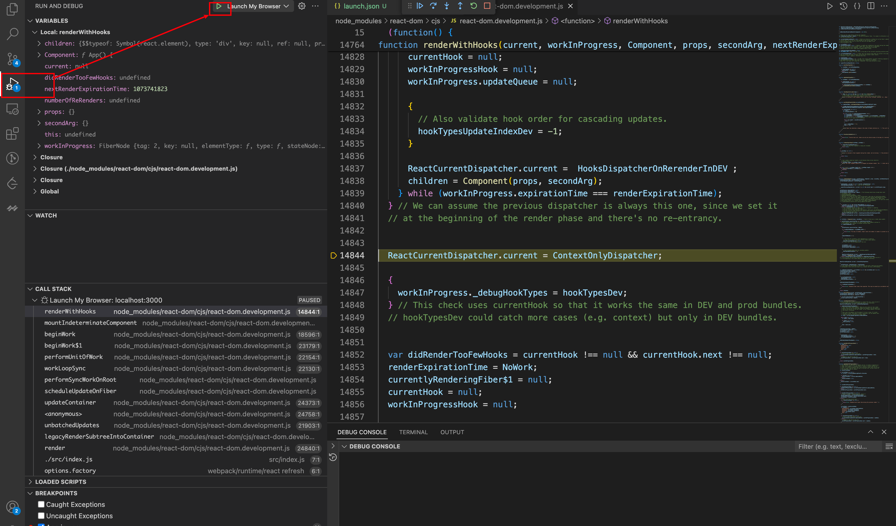
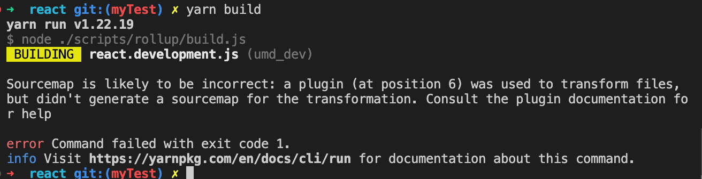
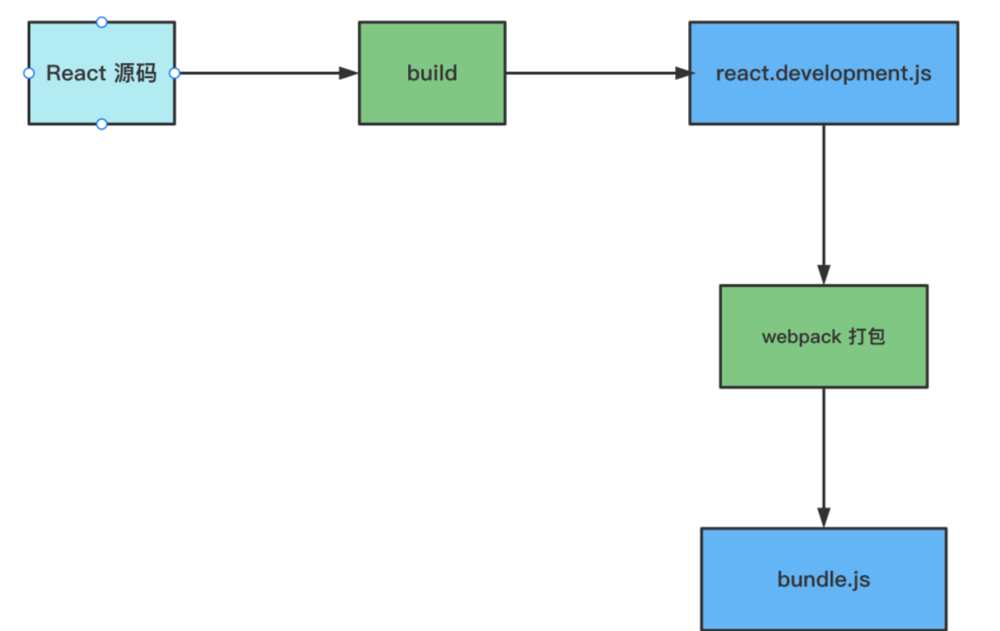
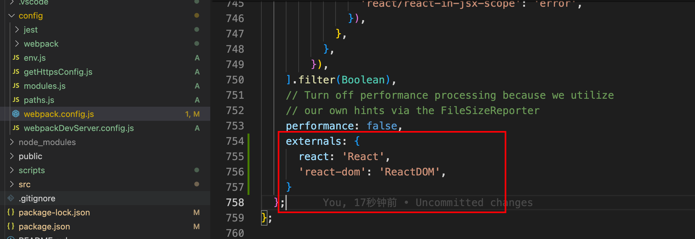
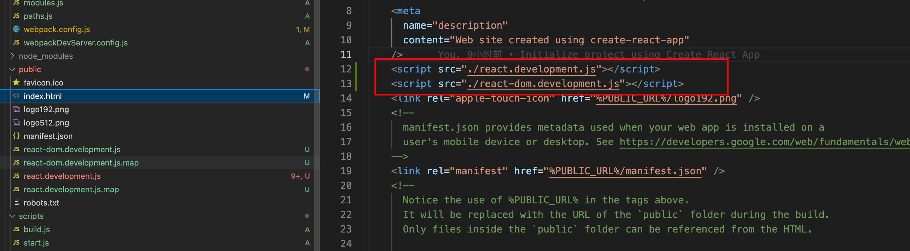
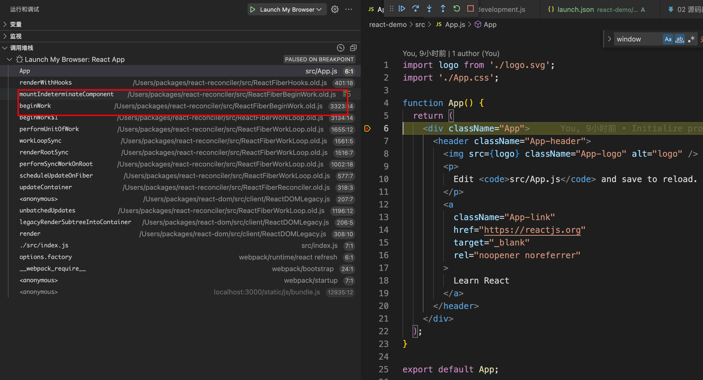
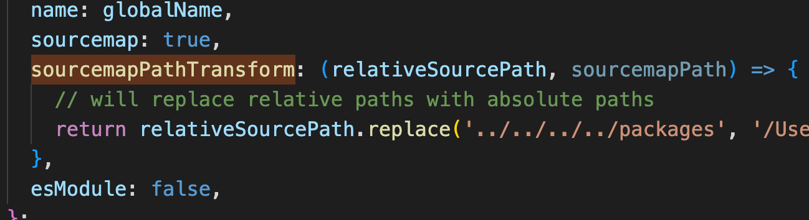

# 如何调试源码

## 一：react工程组织流程


## 二：下载指定版本的react并初始化

1. [指引🔗：](https://github.com/facebook/react/tree/v18.2.0)
2. 找到指定版本的tag,react每发布一个版本都会打一个tag，我们在本地新建一个分支切换到指定tag上就好，例如
   `git checkout -b myTest v18.2.0`
3. 安装依赖 `yarn`

## 三：新建一个react项目

`npx create-react-app react-demo`
注意：项目请使用对应的react版本，如果版本不对请手动更改react依赖到指定版本

## 四：用 VSCode 调试 React 项目

1. 添加一个 VSCode 的 debugger 配置,在根目录下建一个 .vscode/launch.json 的文件，添加一个 chrome 类型的调试配置，输入调试的 url。 具体配置可查看[VSCode官方文档](https://code.visualstudio.com/docs/nodejs/browser-debugging#nodejs-articles)。这里要注意url和webRoot，如果需要调试的文件不在项目的跟路径下，这里需要改一下webRoot，加上对应的路径就好。同时也需要注意这里需要打开sourceMap才能启用vscode的sourceMap功能。

   ```json
   {
     // 使用 IntelliSense 了解相关属性。 
     // 悬停以查看现有属性的描述。
     // 欲了解更多信息，请访问: https://go.microsoft.com/fwlink/?linkid=830387
     "version": "0.2.0",
     "configurations": [
       {
         "type": "chrome",
         "request": "launch",
         "name": "Launch chrome",
         "url": "http://localhost:3000",
         "webRoot": "${workspaceFolder}",
       }
     ],
   }
   ```

   

2. 点击debugger就可以开始调试react源码了

   

3. 这里我们调试的时候看到的react源码都是react`build`之后发在npm上的，所以我们无法对应到react源码中最初的代码，这时候就需要使用sourceMap来处理了。代码位于`scripts/rollup/build.js`路径下面

   ```js
   function getRollupOutputOptions(
     outputPath,
     format,
     globals,
     globalName,
     bundleType
   ) {
     const isProduction = isProductionBundleType(bundleType);
   
     return {
       file: outputPath,
       format,
       globals,
       freeze: !isProduction,
       interop: getRollupInteropValue,
       name: globalName,
       sourcemap: true, // 新增sourcemao
       sourcemapPathTransform(relative, sourcemap) {
         return relative.replace('../../../../packages', '/xxx/Desktop/reactSource/react18/packages');
       }, // 改成绝对定位
       esModule: false,
       exports: 'auto',
     };
   }
   ```

   

4. 可以看到原本的build是没有输出sourceMap的，我们这里更改为true，然后执行build命令。发现报错



> 原因：某个转换的插件没有生成 sourcemap。
>
> 这个是因为构建的过程中会进行多次转换，会生成多次 sourcemap，然后把 sourcemap 串联起来就是最终的 sourcemap。如果中间有一步转换没有生成 sourcemap，那就断掉了，也就没法把 sourcemap 串联起来了。
>
> 这个问题的解决只要找出没有生成 sourcemap 的那几个插件注释掉就可以了：
>
> 我们在`getPlugins`函数中注释以下插件
>
> ```js
> {
> renderChunk(source) {
>  return Wrappers.wrapBundle(
>    source,
>    bundleType,
>    globalName,
>    filename,
>    moduleType,
>    bundle.wrapWithModuleBoundaries
>  );
> },
> },
> ```
>
> 这个是添加一些头部的代码的，比如 Lisence 等。
>
> ```
> shouldStayReadable &&
> prettier({
> parser: 'flow',
> singleQuote: false,
> trailingComma: 'none',
> bracketSpacing: true,
> }),
> ```
>
> 这个是用 prettier 格式化代码的。
>
> ```bash
> isProduction &&
> bundleType !== ESM_PROD &&
> closure({
>  compilation_level: 'SIMPLE',
>  language_in: 'ECMASCRIPT_2020',
>  language_out:
>  bundleType === NODE_ES2015
>  ? 'ECMASCRIPT_2020'
>  : bundleType === BROWSER_SCRIPT
>  ? 'ECMASCRIPT5'
>  : 'ECMASCRIPT5_STRICT',
>  emit_use_strict:
>  bundleType !== BROWSER_SCRIPT &&
>  bundleType !== ESM_PROD &&
>  bundleType !== ESM_DEV,
>  env: 'CUSTOM',
>  warning_level: 'QUIET',
>  apply_input_source_maps: false,
>  use_types_for_optimization: false,
>  process_common_js_modules: false,
>  rewrite_polyfills: false,
>  inject_libraries: false,
>  allow_dynamic_import: true,
> 
>  // Don't let it create global variables in the browser.
>  // https://github.com/facebook/react/issues/10909
>  assume_function_wrapper: !isUMDBundle,
>  renaming: !shouldStayReadable,
> }),
> ```
>
> 用来压缩代码，去掉空白
>
> ```js
> {
> transform(source) {
>   return source.replace(/['"]use strict["']/g, '');
> },
> },
> ```
>
> 删除'use strict'
>
> tips：如果还有报错，检查下错误提示，看下哪个插件不能用

5. 重新执行build命令，就可以看到打包了sourceMap文件，但是我们会发现build出来的map文件没有内容，这是因为react使用了flow作为静态类型检查，在打包的时候会用到flow-remove-types这个插件进行类型过滤。但是使用这个插件的时候没有考虑到`sourceMap`的生成，我们改下这个插件的代码即可

   ```javascript
   {
     name: 'rollup-plugin-flow-remove-types',
     transform(code) {
       const transformed = flowRemoveTypes(code, { pretty: true }); // 这里加上{ pretty: true }配置即可
       return {
         code: transformed.toString(),
         map: transformed.generateMap(),
       };
     },
   },
   ```

   

6. 这时候我们可以通过将react和react-dom文件夹复制到我们的项目node_modules中去，替换掉从npm上下载的没有sourceMap文件的包。但是要注意这个时候我们还是不能从我们项目的代码直接调试到react的源码中。原因是我们的项目在进行webpack打包的时候也进行了一次react.development.js到bundles.js的打包，相当于要找到源码的位置需要进行两次sourceMap的查找。调试的时候浏览器只会找一次。



7. 所以我们只要干掉webpack打包这一步就可以实现bundle.js到react源码的映射了。webpack 支持 externals 来配置一些模块使用全局变量而不进行打包，这样我们就可以单独加载 react、react-dom，然后把他们导出的全局变量配置到 externals 就行了。我们在项目中使用`npm run eject`命令暴露出webpack配置进行更改即可



然后我们把这两个文件在HTML中当作全局引用



8. 之后就可以直接调试源码中的文件了

   

9. 要实现点击调用栈跳转源码位置我们需要将react和react-demo放入同一个工作目录中，并且更改一下sourceMap的生成路径，使用绝对路径而不是相对路径。

   


## 错误排查

1. 如果遇到调试不能走到react源码中，请检查package.json中type是否设置为module模块类型

这样我们就可以愉快的在vscode中调试我们的react源码啦