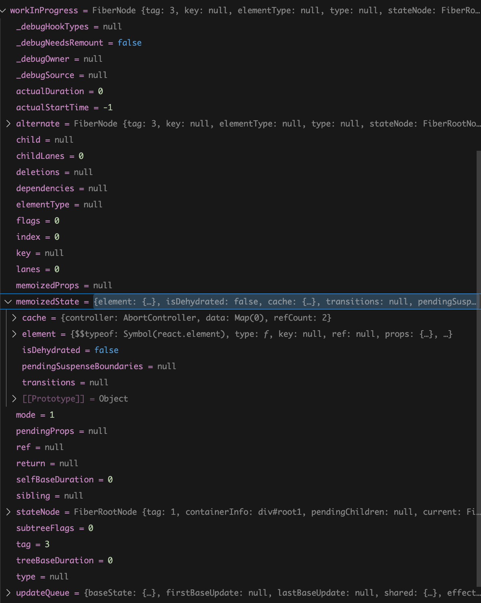

# 各种元素的fiber节点总结

## hostFiber

- `memoizedState`：存储当前的元素内容，里面的`element`属性存储的就是将要更新的子元素
- `stateNode`: 存储的是`FiberRootNode`节点，应用根节点
- `updateQueue`: 存储的是更新的能容，里面携带的`pyload`是子元素的`element`

## 函数组件

1. `memoizedState`：存储的是`hooks`链表
2. `type`：存储的是函数组件的函数体
3. `elementType`：存储的是函数组件的函数体
4. `updateQueue`：存储的是`useEffect / useLayoutEffect hook`内容
